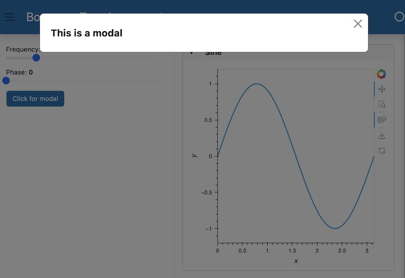

# Toggle Modal

This guide addresses how to toggle the modal area of a template.

```{admonition} Prerequisites
1. The [How to > Set a Template](./template_set) guide demonstrates how to set a template for a deployable app.
```

---

A modal can be opened and closed with `.open_modal()` and `.close_modal()` methods, respectively. Let's create a modal that is activated by a button on the sidebar. We'll first save this script below into a file called `app.py`:

:::{card} app.py
``` {code-block} python
:emphasize-lines: 24-36

import hvplot.pandas
import numpy as np
import pandas as pd
import panel as pn

# Explicitly set template and add some text to the header area
template = pn.template.BootstrapTemplate(title='Bootstrap Template')

# Data and Widgets
xs = np.linspace(0, np.pi)
freq = pn.widgets.FloatSlider(name="Frequency", start=0, end=10, value=2)
phase = pn.widgets.FloatSlider(name="Phase", start=0, end=np.pi)

# Interactive data pipeline
def sine(freq, phase):
    return pd.DataFrame(dict(y=np.sin(xs*freq+phase)), index=xs)

dfi_sine = hvplot.bind(sine, freq, phase).interactive()

# Add components to the sidebar, main, and header
template.sidebar.extend([freq, phase])
template.main.append(
    pn.Card(dfi_sine.hvplot(heiht=200, min_height=400).output(), title='Sine')
)
template.header.append('## Header')

# Add some content to the modal area
template.modal.append("## This is a modal")

# Create a button
modal_btn = pn.widgets.Button(name="Click for modal")

# Callback that will open the modal when the button is clicked
def about_callback(event):
    template.open_modal()

# Link the button to the callback and append it to the sidebar
modal_btn.on_click(about_callback)
template.sidebar.append(modal_btn)

template.servable();
```
:::

Now we can activate this app on the command line. When we click the button in the sidebar, we see the modal pop up:

```bash
panel serve app.py --show --dev
```



## Related Resources

- See [How-to > Apply Templates > Set a Template](./template_set) for alternate approaches to set a template.
- Read [Explanation > Templates](../../explanation/styling/templates_overview) for explanation.
