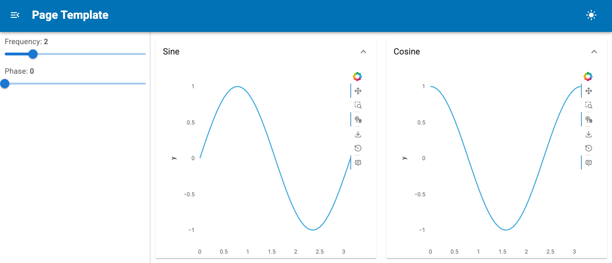

# Set a Template

This guide addresses how to set a template for a deployable app.

---

There are two ways of building an application with a template: either we explicitly construct a `pn.ui.Page` or we set the global template and mark components as servable into its areas.

## Explicit Constructor

The explicit approach instantiates a `Page` directly and passes the components for each area as lists.

Let us construct a very simple app containing two plots in the `main` area and two widgets in the `sidebar`. Let's save the script below into a file called `app.py`.

:::{card} app.py
``` {code-block} python
:emphasize-lines: 20-29

import hvplot.pandas
import numpy as np
import pandas as pd
import panel as pn

pn.extension(throttled=True)

xs = np.linspace(0, np.pi)
freq = pn.ui.FloatSlider(label="Frequency", start=0, end=10, value=2)
phase = pn.ui.FloatSlider(label="Phase", start=0, end=np.pi)

def sine(freq, phase):
    df = pd.DataFrame(dict(y=np.sin(xs*freq+phase)), index=xs)
    return df.hvplot(responsive=True, min_height=400)

def cosine(freq, phase):
    df = pd.DataFrame(dict(y=np.cos(xs*freq+phase)), index=xs)
    return df.hvplot(responsive=True, min_height=400)

plots = pn.ui.Row(
    pn.ui.Card(pn.ui.HoloViews(pn.bind(sine, freq, phase)), title='Sine'),
    pn.ui.Card(pn.ui.HoloViews(pn.bind(cosine, freq, phase)), title='Cosine'),
)

pn.ui.Page(
    title='Page Template',
    sidebar=[freq, phase],
    main=[plots],
).servable()
```
:::

```{note}
A `Page` can be served or displayed just like any other Panel component, i.e. using `.servable()`, `.show()` or by rendering it in a notebook cell.
```

Now we can activate this app on the command line:

``` bash
panel serve app.py --show
```



## Global Template

Another, often simpler approach is to set the global template with `pn.extension(template='page')`. Once the global template is set, we can add components to its areas using `.servable(target=...)`; the valid targets are `'main'` (the default), `'sidebar'`, `'header'` and `'contextbar'`. The global `Page` itself is available as `pn.state.template`, e.g. to set its `title`. Let's create the same app as above using this approach and save it into a file called `app_global.py`.

:::{card} app_global.py
``` {code-block} python
:emphasize-lines: 6, 9-10, 20-23

import hvplot.pandas
import numpy as np
import pandas as pd
import panel as pn

pn.extension(template='page', throttled=True)

xs = np.linspace(0, np.pi)
freq = pn.ui.FloatSlider(label="Frequency", start=0, end=10, value=2).servable(target='sidebar')
phase = pn.ui.FloatSlider(label="Phase", start=0, end=np.pi).servable(target='sidebar')

def sine(freq, phase):
    df = pd.DataFrame(dict(y=np.sin(xs*freq+phase)), index=xs)
    return df.hvplot(responsive=True, min_height=400)

def cosine(freq, phase):
    df = pd.DataFrame(dict(y=np.cos(xs*freq+phase)), index=xs)
    return df.hvplot(responsive=True, min_height=400)

pn.ui.Row(
    pn.ui.Card(pn.ui.HoloViews(pn.bind(sine, freq, phase)), title='Sine'),
    pn.ui.Card(pn.ui.HoloViews(pn.bind(cosine, freq, phase)), title='Cosine'),
).servable(title='Page Template')
```
:::

Now, we can activate this app on the command line:

``` bash
panel serve app_global.py --show
```

The result is identical to the explicitly constructed `Page` above.

The classic templates (`'bootstrap'`, `'fast'`, `'material'`, `'vanilla'`, ...) can still be selected by name in the same way.

## Related Resources

- Read [Explanation > Templates](../../explanation/styling/templates_overview) for explanation.
