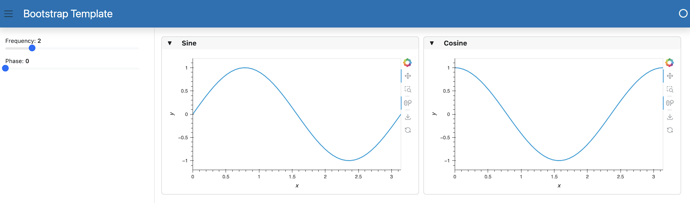

# Set a Template

This guide addresses how to set a template for a deployable app.

---

There are two ways of building an application using templates; either we explicitly construct the template or we change the global template.

## Explicit Constructor

The explicit approach instantiates a template directly and then add components to the template's areas.

Let us construct a very simple app containing two plots in the `main` area and two widgets in the `sidebar` based on the `BootstrapTemplate` class. Let's save this script below into a file called `app.py`.

:::{card} app.py
``` {code-block} python
:emphasize-lines: 5, 21-29

import hvplot.pandas
import numpy as np
import pandas as pd
import panel as pn

template = pn.template.BootstrapTemplate(title='Bootstrap Template')

xs = np.linspace(0, np.pi)
freq = pn.widgets.FloatSlider(name="Frequency", start=0, end=10, value=2)
phase = pn.widgets.FloatSlider(name="Phase", start=0, end=np.pi)

def sine(freq, phase):
    return pd.DataFrame(dict(y=np.sin(xs*freq+phase)), index=xs)

def cosine(freq, phase):
    return pd.DataFrame(dict(y=np.cos(xs*freq+phase)), index=xs)

dfi_sine = hvplot.bind(sine, freq, phase).interactive()
dfi_cosine = hvplot.bind(cosine, freq, phase).interactive()

plot_opts = dict(responsive=True, min_height=400)

template.sidebar.append(freq)
template.sidebar.append(phase)

template.main.append(
    pn.Row(
        pn.Card(dfi_sine.hvplot(**plot_opts).output(), title='Sine'),
        pn.Card(dfi_cosine.hvplot(**plot_opts).output(), title='Cosine'),
    )
)
template.servable();
```
:::

```{note}
Templates can be served or displayed just like any other Panel component, i.e. using `.servable()` or `.show()`.
```

Now we can activate this app on the command line:

``` bash
panel serve app.py --show
```



## Global Template

Another, often simpler approach is to set the global template with the `pn.extension()` call. Once the global template is set, we can easily add components to the template using `.servable(area=...)` calls. Let's create the same app as above but using this global template approach. We'll save the script below into a file called `app_global.py`.

:::{card} app.py
``` {code-block} python
:emphasize-lines: 4, 7-8, 20-23

import hvplot.pandas
import numpy as np
import pandas as pd
import panel as pn

pn.extension(template='bootstrap')

xs = np.linspace(0, np.pi)
freq = pn.widgets.FloatSlider(name="Frequency", start=0, end=10, value=2).servable(target='sidebar')
phase = pn.widgets.FloatSlider(name="Phase", start=0, end=np.pi).servable(target='sidebar')

def sine(freq, phase):
    return pd.DataFrame(dict(y=np.sin(xs*freq+phase)), index=xs)

def cosine(freq, phase):
    return pd.DataFrame(dict(y=np.cos(xs*freq+phase)), index=xs)

dfi_sine = hvplot.bind(sine, freq, phase).interactive()
dfi_cosine = hvplot.bind(cosine, freq, phase).interactive()

plot_opts = dict(responsive=True, min_height=400)

pn.Row(
    pn.Card(dfi_sine.hvplot(**plot_opts).output(), title='Sine'),
    pn.Card(dfi_cosine.hvplot(**plot_opts).output(), title='Cosine'),
).servable(target='main');
```
:::

Now, we can activate this app on the command line:

``` bash
panel serve app_global.py --show
```


## Related Resources

- Read [Explanation > Templates](../../explanation/styling/templates_overview) for explanation.
