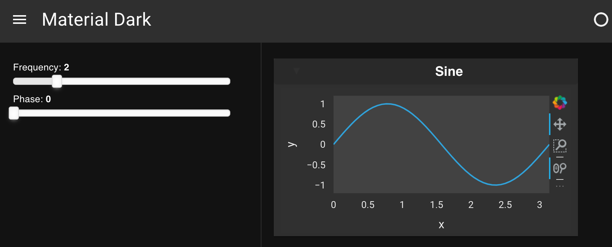

# Customize Template Theme

This guide addresses how to customize the theme of a template.

```{admonition} Prerequisites
1. The [How to > Set a Template](./template_set.md) guide demonstrates how to set a template for a deployable app.
```

---

To implement a custom template theme you should declare a generic class and a specific class implementation for all the templates that should be supported, e.g. here is an example of what the definition of a `DarkTheme` might look like for the `MaterialTemplate`.

```python
import param
import panel as pn
from panel.template.theme import Theme
from bokeh.themes import DARK_MINIMAL

class DarkTheme(Theme): # generic class
    """
    The DarkTheme provides a dark color palette
    """

    bokeh_theme = param.ClassSelector(class_=(Theme, str), default=DARK_MINIMAL)

class MaterialDarkTheme(DarkTheme): # specific class

    # css = param.Filename() Here we could declare some custom CSS to apply

    # This tells Panel to use this implementation
    _template = pn.template.MaterialTemplate
```

Once these classes are created, the themes can be imported and applied to a template. We will use the generic `DarkTheme` that is shipped with Panel to simplify the example below:

:::{card} app.py

```python
import panel as pn
from panel.template import DarkTheme
import numpy as np
import holoviews as hv

# Data and Widgets
xs = np.linspace(0, np.pi)
freq = pn.widgets.FloatSlider(name="Frequency", start=0, end=10, value=2)
phase = pn.widgets.FloatSlider(name="Phase", start=0, end=np.pi)

# Plotting function bound to widgets
@pn.depends(freq=freq, phase=phase)
def sine(freq, phase):
    return hv.Curve((xs, np.sin(xs*freq+phase))).opts(
        height=400, width=400)

dark = pn.template.MaterialTemplate(title='Material Dark', theme=DarkTheme)

dark.sidebar.append(freq)
dark.sidebar.append(phase)

dark.main.append(pn.Card(hv.DynamicMap(sine), title='Sine'))

dark.servable()
```
::::

Now, we can activate this app on the command line:

``` bash
panel serve app.py --show --autoreload
```



## Related Resources

- See [How-to > Apply Templates > Build a Custom Template](./template_custom.md) to create a completely custom template.
- See [How-to > Apply Templates > Set a Template](./template_set.md) for alternate approaches to set a template.
- Read [Background > Templates](../../background/templates/templates_overview.md) for explanation.
