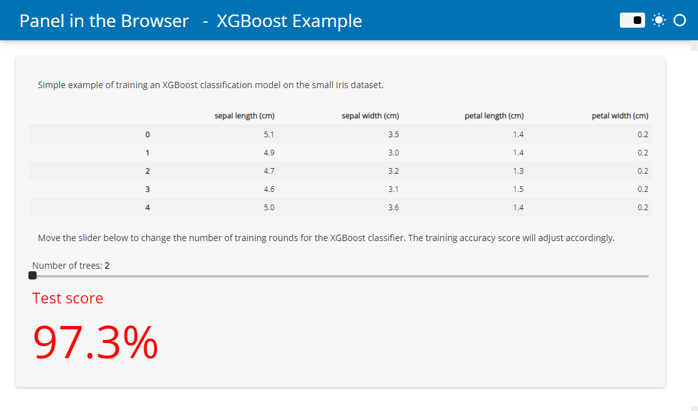

# Converting Panel applications

Writing an HTML file from scratch with all the Javascript and Python dependencies and other boilerplate can be quite cumbersome, and requires learning a good bit of HTML. To avoid writing all the boilerplate, Panel provides support for converting an entire application (including Panel templates) to an HTML file, using the `panel convert` command-line interface (CLI). As a starting point create one or more Python scripts or notebook files containing your application. The only requirement is that they import only global modules and packages (relative imports of other scripts or modules is not supported) and that the libraries have been [compiled for Pyodide](https://github.com/pyodide/pyodide/tree/main/packages) or are available as pure-Python wheels from PyPI.

The ``panel convert`` command has the following options:

    positional arguments:
    DIRECTORY-OR-SCRIPT   The app directories or scripts to serve (serve empty document if not specified)

    options:
    -h, --help            show this help message and exit
    --to TO               The format to convert to, one of 'pyodide' (default), 'pyodide-worker', 'pyscript' or 'pyscript-worker'
    --compiled            Whether to use the compiled and faster version of Pyodide.
    --out OUT             The directory to write the file to.
    --title TITLE         A custom title for the application(s).
    --skip-embed          Whether to skip embedding pre-rendered content in the converted file to display content while app is loading.
    --index               Whether to create an index if multiple files are served.
    --pwa                 Whether to add files to serve applications as a Progressive Web App.
    --requirements REQUIREMENTS [REQUIREMENTS ...]
                          Explicit requirements to add to the converted file, a single requirements.txt file or a JSON file containing requirements per app. By default requirements are inferred from the code.
    --resources RESOURCES [RESOURCES ...]
                          Files to pack for distribution with the app. Does only support files located in the directory of the main panel app (or in subdirectories below).
    --disable-http-patch  Whether to disable patching http requests using the pyodide-http library.
    --watch               Watch the files
    --num-procs NUM_PROCS
                          The number of processes to start in parallel to convert the apps.

## Example

This example will demonstrate how to *convert* and *serve* a basic data app locally.

- install the dependencies `pip install panel scikit-learn xgboost`.
- Create a `script.py` file with the following content

```python
import panel as pn

from sklearn.datasets import load_iris
from sklearn.metrics import accuracy_score
from xgboost import XGBClassifier

pn.extension(sizing_mode="stretch_width", template="fast")
pn.state.template.param.update(site="Panel in the Browser", title="XGBoost Example")

iris_df = load_iris(as_frame=True)

trees = pn.widgets.IntSlider(start=2, end=30, name="Number of trees")

def pipeline(trees):
    model = XGBClassifier(max_depth=2, n_estimators=trees)
    model.fit(iris_df.data, iris_df.target)
    accuracy = round(accuracy_score(iris_df.target, model.predict(iris_df.data)) * 100, 1)
    return pn.indicators.Number(
        name="Test score",
        value=accuracy,
        format="{value}%",
        colors=[(97.5, "red"), (99.0, "orange"), (100, "green")],
    )

pn.Column(
    "Simple example of training an XGBoost classification model on the small Iris dataset.",
    iris_df.data.head(),
    "Move the slider below to change the number of training rounds for the XGBoost classifier. The training accuracy score will adjust accordingly.",
    trees,
    pn.bind(pipeline, trees),
).servable()
```

- Run `panel convert script.py --to pyodide-worker --out pyodide`
- Run `python3 -m http.server` to start a web server locally
- Open `http://localhost:8000/pyodide/script.html` to try out the app.

The app should look like this



You can now add the `script.html` (and `script.js` file if you used the `pyodide-worker` target) to your Github pages or similar. **no separate server needed!**

## Tips & Tricks for development

- While developing you should run the script locally with *auto reload*: `panel serve script.py --autoreload`.
- You can also watch your script for changes and rebuild it if you make an edit with `panel convert ... --watch`
- If the converted app does not work as expected, you can most often find the errors in the browser
console. [This guide](https://balsamiq.com/support/faqs/browserconsole/) describes how to open the
console.
- You can find answers to the most frequently asked questions about *Python in the browser* in the [Pyodide - FAQ](https://pyodide.org/en/stable/usage/faq.html) or the [PyScript FAQ](https://docs.pyscript.net/latest/reference/faq.html). For example the answer to "How can I load external data?".

## Formats

Using the `--to` argument on the CLI you can control the format of the file that is generated by `panel convert`. You have three options, each with distinct advantages and disadvantages:

- **`pyodide`** (default): Run application using Pyodide running in the main thread. This option is less performant than pyodide-worker but produces completely standalone HTML files that do not have to be hosted on a static file server (e.g. Github Pages).
- **`pyodide-worker`**: Generates an HTML file and a JS file containing a Web Worker that runs in a separate thread. This is the most performant option, but files have to be hosted on a static file server.
- **`pyscript`**: Generates an HTML leveraging PyScript. This produces standalone HTML files containing `<py-env>` and `<py-script>` tags containing the dependencies and the application code. This output is the most readable, and should have equivalent performance to the `pyodide` option.
- **`pyscript-worker`**: Generates an HTML file and a separate PY file containing the panel app leveraging PyScript in a WebWorker. This needs proper setup of Content-Security-Policies on the webserver.

## Requirements

The `panel convert` command will try its best to figure out the requirements of your script based on the imports, which means that in most cases you won't have to provide the explicit `--requirements` argument. However, if some library uses an optional import that cannot be inferred from the list of imports in your app you will have to provide an explicit list of dependencies. Note that `panel` and its dependencies including NumPy and Bokeh will be added loaded automatically, e.g. the explicit requirements for the app above would look like this:

```bash
panel convert script.py --to pyodide-worker --out pyodide --requirements xgboost scikit-learn pandas
```

Alternatively you may also provide a `requirements.txt` file:

```bash
panel convert script.py --to pyodide-worker --out pyodide --requirements requirements.txt
```

One also can provide URLs to Python wheels provided at filesystem or online locations. Wheels available in the local filesystem will be packed into a zip-file (which needs to be hosted with the app) which will be unpacked to emscriptens MEMFS for installation.

## Index

If you convert multiple applications at once you may want to add an index to be able to navigate between the applications easily. To enable the index simply pass `--index` to the convert command.

## Prerendering

In order to improve the loading experience Panel will pre-render and embed the initial render of the page and replace it with live components once the page is loaded. This is important because Pyodide has to fetch the entire Python runtime and all required packages from a CDN. This can be **very** slow depending on your internet connection. If you want to disable this behavior and render an initially blank page use the `--skip-embed` option. Otherwise Panel will render application using the current Python process (presumably outside the browser) into the HTML file as a "cached" copy of the application for the user to see while the Python runtime is initialized and the actual browser-generated application is ready for interaction.

## Progressive Web Apps

Progressive web applications (PWAs) provide a way for your web apps to behave almost like a native application, both on mobile devices and on the desktop. The `panel convert` CLI has a `--pwa` option that will generate the necessary files to turn your Panel + Pyodide application into a PWA. The web manifest, service worker script and assets such as thumbnails are exported alongside the other HTML and JS files and can then be hosted on your static file host. Note that Progressive web apps must be served via HTTPS to ensure user privacy, security, and content authenticity, including the application itself and all resources it references. Depending on your hosting service, you will have to enable HTTPS yourself. GitHub pages generally make this very simple and provide a great starting point.

Once generated, you can inspect the `site.webmanifest` file and modify it to your liking, including updating the favicons in the assets directory.

:::{note}
If you decide to enable the `--pwa` ensure that you also provide a unique `--title`. Otherwise the browser caches storing your apps dependencies will end up overwriting each other.
:::

## Handling HTTP requests

By default Panel will install the [pyodide-http](https://github.com/koenvo/pyodide-http) library which patches `urllib3` and `requests` making it possible to use them within the pyodide process. To disable this behavior use the `--disable-http-patch` CLI option.

Note that making HTTP requests when converting to the `pyodide` or `pyscript` target will block the main browser thread and result in a poor user experience. Therefore we strongly recommend converting to `pyodide-worker` if your app is making synchronous HTTP requests.
