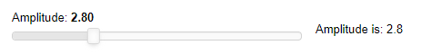

# Using Panel in Pyodide & PyScript

## Installing Panel in the browser

To install Panel in the browser you merely have to use the installation mechanism provided by each supported runtime:

### Pyodide

Currently, the best supported mechanism for installing packages in Pyodide is `micropip`.

To get started with Pyodide simply follow their [Getting started guide](https://pyodide.org/en/stable/usage/quickstart.html). Note that if you want to render Panel output you will also have to load [Bokeh.js](https://docs.bokeh.org/en/2.4.1/docs/first_steps/installation.html#install-bokehjs:~:text=Installing%20standalone%20BokehJS%C2%B6) and Panel.js from CDN. The most basic pyodide application therefore looks like this:

```html
<!DOCTYPE html>
<html>
  <head>
    <meta charset="UTF-8">
    <meta name="viewport" content="width=device-width,initial-scale=1.0">
    <script src="https://cdn.jsdelivr.net/pyodide/v{{PYODIDE_VERSION}}/full/pyodide.js"></script>

    <script type="text/javascript" src="https://cdn.bokeh.org/bokeh/release/bokeh-{{BOKEH_VERSION}}.js"></script>
    <script type="text/javascript" src="https://cdn.bokeh.org/bokeh/release/bokeh-widgets-{{BOKEH_VERSION}}.min.js"></script>
    <script type="text/javascript" src="https://cdn.bokeh.org/bokeh/release/bokeh-tables-{{BOKEH_VERSION}}.min.js"></script>
    <script type="text/javascript" src="https://cdn.jsdelivr.net/npm/@holoviz/panel@{{PANEL_VERSION}}/dist/panel.min.js"></script>

  </head>
  <body>
    <div id="simple_app"></div>
    <script type="text/javascript">
      async function main(){
        let pyodide = await loadPyodide();
        await pyodide.loadPackage("micropip");
        const micropip = pyodide.pyimport("micropip");
        await micropip.install([
          "https://cdn.holoviz.org/panel/{{PANEL_VERSION}}/dist/wheels/bokeh-{{BOKEH_VERSION}}-py3-none-any.whl",
          "https://cdn.holoviz.org/panel/{{PANEL_VERSION}}/dist/wheels/panel-{{PANEL_VERSION}}-py3-none-any.whl"]
        )
        pyodide.runPython(`
          import panel as pn

          pn.extension(sizing_mode="stretch_width")

          slider = pn.widgets.FloatSlider(start=0, end=10, name='Amplitude')

          def callback(new):
              return f'Amplitude is: {new}'

          pn.Row(slider, pn.bind(callback, slider)).servable(target='simple_app');
      `);
      }
      main();
    </script>
  </body>
</html>
```

The app should look like this



:::{admonition} warn
The default bokeh and panel packages are very large, therefore we recommend you pip install specialized wheels:

```javascript
const bk_whl = "https://cdn.holoviz.org/panel/{{PANEL_VERSION}}/dist/wheels/bokeh-{{BOKEH_VERSION}}-py3-none-any.whl"
const pn_whl = "https://cdn.holoviz.org/panel/{{PANEL_VERSION}}/dist/wheels/panel-{{PANEL_VERSION}}-py3-none-any.whl"
await micropip.install(bk_whl, pn_whl)
```

:::

### PyScript

A basic, single file pyscript example looks like

```html
<!DOCTYPE html>
<html>
  <head>
    <meta charset="UTF-8">
    <meta name="viewport" content="width=device-width,initial-scale=1.0">
    <script type="text/javascript" src="https://cdn.bokeh.org/bokeh/release/bokeh-{{BOKEH_VERSION}}.js"></script>
    <script type="text/javascript" src="https://cdn.bokeh.org/bokeh/release/bokeh-widgets-{{BOKEH_VERSION}}.min.js"></script>
    <script type="text/javascript" src="https://cdn.bokeh.org/bokeh/release/bokeh-tables-{{BOKEH_VERSION}}.min.js"></script>
    <script type="text/javascript" src="https://cdn.jsdelivr.net/npm/@holoviz/panel@{{PANEL_VERSION}}/dist/panel.min.js"></script>

    <link rel="stylesheet" href="https://pyscript.net/releases/{{PYSCRIPT_VERSION}}/core.css">
    <script type="module" src="https://pyscript.net/releases/{{PYSCRIPT_VERSION}}/core.js"></script>
  </head>
  <body>
    <div id="simple_app"></div>
    <script type="py" config='{"packages": ["https://cdn.holoviz.org/panel/wheels/bokeh-{{BOKEH_VERSION}}-py3-none-any.whl", "https://cdn.holoviz.org/panel/wheels/panel-{{PANEL_VERSION}}-py3-none-any.whl"]}'>
      import panel as pn

      pn.extension(sizing_mode="stretch_width")

      slider = pn.widgets.FloatSlider(start=0, end=10, name='Amplitude')

      def callback(new):
         return f'Amplitude is: {new}'

      pn.Row(slider, pn.bind(callback, slider)).servable(target='simple_app');
    </script>
  </body>
</html>
```

The app should look identical to the one above.

The [PyScript](https://docs.pyscript.net) documentation recommends you put your configuration and python code into separate files. You can find such examples in the [PyScript Examples Gallery](https://pyscript.com/@examples?q=panel).

## Rendering Panel components in Pyodide or Pyscript

Rendering Panel components into the DOM is quite straightforward. You can simply use the `.servable()` method on any component and provide a target that should match the `id` of a DOM node:

```python
import panel as pn

slider = pn.widgets.FloatSlider(start=0, end=10, name='Amplitude')

def callback(new):
    return f'Amplitude is: {new}'

pn.Row(slider, pn.bind(callback, slider)).servable(target='simple_app');
```

This code will render this simple application into the `simple_app` DOM node:

```html
<div id="simple_app"></div>
```

Alternatively you can also use the `panel.io.pyodide.write` function to write into a particular DOM node:

```python
await pn.io.pyodide.write('simple_app', component)
```
