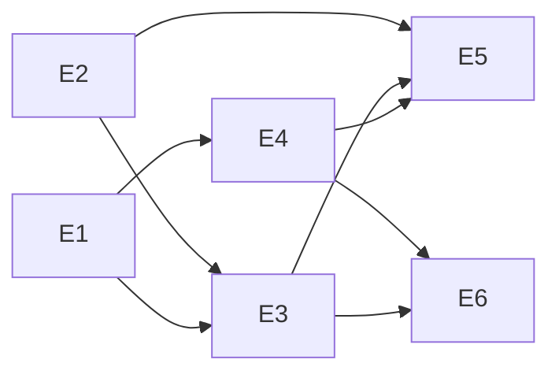

# Stories & Tasks: JupyterLab 4.4–4.6 Support for Panel

> **Based on**: [Solution plan](jupyterlab_4_support_solution.md) · [Compatibility review](jupyterlab_4_compatibility_review.md)  
> **Date**: 2026-08-05  
> **Format**: Epic → User Story → Tasks (with acceptance criteria, estimates, dependencies)

**Estimate legend**: XS ≤ 2h · S ≤ 1d · M ≤ 2d · L ≤ 3d · XL > 3d  

**Priority**: P0 must-ship for support claim · P1 should-ship same release train · P2 follow-up  

---

## Epic map

| Epic ID | Title | Phase | Priority |
|---------|-------|-------|----------|
| E1 | Dependency & packaging policy for JL 4.4–4.6 | A | P0 |
| E2 | jupyter_server extension modernization | B | P0 |
| E3 | CI matrix proving JL 4.4 / 4.5 / 4.6 | C | P0 |
| E4 | pyviz_comms frontend validation (upstream) | D | P0 |
| E5 | Documentation & public support matrix | E | P1 |
| E6 | Edge-case hardening & polish | F | P2 |



---

## Epic E1 — Dependency & packaging policy

**Goal**: Default installs for JupyterLab 4.4–4.6 resolve a compatible `pyviz_comms` 3.x stack.

### Story E1-S1 — Require pyviz_comms 3.x for Panel

**As a** Panel user on JupyterLab 4.5/4.6  
**I want** `pip install panel` to pull a JL4-compatible `pyviz_comms`  
**So that** Preview and bidirectional comms work without hunting for the right extension version.

| Field | Value |
|-------|-------|
| Priority | P0 |
| Estimate | S |
| Depends on | — |
| Repo | panel |

**Acceptance criteria**:
- [ ] `pyproject.toml` declares `pyviz_comms >= 3.0.2`
- [ ] `pixi.toml` default/test features match that lower bound
- [ ] CHANGELOG Compatibility notes the raised requirement and JL3 implication
- [ ] Lock / resolver no longer accepts `pyviz_comms==2.x` for current Panel

**Tasks**:

| Task ID | Description | Estimate | Done when |
|---------|-------------|----------|-----------|
| E1-S1-T1 | Update `pyproject.toml` runtime dependency to `pyviz_comms >= 3.0.2` | XS | File changed; metadata builds |
| E1-S1-T2 | Align `pixi.toml` / regenerate lock as needed | S | `pixi` environments resolve pyviz_comms≥3.0.2 |
| E1-S1-T3 | Draft CHANGELOG Compatibility bullet | XS | Text ready for PR |

---

### Story E1-S2 — Optional JupyterLab extra with supported range

**As a** user installing the recommended/notebook stack  
**I want** an optional extra that pins the supported JupyterLab range  
**So that** I do not accidentally install JupyterLab 5 or ancient 3.x with Panel’s JL docs.

| Field | Value |
|-------|-------|
| Priority | P1 |
| Estimate | XS |
| Depends on | E1-S1 |
| Repo | panel |

**Acceptance criteria**:
- [ ] Optional dep includes `jupyterlab >=4.4,<5` (e.g. `recommended` and/or new `jupyter` extra)
- [ ] Docs mention the extra in the support matrix page

**Tasks**:

| Task ID | Description | Estimate | Done when |
|---------|-------------|----------|-----------|
| E1-S2-T1 | Add/adjust `[project.optional-dependencies]` pins | XS | `pip install 'panel[jupyter]'` (or recommended) pulls JL 4.4–4.x |
| E1-S2-T2 | Cross-link from install / notebook docs | XS | Link present |

---

## Epic E2 — jupyter_server extension modernization

**Goal**: Preview server extension loads on JL 4.4–4.6 without deprecated entry points.

### Story E2-S1 — Implement `_jupyter_server_extension_points`

**As a** JupyterLab 4.6 administrator  
**I want** Panel to expose the modern jupyter_server extension discovery API  
**So that** the server starts without deprecation warnings and keeps working after `_paths` removal.

| Field | Value |
|-------|-------|
| Priority | P0 |
| Estimate | S |
| Depends on | — |
| Repo | panel |

**Acceptance criteria**:
- [ ] `_jupyter_server_extension_points()` exists and returns `[{"module": "panel.io.jupyter_server_extension"}]`
- [ ] Exported from `panel` / `panel.io`
- [ ] Legacy `_jupyter_server_extension_paths` still works (alias OK)
- [ ] `jupyter server extension list` shows Panel; Preview routes still registered
- [ ] No “`_jupyter_server_extension_points` was not found” warning for Panel

**Tasks**:

| Task ID | Description | Estimate | Done when |
|---------|-------------|----------|-----------|
| E2-S1-T1 | Implement points API in `panel/io/notebook.py` | XS | Function present |
| E2-S1-T2 | Export from `panel/io/__init__.py` and `panel/__init__.py` | XS | `from panel import _jupyter_server_extension_points` works |
| E2-S1-T3 | Manual smoke: enable extension, hit `/panel-preview/render/...` | S | Preview HTML returns 200 on local JL |
| E2-S1-T4 | Add unit/smoke test for discovery function shape | XS | Test green |

---

### Story E2-S2 — Clean up Preview handler deprecated Python APIs

**As a** maintainer running Panel on Python 3.12+ with JL 4.6  
**I want** Preview WebSocket code free of deprecated `datetime.utcnow`  
**So that** we do not accumulate runtime warnings in supported stacks.

| Field | Value |
|-------|-------|
| Priority | P1 |
| Estimate | XS |
| Depends on | — |
| Repo | panel |

**Acceptance criteria**:
- [ ] `PanelWSProxy.open` uses timezone-aware UTC
- [ ] Token expiry behavior unchanged
- [ ] Existing Preview UI tests pass

**Tasks**:

| Task ID | Description | Estimate | Done when |
|---------|-------------|----------|-----------|
| E2-S2-T1 | Replace `datetime.utcnow()` in `jupyter_server_extension.py` | XS | No utcnow usage |
| E2-S2-T2 | Optionally replace `ensure_future` with `create_task` in `on_close` | XS | Same shutdown behavior |
| E2-S2-T3 | Run Preview UI tests | S | Green |

---

## Epic E3 — CI matrix for JupyterLab 4.4 / 4.5 / 4.6

**Goal**: Continuous proof of support on all three minors.

### Story E3-S1 — Pixi environments (or equivalent) for pinned JL versions

**As a** contributor  
**I want** local/CI environments pinned to JL 4.4, 4.5, and 4.6  
**So that** I can reproduce version-specific failures.

| Field | Value |
|-------|-------|
| Priority | P0 |
| Estimate | M |
| Depends on | E1-S1 |
| Repo | panel |

**Acceptance criteria**:
- [ ] Three resolvable environments/features with `jupyterlab` `4.4.*`, `4.5.*`, `4.6.*`
- [ ] Each includes `pyviz_comms >= 3.0.2` and UI test deps
- [ ] Documented how to run: e.g. `pixi run -e test-ui-jl45 …`

**Tasks**:

| Task ID | Description | Estimate | Done when |
|---------|-------------|----------|-----------|
| E3-S1-T1 | Design matrix (features vs workflow-only pins) | XS | Decision recorded in PR |
| E3-S1-T2 | Add pixi features / env pins + lock | M | Three envs install cleanly |
| E3-S1-T3 | Document local commands in developer guide | S | Commands work from clean clone |

---

### Story E3-S2 — GitHub Actions Jupyter UI matrix

**As a** maintainer  
**I want** CI to run Jupyter Preview tests on JL 4.4, 4.5, and 4.6  
**So that** we catch regressions before release.

| Field | Value |
|-------|-------|
| Priority | P0 |
| Estimate | M |
| Depends on | E3-S1, E2-S1 |
| Repo | panel |

**Acceptance criteria**:
- [ ] Workflow matrix includes JL 4.4 / 4.5 / 4.6 (at least ubuntu)
- [ ] Each cell: enable server extension → start JupyterLab → run `--jupyter` UI tests (or Preview subset)
- [ ] Artifacts (logs/screenshots) uploaded on failure
- [ ] Cost noted: full OS matrix remains on a single JL version if needed

**Tasks**:

| Task ID | Description | Estimate | Done when |
|---------|-------------|----------|-----------|
| E3-S2-T1 | Extend `.github/workflows/test.yaml` matrix | S | Three JL cells appear in Actions |
| E3-S2-T2 | Parameterize install/start/test steps per JL pin | S | Each cell uses correct env |
| E3-S2-T3 | Trim suite if needed (Preview + smoke vs full UI) | S | Runtime acceptable (&lt; budget) |
| E3-S2-T4 | Verify failure artifacts path | XS | Failed job uploads screenshots/logs |

---

### Story E3-S3 — Environment smoke assertions

**As a** CI job  
**I want** to fail fast if the wrong JL or pyviz_comms landed  
**So that** green builds always mean the intended versions were tested.

| Field | Value |
|-------|-------|
| Priority | P1 |
| Estimate | S |
| Depends on | E3-S1 |
| Repo | panel |

**Acceptance criteria**:
- [ ] Script/pytest checks JL version, `pyviz_comms>=3.0.2`, labextension `@pyviz/jupyterlab_pyviz`, server extension enabled
- [ ] Invoked at start of Jupyter UI job

**Tasks**:

| Task ID | Description | Estimate | Done when |
|---------|-------------|----------|-----------|
| E3-S3-T1 | Write `scripts/check_jupyterlab_stack.py` (or pytest) | S | Exits non-zero on mismatch |
| E3-S3-T2 | Wire into workflow before UI tests | XS | Job uses the check |

---

## Epic E4 — pyviz_comms frontend validation (upstream)

**Goal**: Confirm `@pyviz/jupyterlab_pyviz` works on JL 4.4–4.6; fix or migrate build if needed.

### Story E4-S1 — Manual / CI smoke of pyviz labextension on JL 4.4–4.6

**As a** Panel + HoloViz user  
**I want** the Preview button and Comms extension to work on JupyterLab 4.6  
**So that** Panel’s “JL 4.6 supported” claim includes the UI I actually click.

| Field | Value |
|-------|-------|
| Priority | P0 |
| Estimate | M |
| Depends on | E1-S1 |
| Repo | pyviz_comms (primary), panel (consumer QA) |

**Acceptance criteria**:
- [ ] On JL 4.4, 4.5, 4.6: MIME render, Comm sync, Preview button, Layout Builder smoke pass
- [ ] Issues filed upstream for any 4.6-only failures
- [ ] Panel support claim for 4.6 blocked until pass or documented waiver

**Tasks**:

| Task ID | Description | Estimate | Done when |
|---------|-------------|----------|-----------|
| E4-S1-T1 | Create test matrix checklist spreadsheet/issue template | XS | Checklist exists |
| E4-S1-T2 | Run smoke on JL 4.4 + Panel main | S | Results logged |
| E4-S1-T3 | Run smoke on JL 4.5.9 + Panel main | S | Results logged |
| E4-S1-T4 | Run smoke on JL 4.6.x + Panel main | S | Results logged |
| E4-S1-T5 | File/fix pyviz_comms bugs if any | L | Blocking bugs fixed or waived |

---

### Story E4-S2 — Optional migrate pyviz_comms build to jupyter-builder

**As a** pyviz_comms maintainer  
**I want** labextension builds to use `jupyter-builder` / `@jupyter/builder`  
**So that** CI does not need a full JupyterLab install (JL 4.6 tooling direction).

| Field | Value |
|-------|-------|
| Priority | P1 |
| Estimate | M |
| Depends on | E4-S1 (can parallelize after smoke starts) |
| Repo | pyviz_comms |

**Acceptance criteria**:
- [ ] `pyproject.toml` / `package.json` follow JL 4.6 migration guide
- [ ] Produced labextension still loads on JL 4.4–4.6
- [ ] New pyviz_comms release published if wheel contents change
- [ ] Panel lower bound bumped only if required

**Tasks**:

| Task ID | Description | Estimate | Done when |
|---------|-------------|----------|-----------|
| E4-S2-T1 | Replace build requires with `jupyter-builder` | S | Build succeeds without full JL |
| E4-S2-T2 | Switch npm scripts to `jupyter-builder` CLI | S | `build:prod` works |
| E4-S2-T3 | Verify prebuilt extension on JL 4.4/4.5/4.6 | M | Smoke green |
| E4-S2-T4 | Release pyviz_comms; update Panel pin if needed | S | Versions published |

---

## Epic E5 — Documentation & public support matrix

**Goal**: Users know how to install and what is supported.

### Story E5-S1 — Public JupyterLab support matrix page

**As a** Panel user  
**I want** a single page listing supported JupyterLab versions and required packages  
**So that** I can set up a working environment quickly.

| Field | Value |
|-------|-------|
| Priority | P1 |
| Estimate | S |
| Depends on | E1-S1 (content accuracy) |
| Repo | panel |

**Acceptance criteria**:
- [ ] New doc (e.g. `doc/how_to/notebook/jupyterlab_support.md`) covers 4.4 / 4.5 / 4.6
- [ ] States `pyviz_comms >= 3.0.2`, split-env rules, feature list
- [ ] Linked from notebook how-to index / Preview / Layout Builder
- [ ] Links to solution + compatibility review for maintainers

**Tasks**:

| Task ID | Description | Estimate | Done when |
|---------|-------------|----------|-----------|
| E5-S1-T1 | Author `jupyterlab_support.md` | S | Page reviewed |
| E5-S1-T2 | Wire toctree / index links | XS | Discoverable in docs build |
| E5-S1-T3 | Add maintainer links to solution/review docs | XS | Links resolve |

---

### Story E5-S2 — Fix outdated JupyterLab install instructions

**As a** JupyterLab 4 user  
**I want** notebook docs that do not tell me to run classic `jupyter labextension install`  
**So that** I follow a path that matches prebuilt extensions.

| Field | Value |
|-------|-------|
| Priority | P1 |
| Estimate | S |
| Depends on | E5-S1 (optional parallel) |
| Repo | panel |

**Acceptance criteria**:
- [ ] `doc/how_to/notebook/notebook.md` updated for JL 4.x / pip prebuilt extensions
- [ ] Preview + Layout Builder pages mention version prerequisites
- [ ] No remaining primary guidance that requires source labextension builds for JL 4

**Tasks**:

| Task ID | Description | Estimate | Done when |
|---------|-------------|----------|-----------|
| E5-S2-T1 | Rewrite notebook.md install section | S | Docs build; accurate for JL 4.4–4.6 |
| E5-S2-T2 | Update `jupyterlabpreview.md` prerequisites | XS | Table/list present |
| E5-S2-T3 | Align `layout_builder.md` version notes | XS | Consistent with ≥3.0.2 |

---

### Story E5-S3 — Developer guide: testing against pinned JupyterLab

**As a** Panel contributor  
**I want** developer docs explaining how to run JL-matrix tests locally  
**So that** I can verify fixes without guessing CI commands.

| Field | Value |
|-------|-------|
| Priority | P2 |
| Estimate | S |
| Depends on | E3-S1 |
| Repo | panel |

**Acceptance criteria**:
- [ ] Developer guide section documents env names and test commands
- [ ] Mentions enabling `panel.io.jupyter_server_extension`

**Tasks**:

| Task ID | Description | Estimate | Done when |
|---------|-------------|----------|-----------|
| E5-S3-T1 | Add subsection under `doc/developer_guide/` | S | Merged with E3-S1-T3 or follow-up |

---

## Epic E6 — Edge-case hardening & polish

**Goal**: Reduce residual risk after the support claim ships.

### Story E6-S1 — Re-verify keyboard shortcut suppression on JL 4.6

**As a** notebook user editing Panel widgets  
**I want** keystrokes in inputs not to trigger JupyterLab shortcuts  
**So that** typing remains usable after JL 4.6 a11y/shortcut changes.

| Field | Value |
|-------|-------|
| Priority | P2 |
| Estimate | S |
| Depends on | E3-S2 or manual JL 4.6 env |
| Repo | panel |

**Acceptance criteria**:
- [ ] Manual test on JL 4.6: TextInput / Ace / Tabulator edit do not trigger notebook commands
- [ ] If broken: fix `doc_nb_js.js` (or equivalent) and add UI regression test if feasible

**Tasks**:

| Task ID | Description | Estimate | Done when |
|---------|-------------|----------|-----------|
| E6-S1-T1 | Manual keyboard matrix on JL 4.6 | S | Results noted |
| E6-S1-T2 | Fix embed attribute/selectors if needed | S | Regression closed |
| E6-S1-T3 | Optional Playwright assertion | M | Test in `--jupyter` suite |

---

### Story E6-S2 — Theme token smoke on JL 4.6

**As a** user switching JupyterLab light/dark  
**I want** Panel components to keep following `--jp-*` variables  
**So that** themes do not look broken on 4.6.

| Field | Value |
|-------|-------|
| Priority | P2 |
| Estimate | XS |
| Depends on | — |
| Repo | panel |

**Acceptance criteria**:
- [ ] Fast/Bootstrap/Native glance test on JL 4.6 light + dark
- [ ] No missing required tokens for Panel’s current CSS

**Tasks**:

| Task ID | Description | Estimate | Done when |
|---------|-------------|----------|-----------|
| E6-S2-T1 | Manual theme smoke + screenshots | XS | Attached to epic issue |
| E6-S2-T2 | CSS fix only if regression found | S | Visual OK |

---

### Story E6-S3 — JupyterLite / Panelite compatibility note

**As a** Panelite user  
**I want** clarity whether JL 4.6-era JupyterLite is validated  
**So that** WASM docs stay honest.

| Field | Value |
|-------|-------|
| Priority | P2 |
| Estimate | S |
| Depends on | lite stack versions |
| Repo | panel |

**Acceptance criteria**:
- [ ] Smoke or explicit “best effort” note on support matrix
- [ ] lite feature still pins adequate `pyviz_comms`

**Tasks**:

| Task ID | Description | Estimate | Done when |
|---------|-------------|----------|-----------|
| E6-S3-T1 | Run/record Panelite smoke or document waiver | S | Matrix page updated |

---

## Suggested sprint packaging

### Sprint 1 — Foundation (P0)

| Story | Tasks |
|-------|-------|
| E1-S1 | T1–T3 |
| E2-S1 | T1–T4 |
| E2-S2 | T1–T3 |
| E4-S1 | T1–T2 (start smokes) |

**Sprint 1 exit**: Dependency + extension points PR mergeable; early smoke results on ≥1 JL minor.

### Sprint 2 — Prove it (P0)

| Story | Tasks |
|-------|-------|
| E3-S1 | T1–T3 |
| E3-S2 | T1–T4 |
| E3-S3 | T1–T2 |
| E4-S1 | T3–T5 |

**Sprint 2 exit**: CI green on 4.4 / 4.5 / 4.6 Preview path; pyviz_comms blockers known or fixed.

### Sprint 3 — Ship the claim (P1)

| Story | Tasks |
|-------|-------|
| E1-S2 | T1–T2 |
| E5-S1 | T1–T3 |
| E5-S2 | T1–T3 |
| E4-S2 | T1–T4 (if capacity) |

**Sprint 3 exit**: Docs + extras published; release notes can say “JupyterLab 4.4–4.6 supported”.

### Backlog (P2)

E5-S3, E6-S1, E6-S2, E6-S3.

---

## Story → solution phase traceability

| Story | Solution phase |
|-------|----------------|
| E1-S1, E1-S2 | Phase A |
| E2-S1, E2-S2 | Phase B |
| E3-S1, E3-S2, E3-S3 | Phase C |
| E4-S1, E4-S2 | Phase D |
| E5-S1, E5-S2, E5-S3 | Phase E |
| E6-S1, E6-S2, E6-S3 | Phase F |

---

## Definition of Done (program level)

Support for JupyterLab **4.4–4.5.9 and 4.6** may be announced when:

1. All **P0** stories (E1-S1, E2-S1, E3-S1, E3-S2, E4-S1) are Done.  
2. **P1** docs stories (E5-S1, E5-S2) are Done.  
3. CHANGELOG Compatibility section published.  
4. No open **blocking** pyviz_comms defects on JL 4.6 Preview/Comms.

---

## Issue titles (copy-paste for GitHub/Linear/Notion)

**Epic**: `[JL4] Official JupyterLab 4.4–4.6 support`

**Stories**:
1. `[JL4] Raise pyviz_comms lower bound to >=3.0.2`
2. `[JL4] Optional jupyterlab>=4.4,<5 extra`
3. `[JL4] Add _jupyter_server_extension_points`
4. `[JL4] Replace datetime.utcnow in Preview WS proxy`
5. `[JL4] Pixi envs for JupyterLab 4.4 / 4.5 / 4.6`
6. `[JL4] CI matrix for Jupyter UI/Preview tests`
7. `[JL4] Stack smoke check script for CI`
8. `[JL4][pyviz_comms] Validate labextension on JL 4.4–4.6`
9. `[JL4][pyviz_comms] Migrate build to jupyter-builder`
10. `[JL4] Docs: JupyterLab support matrix page`
11. `[JL4] Docs: modernize notebook install instructions`
12. `[JL4] Dev guide: run JL-pinned UI tests`
13. `[JL4] Verify keyboard shortcut suppression on JL 4.6`
14. `[JL4] Theme token smoke on JL 4.6`
15. `[JL4] Panelite/JupyterLite support note`

---

## Task board CSV (optional import)

```csv
epic,story,task_id,title,priority,estimate,repo,depends_on
E1,E1-S1,E1-S1-T1,Update pyproject.toml pyviz_comms>=3.0.2,P0,XS,panel,
E1,E1-S1,E1-S1-T2,Align pixi.toml and lock,P0,S,panel,E1-S1-T1
E1,E1-S1,E1-S1-T3,CHANGELOG compatibility note,P0,XS,panel,E1-S1-T1
E1,E1-S2,E1-S2-T1,Optional jupyterlab>=4.4,<5 extra,P1,XS,panel,E1-S1
E1,E1-S2,E1-S2-T2,Link extra from install docs,P1,XS,panel,E1-S2-T1
E2,E2-S1,E2-S1-T1,Implement _jupyter_server_extension_points,P0,XS,panel,
E2,E2-S1,E2-S1-T2,Export extension points API,P0,XS,panel,E2-S1-T1
E2,E2-S1,E2-S1-T3,Manual Preview smoke,P0,S,panel,E2-S1-T2
E2,E2-S1,E2-S1-T4,Unit test discovery shape,P0,XS,panel,E2-S1-T1
E2,E2-S2,E2-S2-T1,Replace datetime.utcnow,P1,XS,panel,
E2,E2-S2,E2-S2-T2,asyncio.create_task cleanup,P1,XS,panel,
E2,E2-S2,E2-S2-T3,Run Preview UI tests,P1,S,panel,E2-S2-T1
E3,E3-S1,E3-S1-T1,Design JL matrix approach,P0,XS,panel,E1-S1
E3,E3-S1,E3-S1-T2,Add pixi JL pins and lock,P0,M,panel,E3-S1-T1
E3,E3-S1,E3-S1-T3,Document local JL test commands,P0,S,panel,E3-S1-T2
E3,E3-S2,E3-S2-T1,Extend GHA matrix for JL versions,P0,S,panel,E3-S1
E3,E3-S2,E3-S2-T2,Parameterize install/start/test,P0,S,panel,E3-S2-T1
E3,E3-S2,E3-S2-T3,Trim suite for CI budget,P0,S,panel,E3-S2-T2
E3,E3-S2,E3-S2-T4,Verify failure artifacts,P0,XS,panel,E3-S2-T2
E3,E3-S3,E3-S3-T1,Write stack smoke script,P1,S,panel,E3-S1
E3,E3-S3,E3-S3-T2,Wire smoke into workflow,P1,XS,panel,E3-S3-T1
E4,E4-S1,E4-S1-T1,Create smoke checklist,P0,XS,pyviz_comms+panel,
E4,E4-S1,E4-S1-T2,Smoke JL 4.4,P0,S,panel,E4-S1-T1
E4,E4-S1,E4-S1-T3,Smoke JL 4.5.9,P0,S,panel,E4-S1-T1
E4,E4-S1,E4-S1-T4,Smoke JL 4.6,P0,S,panel,E4-S1-T1
E4,E4-S1,E4-S1-T5,Fix upstream blockers,P0,L,pyviz_comms,E4-S1-T4
E4,E4-S2,E4-S2-T1,pyproject jupyter-builder migrate,P1,S,pyviz_comms,
E4,E4-S2,E4-S2-T2,npm jupyter-builder scripts,P1,S,pyviz_comms,E4-S2-T1
E4,E4-S2,E4-S2-T3,Verify extension on 4.4-4.6,P1,M,pyviz_comms,E4-S2-T2
E4,E4-S2,E4-S2-T4,Release and bump Panel if needed,P1,S,both,E4-S2-T3
E5,E5-S1,E5-S1-T1,Author jupyterlab_support.md,P1,S,panel,E1-S1
E5,E5-S1,E5-S1-T2,Wire docs toctree,P1,XS,panel,E5-S1-T1
E5,E5-S1,E5-S1-T3,Link solution/review docs,P1,XS,panel,E5-S1-T1
E5,E5-S2,E5-S2-T1,Rewrite notebook.md install,P1,S,panel,
E5,E5-S2,E5-S2-T2,Update preview prerequisites,P1,XS,panel,
E5,E5-S2,E5-S2-T3,Align layout_builder versions,P1,XS,panel,
E5,E5-S3,E5-S3-T1,Developer guide JL testing section,P2,S,panel,E3-S1
E6,E6-S1,E6-S1-T1,Manual keyboard matrix JL 4.6,P2,S,panel,
E6,E6-S1,E6-S1-T2,Fix shortcut suppression if needed,P2,S,panel,E6-S1-T1
E6,E6-S1,E6-S1-T3,Optional Playwright coverage,P2,M,panel,E6-S1-T2
E6,E6-S2,E6-S2-T1,Theme smoke JL 4.6,P2,XS,panel,
E6,E6-S2,E6-S2-T2,CSS fix if regression,P2,S,panel,E6-S2-T1
E6,E6-S3,E6-S3-T1,Panelite note or smoke,P2,S,panel,
```

---

## Quick ownership suggestion

| Area | Suggested owner |
|------|-----------------|
| Packaging / deps / CHANGELOG | Panel release maintainer |
| Server extension + Preview tests | Panel IO maintainer |
| CI / pixi matrix | Panel CI maintainer |
| `@pyviz/jupyterlab_pyviz` | pyviz_comms maintainer |
| Docs / support matrix | Docs + Panel IO |
| Manual QA on 4.4 / 4.5.9 / 4.6 | QA or rotating maintainer |
