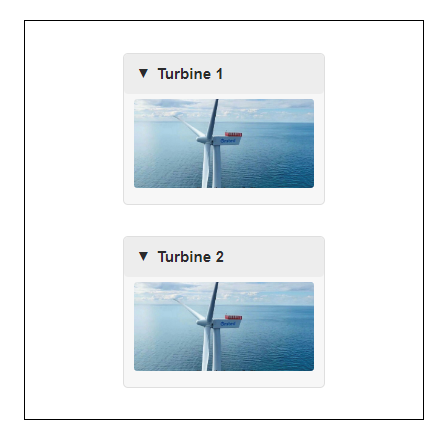

# Align Content

In this tutorial, we will explore alignment and spacing options for content:

- `align`: We can align content `'start'`, `'center'`, or `'end'` inside a container.
- `margin`: To fine-tune alignment by a few *pixels* or add space between content.
- `Spacer`: Utilize `Spacer`s to align or add space between content.

## Align a Button

Let's run the code below to see how we can horizontally center-align the `Button`.

```{pyodide}
import panel as pn

pn.extension(design="fast")

pn.Column(
    pn.pane.PNG("https://assets.holoviz.org/panel/tutorials/wind_turbine.png", height=150, sizing_mode="scale_width"),
    pn.widgets.Button(name="Stop the Turbine", icon="hand-stop", align="center"),
    sizing_mode="fixed", width=400, height=400, styles={"border": "1px solid black"}
).servable()
```

We will now align the `Button` *center* horizontally.

## Aligning Techniques

:::::{tab-set}

::::{tab-item} `align`
:sync: align

```{pyodide}
import panel as pn

pn.extension(design="fast")

pn.Column(
    pn.pane.PNG("https://assets.holoviz.org/panel/tutorials/wind_turbine.png", height=150, sizing_mode="scale_width"),
    pn.widgets.Button(name="Stop the Turbine", icon="hand-stop", align="center"),
    sizing_mode="fixed", width=400, height=400, styles={"border": "1px solid black"}
).servable()
```

:::{note}
The `align` value can take a single value or a 2-tuple (horizontal, vertical).
:::

::::

::::{tab-item} `Spacer`
:sync: spacer

```{pyodide}
import panel as pn

pn.extension(design=" fast")

pn.Column(
    pn.pane.PNG("https://assets.holoviz.org/panel/tutorials/wind_turbine.png", height=150, sizing_mode="scale_width"),
    pn.Row(pn.Spacer(sizing_mode="stretch_width"), pn.widgets.Button(name="Stop the Turbine", icon="hand-stop"), pn.Spacer(sizing_mode="stretch_width")),
    sizing_mode="fixed", width=400, height=400, styles={"border": "1px solid black", "border-radius": "5px"}
).servable()
```

::::

::::{tab-item} `margin`
:sync: margin

```{pyodide}
import panel as pn

pn.extension(design="fast")

margin = int((400-147)/2) # The Button is 147 pixels wide

pn.Column(
    pn.pane.PNG("https://assets.holoviz.org/panel/tutorials/wind_turbine.png", height=150, sizing_mode="scale_width"),
    pn.widgets.Button(name="Stop the Turbine", icon="hand-stop", margin=(5,margin)),
    sizing_mode="fixed", width=400, height=400, styles={"border": "1px solid black"}
).servable()
```

:::{note}
The `margin` value can take a single value, a 2-tuple (top/bottom, left/right), or a 4-tuple (top, right, bottom, left).
:::

::::

:::::

## Exercise: Align Cards

Let's align each of the two *cards* in the center of their respective *vertical halves*.

```{pyodide}
import panel as pn

pn.extension()

image = pn.pane.PNG("https://assets.holoviz.org/panel/tutorials/wind_turbine.png", height=150, sizing_mode="scale_width")

card1 = pn.Card(image, title='Turbine 1', width=200)
card2 = pn.Card(image, title='Turbine 2', width=200)

pn.Column(
    card1, card2,
    sizing_mode="fixed", width=400, height=400, styles={"border": "1px solid black"}
).servable()
```

There can be many code solutions, but the solution should look like this:



:::{dropdown} Solutions

::::{tab-set}

:::{tab-item} `align` + `Spacer`
:sync: solution-align-spacer

```{pyodide}
import panel as pn

pn.extension()

image = pn.pane.PNG("https://assets.holoviz.org/panel/tutorials/wind_turbine.png", sizing_mode="scale_both")

card1 = pn.Card(image, title='Turbine 1', height=150, width=200, align="center")
card2 = pn.Card(image, title='Turbine 2', height=150, width=200, align="center")
spacer = pn.Spacer(height=33)

pn.Column(
    spacer, card1, spacer, card2,
    sizing_mode="fixed", width=400, height=400, styles={"border": "1px solid black"}
).servable()
```

:::

:::{tab-item} `align` + `margin`
:sync: solution-align-margin

```{pyodide}
import panel as pn

pn.extension()

image = pn.pane.PNG("https://assets.holoviz.org/panel/tutorials/wind_turbine.png", sizing_mode="scale_both")

card1 = pn.Card(image, title='Turbine 1', height=150, width=200, align="center", margin=(33,0,17,0))
card2 = pn.Card(image, title='Turbine 2', height=150, width=200, align="center", margin=(16,0,33,0))

pn.Column(
    card1, card2,
    sizing_mode="fixed", width=400, height=400, styles={"border": "1px solid black"}
).servable()
```

:::

::::

## Recap

In this tutorial, we have explored alignment and spacing options for content:

- `align`: Align content `'start'`, `'center'`, or `'end'` inside a container.
- `margin`: Use `margin` to fine-tune alignment by a few *pixels* or add space between content.
- `Spacer`: Utilize `Spacer`s to align or add space between content.

## References

### How-to

- [Align Components](../../how_to/layout/align.md)

### Explanation

- [`align`](https://holoviz-dev.github.io/panel/explanation/components/components_overview.html#align)
