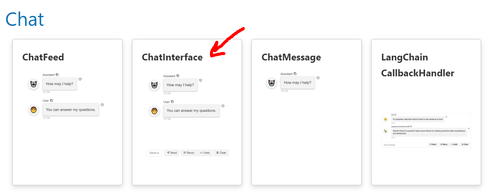

# Build a Chat Bot

In this tutorial, we will build a streaming *chat bot*. We will first use the *high-level* [`ChatInterface`](../../reference/chat/ChatInterface.ipynb) to build a basic chat bot. Then we will add streaming.

:::{note}
When we ask to *run the code* in the sections below, we may either execute the code directly in the Panel docs via the green *run* button, in a cell in a notebook, or in a file `app.py` that is served with `panel serve app.py --autoreload`.
:::

## Build a Basic Chat Bot

Run the code below:

```{pyodide}
import panel as pn
from time import sleep

pn.extension()

def get_response(contents, user, instance):
    if "turbine" in contents.lower():
        response = "A wind turbine converts wind energy into electricity."
    else:
        response = "Sorry, I don't know."
    sleep(1)
    return response

chat_bot = pn.chat.ChatInterface(callback=get_response, max_height=500)
chat_bot.send("Ask me what a wind turbine is", user="Assistant", respond=False)
chat_bot.servable()
```

Try entering `What is a wind turbine?` in the *text input* and click *Send*.

:::{hint}
The `callback` function `get_response` will receive `"What is a wind turbine?"` in the `contents` argument. Since `contents` contains the word *turbine*, the chat bot will return `"A wind turbine converts wind energy into electricity."` as the `response`.
:::

## Add Streaming

We will now make the chat bot *stream* its response just like ChatGPT does.

Run the code below:

```{pyodide}
import panel as pn
from time import sleep

pn.extension()

def get_response(contents, user, instance):
    if "turbine" in contents.lower():
        response = "A wind turbine converts wind energy into electricity."
    else:
        response = "Sorry, I don't know."
    for index in range(len(response)):
        yield response[0:index+1]
        sleep(0.03)

chat_bot = pn.chat.ChatInterface(callback=get_response, max_height=500)
chat_bot.send("Ask me anything!", user="Assistant", respond=False)
chat_bot.servable()
```

Try entering `What is a wind turbine?` in the *text input* and click *Send*.

:::{note}
The chat app is now *streaming* because we `yield` the partial `response` instead of `return`ing the full `response`.
:::

:::{note}
To make the Streaming Chat Bot scale to many users you should be using `async`. You will learn more about scaling applications and `async` in the [Intermediate Tutorials](../intermediate/index.md).
:::

## Learn More

We can learn more about the `ChatInterface` via its [*reference guide*](../../reference/chat/ChatInterface.html). We find the *reference guide* in the [Chat Section](/reference/index.html#chat) of the [Component Gallery](../../reference/index.md).

[](/reference/index.html#chat)

## Find Inspiration

We can find more inspiration and starter templates at [Panel-Chat-Examples](https://holoviz-topics.github.io/panel-chat-examples/).

:::{image} ../../_static/images/panel-chat-examples.png
:height: 300px
:target: https://holoviz-topics.github.io/panel-chat-examples/
:::

## Recap

In this section, we have

- used the *easy to use*, *high-level* [`ChatInterface`](../../reference/chat/ChatInterface.ipynb) to build a chat bot.

## Resources

- [Chat Component Gallery](/reference/index.html#chat)
- [Panel-Chat-Examples](https://holoviz-topics.github.io/panel-chat-examples/)
