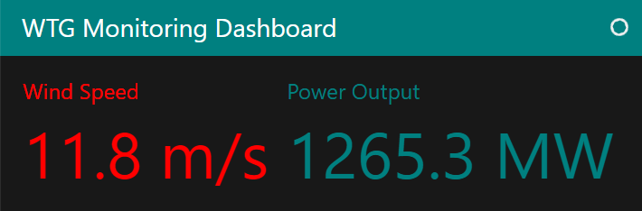

# Build Monitoring Dashboard

In this tutorial, we will build a basic monitoring dashboard that *refreshes* the entire page periodically. We will be using `pn.panel`, the [`DeckGL`](../../reference/panes/DeckGL.ipynb) *pane*, and the [`Number`](../../reference/indicators/Number.ipynb) *indicator*.

## Install the Dependencies

Please make sure [SciPy](https://scipy.org/) is installed.

::::{tab-set}

:::{tab-item} conda
:sync: conda

``` bash
conda install -y -c conda-forge scipy
```

:::

:::{tab-item} pip
:sync: pip

``` bash
pip install scipy
```

:::

::::

## Build the App

Copy the code below to a file named `app.py`:

```python
import numpy as np
import panel as pn
from scipy.interpolate import interp1d

pn.extension("deckgl")

TEXT = """
# Hornsea Two

Hornsea Two is located  89km off the Yorkshire coast, adjacent to sister project Hornsea 1. \
The 1.3GW project comprises 165 wind turbines which will help power over 1.4 million \
UK homes with low-cost renewable energy.
"""

ACCENT="teal"
MAPBOX_KEY = "pk.eyJ1IjoicGFuZWxvcmciLCJhIjoiY2s1enA3ejhyMWhmZjNobjM1NXhtbWRrMyJ9.B_frQsAVepGIe-HiOJeqvQ"

WIND_SPEED_STD_DEV = 2.0
WIND_SPEED_MEAN = 8.0

WIND_SPEEDS = np.array([0, 3, 6, 9, 12, 15, 18, 21])  # Wind speed (m/s)
POWER_OUTPUTS = np.array([0,39,260,780, 1300, 1300, 0, 0])  # Power output (MW)

# Extract Data

def get_wind_speed():
    # Replace with your own wind speed source
    return round(np.random.normal(WIND_SPEED_MEAN, WIND_SPEED_STD_DEV), 1)

wind_speed = get_wind_speed()

# Transform Data

def get_power_output(wind_speed):
    # Replace with your own power output calculation
    power_interpolation = interp1d(
        WIND_SPEEDS, POWER_OUTPUTS, kind="linear", fill_value="extrapolate"
    )
    return np.round(power_interpolation(wind_speed), 1)

power_output = get_power_output(wind_speed)

## View Data

wind_speed_view = pn.indicators.Number(
    name="Wind Speed",
    value=wind_speed,
    format="{value} m/s",
    colors=[(10, ACCENT), (100, "red")],
)
power_output_view = pn.indicators.Number(
    name="Power Output",
    value=power_output,
    format="{value} MW",
    colors=[
        (power_output, ACCENT),
        (max(POWER_OUTPUTS), "red"),
    ],
)

LATITUDE = 53.918333
LONGITUDE = 1.560000
deck = {
    "initialViewState": {
        "bearing": -27.36,
        "latitude": LATITUDE,
        "longitude": LONGITUDE,
        "pitch": 40.5,
        "zoom": 8,
    },
    "layers": [
        {
            "@@type": "HexagonLayer",
            "data": [{"lat": LATITUDE-0.05, "lon": LONGITUDE, "title": "HornSea Two"}],
            "getPosition": "@@=[lon, lat]",
        }
    ],
    "mapStyle": "mapbox://styles/mapbox/dark-v9",
    "views": [{"@@type": "MapView", "controller": True}],
}
map = pn.pane.DeckGL(
    deck, mapbox_api_key=MAPBOX_KEY, sizing_mode="stretch_width", height=600
)

## Layout and style with a template

pn.template.FastListTemplate(
    title="WTG Monitoring Dashboard",
    main=[
        TEXT,
        pn.Row(wind_speed_view, power_output_view),
        map,
    ],
    accent=ACCENT,
    main_layout=None,
    theme="dark",
    theme_toggle=False,
    meta_refresh="10", # Automatically refresh every 10 seconds
).servable(); # The ; is only needed if used in a notebook
```

Serve the `app.py` file with

```bash
panel serve app.py --autoreload
```

Open [http://localhost:5006/app](http://localhost:5006/app)

It should look like



You will notice it automatically refreshes every 10 seconds.

Try changing `meta_refresh="10"` to `meta_refresh="5"`. What happens?

## Break it down

We display the *wind speed* with a [`Number`](../../reference/indicators/Number.ipynb) *indicator*

```python
wind_speed_view = pn.indicators.Number(
    name="Wind Speed",
    value=wind_speed,
    format="{value} m/s",
    colors=[(10, ACCENT), (100, "red")],
)
```

The *map* is displayed with a [`DeckGL`](../../reference/panes/DeckGL.ipynb) *pane*

```python
map = pn.pane.DeckGL(
    deck, mapbox_api_key=MAPBOX_KEY, sizing_mode="stretch_width", height=600
)
```

We remember to import the DeckGL JavaScript dependencies via

```python
pn.extension("deckgl")
```

The `TEXT` is displayed in a [`Markdown`](../../reference/panes/Markdown.ipynb) *pane* implicitly picked by `pn.panel`.

Finally, we use the [`FastListTemplate`](../../reference/templates/FastListTemplate.ipynb) to easily layout and style the dashboard. We will learn more about *templates* in the [Use Templates](templates.md) tutorial.

Here we use the `meta_refresh` argument to instruct the browser to automatically refresh the page every 10 seconds.

```python
    meta_refresh="10",
```

:::{note}
Using the `meta_refresh` argument can be a really robust way to build a *display-only* dashboard for a control room or similar.
:::

## Recap

In this tutorial, we have built a basic monitoring dashboard that *refreshes* the entire page periodically. We have used  `pn.panel`, the [`DeckGL`](../../reference/panes/DeckGL.ipynb) *pane*, and the [`Number`](../../reference/indicators/Number.ipynb) *indicator*.

We used the `meta_refresh` argument of the [FastListTemplate](../../reference/templates/FastListTemplate.ipynb) to automatically *refresh* the dashboard periodically.

## Resources

- [FastListTemplate](../../reference/templates/FastListTemplate.ipynb)
