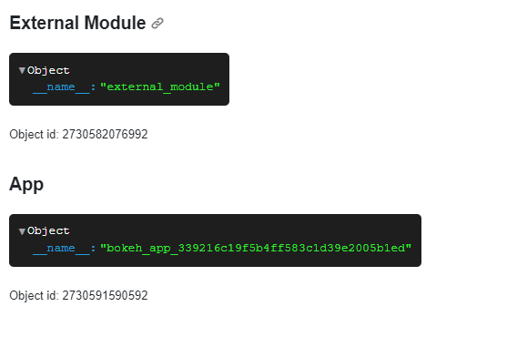
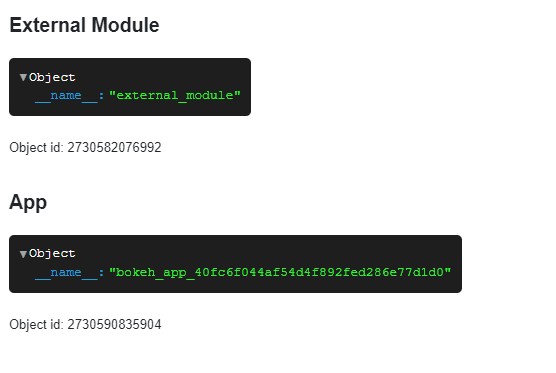

# Add Caching

Caching allows us to store and reuse valuable computations, reducing the energy required for calculations and making our apps run faster and smoother:

- Use the `@pn.cache` annotator to *cache* function results.

:::{note}
When we ask to *run the code* in the sections below, we may execute the code directly in the Panel docs via the green *run* button, in a cell in a notebook, or in a file `app.py` that is served with `panel serve app.py --autoreload`.
:::

## Understand the Load

To understand why caching can be helpful and how to apply it, its important to understand how a Panel application executes code.

Create a file `external_module.py` containing the code below:

```{python}
print("running external_module.py")

# I'm defined once and shared between all sessions (i.e. between all users)
external_data={"__name__": __name__}
```

Create a file `app.py` containing the code below

```{python}
import panel as pn

from external_module import external_data

pn.extension()

print("running app.py")

# I'm defined when the servers starts and
# I'm defined each time the app loads and only shared within that session
data = {"__name__": __name__}

pn.Column(
    "## External Module", external_data, f"Object id: {id(external_data)}",
    "## App", data, f"Object id: {id(data)}",
).servable()
```

Run

```bash
panel serve app.py
```

It should look like

```bash
$ panel serve app.py --autoreload
running external_module.py
running app.py
2024-02-05 07:35:52,083 Starting Bokeh server version 3.3.3 (running on Tornado 6.4)
2024-02-05 07:35:52,085 User authentication hooks NOT provided (default user enabled)
2024-02-05 07:35:52,087 Bokeh app running at: http://localhost:5006/app
2024-02-05 07:35:52,087 Starting Bokeh server with process id: 35656
```

Now open [http://localhost:5006/app](http://localhost:5006/app)

In the terminal you will find the additional lines

```bash
running app.py
2024-02-05 07:37:50,024 WebSocket connection opened
2024-02-05 07:37:50,025 ServerConnection created
```

And the app will look like



Refresh [http://localhost:5006/app](http://localhost:5006/app).

In the terminal you will find the additional lines

```bash
running app.py
2024-02-05 07:38:53,340 WebSocket connection closed: code=1001, reason=None
2024-02-05 07:38:53,449 WebSocket connection opened
2024-02-05 07:38:53,450 ServerConnection created
```

The app will look like



Please note how the `__name__` and `id` did not change for the imported *Module* while it did for the served *App* file.

:::{note}
Please note

- imported modules are run once when the server starts only.
  - Objects defined in imported modules are shared between all *sessions*
- your served app code is run once when the server starts and every time a user loads the app.
  - Objects defined here are shared within the single *session* only (unless they are cached).
- only *specific, bound functions* are rerun on user interactions. Not the entire `app.py` script.
:::

## Load Fast with Caching

Run the code below

```{pyodide}
from datetime import datetime
from time import sleep

import panel as pn

pn.extension()


def get_data():
    print("loading data ...")
    sleep(2)
    return {"last_update": str(datetime.now())}


data = get_data()

pn.pane.JSON(data).servable()
```

Try refreshing the browser a few times.

Notice that it takes +2 seconds for the application to load and the timestamp is updated every time the app is reloaded.

### Exercise: Apply Caching

Now let's add caching to the `get_data` function by *annotating* it with `@pn.cache`.

Notice in the terminal that the `data` is loaded once when the server starts.

Try loading and refreshing the app several times. It's nice, right?

:::::{dropdown} Solution

::::{tab-set}

:::{tab-item} Annotation
:sync: annotation

```{pyodide}
from datetime import datetime
from time import sleep

import panel as pn

pn.extension()

@pn.cache
def get_data():
    print("loading data ...")
    sleep(2)
    return {"last_update": str(datetime.now())}


data = get_data()

pn.pane.JSON(data).servable()
```

:::

:::{tab-item} Function
:sync: function

If the `get_data` function is externally given, you can use `pn.cache` as a function instead.

```{pyodide}
from datetime import datetime
from time import sleep

import panel as pn

pn.extension()

def get_data():
    print("loading data ...")
    sleep(2)
    return {"last_update": str(datetime.now())}

get_data = pn.cache(get_data)

data = get_data()

pn.pane.JSON(data).servable()
```

:::

::::

:::::

## Reuse Function Results

Run the code below

```{pyodide}
from time import sleep

import panel as pn

pn.extension()

@pn.cache
def algo(value):
    print(f"calculating {value}")
    sleep(1)
    return value

slider = pn.widgets.IntSlider(name="Value", value=2, start=0, end=10)
pn.Column(
    slider, pn.bind(algo, slider)
).servable()
```

Try dragging the slider. Notice how the app is initially responding slowly but as the cache is *populated* it starts responding instantly.

:::{hint}
You can learn to fine-tune `pn.cache` in the [Automatically Cache](../../how_to/caching/memoization.md) guide.
:::

## Recap

We have been speeding up our apps using caching.

- Use the `@pn.cache` annotator to *cache* function results.

## Resources

### How-to

- [Automatically Cache](../../how_to/caching/memoization.md)
- [Manually Cache](../../how_to/caching/manual.md)
- [Migrate from Streamlit | Add Caching](../../how_to/streamlit_migration/caching.md)
