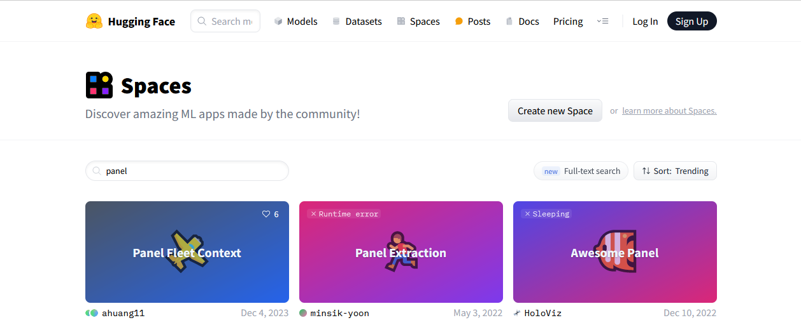
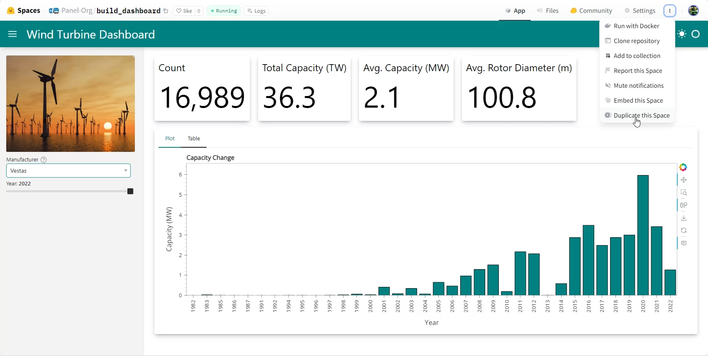
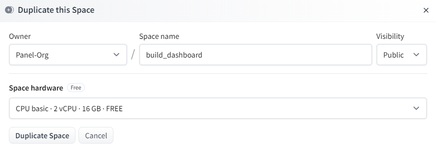
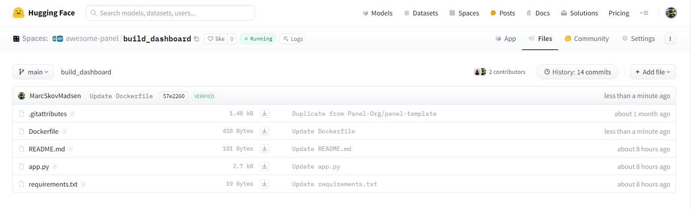
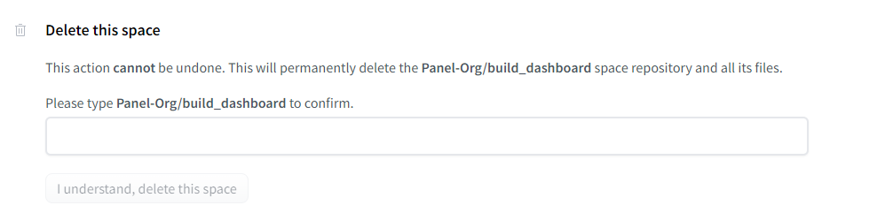

# Deploy an App

Lets get your dashboard in the hands of your users. Lets deploy it to [Hugging Face Spaces](https://huggingface.co/spaces?sort=trending&search=panel).

## Prerequisites

We will assume you have *signed up* for [Hugging Face](hc) and your user is logged in. If not click the `Sign Up` button at [Hugging Face](https://huggingface.co/spaces?sort=trending&search=panel) and follow the instructions.

[](https://huggingface.co/spaces?sort=trending&search=panel)

## Clone the Project

Open [panel-Org/build_dashboard](https://huggingface.co/spaces/panel-Org/build_dashboard).

Click the three vertical dots and then click *Duplicate this Space*.

[](https://huggingface.co/spaces/panel-Org/build_dashboard)

A new form will open. Change the *Visibility* to *Public* if you want to share it with the world.



Then click *Duplicate Space*.

Hugging Face will now *build* your image. It should take less than a minute.

You should now have your own copy of the dashboard running.

## Check the Files

Lets check the files tab

[](https://huggingface.co/spaces/Panel-Org/build_dashboard/tree/main)

The *Files Tab* makes it really easy to update your project.

- `+ Add File`: Click `+ Add File` to add or update files via *drag and drop*.
- *File*: Click any file and then *edit* to edit it. Remember to *Commit changes* when you are done.

### Check the Dockerfile

Click the `Dockerfile`. It should look like

```bash
FROM python:3.11

WORKDIR /code

COPY ./requirements.txt /code/requirements.txt
RUN python3 -m pip install --no-cache-dir --upgrade pip
RUN python3 -m pip install --no-cache-dir --upgrade -r /code/requirements.txt

COPY . .

CMD ["panel", "serve", "/code/app.py", "--address", "0.0.0.0", "--port", "7860",  "--allow-websocket-origin", "*", "--num-procs", "2", "--num-threads", "0", "--index", "app"]

RUN mkdir /.cache
RUN chmod 777 /.cache
```

:::{note}
The lines in the `Dockerfile` refer to

- `FROM python:3.11`: Start from a Python 3.11 *image*
- `WORKDIR /code`: Run commands below from the `/code` folder
- `pip install ...`: Install the requirements
- `COPY . .`: Copy the repository files to the current `WORKDIR`
- `CMD [...]`: Run the following command when the *Docker container* starts.
- `"--address", "0.0.0.0", "--port", "7860"`: Serve the app at `http://0.0.0.0:7860/app`
- `"--allow-websocket-origin", "*"`: Respond to requests from any domain including `huggingface.co`.
- `"--num-procs", "2"`: Start 2 server processes to respond to users in parallel.
- `"--num-threads", "0"`: Use *threading* to execute *callbacks* and *bound* functions *concurrently*.
- `"--index", "app"`: Also serve the app at `http://0.0.0.0:7860`
:::

## Delete Your Space

If your dashboard is not intended for real usage please delete it again to save the worlds resources.

Open the *Settings* tab. Navigate to the bottom of the page. Follow the instructions to *Delete this space*.



## 🥳 Congrats: You are a Hero

You have now acquired the *basic* skills required to build a wide range of Panel apps. You are now a *Panel Hero*.

The recommended next steps are to check out the the *basic apps* on the [*Basic Tutorials*](index.md) page, check out the *basic Topics* on the [*Basic Tutorials*](index.md) page and start using Panel for real.

When you are ready to acquire the skills to build larger and more complex apps, then check out the [Intermediate Tutorials](../intermediate/index.md).

## References

### How-to

- [Configure the Server](../../how_to/server/index.md)
- [Deploy Panel Applications](../../how_to/deployment/index.md)
- [Enable Automatic Threading](../../how_to/concurrency/threading.md)

### Hugging Face Spaces

- [Andrew Huang](https://huggingface.co/ahuang11)
- [Awesome Panel](https://huggingface.co/awesome-panel)
- [Panel-Org](https://huggingface.co/Panel-Org)
- [Sophia Yang](https://huggingface.co/sophiamyang)
