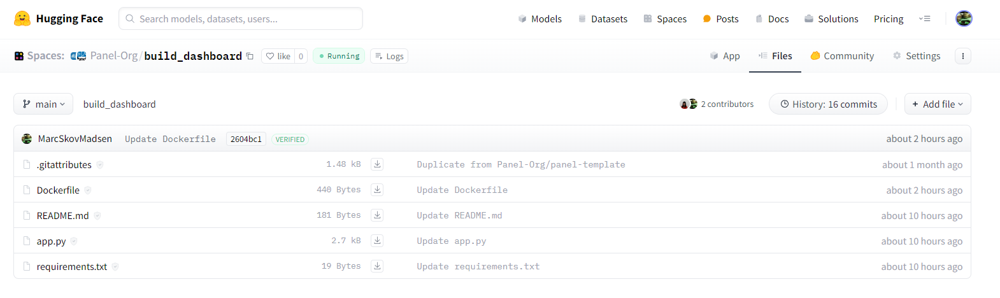

# Deploy a Dashboard

Let's take your dashboard to the next level and get it into the hands of your users. We'll deploy it to [Hugging Face Spaces](https://huggingface.co/spaces?sort=trending&search=panel) to make it easily accessible.

## Prerequisites

Before we begin, ensure that you've signed up for [Hugging Face](https://huggingface.co/) and logged into your account. If not, simply click the "Sign Up" button on the [Hugging Face](https://huggingface.co/spaces?sort=trending&search=panel) page and follow the instructions to create your account.

[](https://huggingface.co/spaces?sort=trending&search=panel)

## Clone the Project

First things first, let's clone the project:

1. Open [panel-Org/build_dashboard](https://huggingface.co/spaces/panel-Org/build_dashboard).
2. Click the three vertical dots, then select "Duplicate this Space".

[](https://huggingface.co/spaces/panel-Org/build_dashboard)

A new form will pop up. Change the "Visibility" to "Public" if you want to share it with the world.


Now, click "Duplicate Space".

Hugging Face will now start building your image, which should take less than a minute.

Once done, you'll have your own copy of the dashboard running.

## Check the Files

Let's take a quick look at the files tab:

[](https://huggingface.co/spaces/Panel-Org/build_dashboard/tree/main)

The "Files Tab" makes it incredibly easy to update your project:

- **+ Add File**: Use this option to add or update files via drag and drop.
- **File**: Click on any file and then hit "Edit" to make changes. Remember to "Commit changes" when you're done.

### Check the Dockerfile

Take a look at the `Dockerfile`. It should look something like this:

```bash
FROM python:3.11

WORKDIR /code

COPY ./requirements.txt /code/requirements.txt
RUN python3 -m pip install --no-cache-dir --upgrade pip
RUN python3 -m pip install --no-cache-dir --upgrade -r /code/requirements.txt

COPY . .

CMD ["panel", "serve", "/code/app.py", "--address", "0.0.0.0", "--port", "7860",  "--allow-websocket-origin", "*", "--num-procs", "2", "--num-threads", "0", "--index", "app"]

RUN mkdir /.cache
RUN chmod 777 /.cache
```

:::{note}
Here's a breakdown of the `Dockerfile`:

- `FROM python:3.11`: Starts from a Python 3.11 image.
- `WORKDIR /code`: Executes commands from the `/code` folder.
- `pip install ...`: Installs the requirements.
- `COPY . .`: Copies the repository files to the current `WORKDIR`.
- `CMD [...]`: Runs the specified command when the Docker container starts.
- `"--address", "0.0.0.0", "--port", "7860"`: Serves the app at `http://0.0.0.0:7860/app`.
- `"--allow-websocket-origin", "*"`: Allows requests from any domain, including `huggingface.co`.
- `"--num-procs", "2"`: Starts 2 server processes to handle users in parallel.
- `"--num-threads", "0"`: Uses threading to execute callbacks and bound functions concurrently.
- `"--index", "app"`: Also serves the app at `http://0.0.0.0:7860`.
:::

## Delete Your Space

If your dashboard isn't intended for real usage, please consider deleting it to conserve resources.

Navigate to the "Settings" tab, scroll to the bottom of the page, and follow the instructions to "Delete this space".


## 🥳 Congrats: You're a Hero!

You've now acquired the basic skills required to build a wide range of Panel apps. You are now a "Panel Hero"!

Feel free to use the badge below on your blog, repository, or apps to showcase your achievement.


```markdown

```

## Next Steps

The next recommended steps are to explore the basic apps on the [Basic Tutorials](index.md) page and start utilizing Panel for real projects.

When you're ready to tackle larger and more complex apps, dive into the [Intermediate Tutorials](../intermediate/index.md).

## References

### How-to

- [Configure the Server](../../how_to/server/index.md)
- [Deploy Panel Applications](../../how_to/deployment/index.md)
- [Enable Automatic Threading](../../how_to/concurrency/threading.md)

### Hugging Face Spaces

- [Andrew Huang](https://huggingface.co/ahuang11)
- [Awesome Panel](https://huggingface.co/awesome-panel)
- [Panel-Org](https://huggingface.co/Panel-Org)
- [Sophia Yang](https://huggingface.co/sophiamyang)
