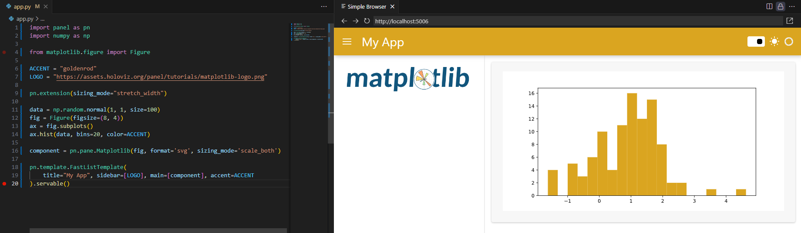

# Develop in an Editor

Welcome to the "Develop in an Editor" section! Here, we'll explore how to develop Panel apps efficiently right within your favorite editor.

Let's dive in!

## Serve Your App with Autoreload

First things first, let's ensure we have all the necessary dependencies installed. You can do this easily via `pip` or `conda`:

::::{tab-set}

:::{tab-item} pip
:sync: pip

```bash
pip install matplotlib numpy panel
```

:::

:::{tab-item} conda
:sync: conda

```bash
conda install -y -c conda-forge matplotlib numpy panel
```

:::

::::

Now that we have our dependencies sorted, let's serve our app with autoreload. Autoreload ensures that your app updates in real-time as you make changes, providing a smooth development experience.

### Serving Your App

Imagine you have a simple Panel app like the following:

```python
import panel as pn
import numpy as np

from matplotlib.figure import Figure

ACCENT = "goldenrod"
LOGO = "https://assets.holoviz.org/panel/tutorials/matplotlib-logo.png"

pn.extension(sizing_mode="stretch_width")

data = np.random.normal(1, 1, size=100)
fig = Figure(figsize=(8, 4))
ax = fig.subplots()
ax.hist(data, bins=20, color=ACCENT)

component = pn.pane.Matplotlib(fig, format='svg', sizing_mode='scale_both')

pn.template.FastListTemplate(
    title="My App", sidebar=[LOGO], main=[component], accent=ACCENT
).servable()
```

Copy this code into a file named `app.py` and save it.

Now, open a terminal and run the following command:

```bash
panel serve app.py --autoreload
```

This will start the server and provide you with a URL where your app is being served. Open this URL in your browser to see your app in action.

It should look like



Now change the

- `ACCENT` value to `teal` and save the `app.py` file.
- `bins` value to `15` and save.
- `title` value to `"My Matplotlib App"` and save.

It should look like

<video controls="" poster="../../_static/images/develop_editor_panel_serve_after.png">
    <source src="https://assets.holoviz.org/panel/tutorials/develop_editor_serve_app.mp4" type="video/mp4" style="max-height: 400px; max-width: 100%;">
    Your browser does not support the video tag.
</video>

## Inspect via Hover

One of the benefits of developing in an editor is the ability to inspect Panel objects conveniently via hover. Simply hover over the object you want to inspect, and you'll see tooltips providing useful information and links to reference guides.

Let's say you want to inspect the `FastListTemplate` object in your code. Hover over it, and you'll see a tooltip with an example code snippet and a reference link. Clicking the reference link takes you directly to the reference guide for further information.


## Inspect via `print`

Another handy way to inspect objects is by printing them. This allows you to see detailed information about the object's structure and contents.

Consider the following code snippet:

```python
import panel as pn

pn.extension(design="material")

component = pn.panel("Hello World")
layout = pn.Column(
    component, pn.widgets.IntSlider(value=2, start=0, end=10, name="Value")
)
print(layout)
layout.servable()
```

Serving this code will print information about the `component` object, revealing its structure and attributes.

Serve the app by running the below command in a terminal.

```bash
panel serve app.py --autoreload
```

Open [http://localhost:5006/app](http://localhost:5006/app) in a browser.

This will look something like the below in the terminal.

```bash
2024-02-22 20:39:50,405 Starting Bokeh server version 3.3.3 (running on Tornado 6.4)
2024-02-22 20:39:50,406 User authentication hooks NOT provided (default user enabled)
2024-02-22 20:39:50,413 Bokeh app running at: http://localhost:5006/app
2024-02-22 20:39:50,413 Starting Bokeh server with process id: 38480
Column(design=<class 'panel.theme.materi...)
    [0] Markdown(str, design=<class 'panel.theme.materi...)
    [1] IntSlider(design=<class 'panel.theme.materi..., end=10, name='Value', value=2)
2024-02-22 20:39:52,712 WebSocket connection opened
2024-02-22 20:39:52,713 ServerConnection created
```

## Inspect Parameters via `.param`

You can inspect the parameters of Panel components using the `.param` namespace and its `_repr_html_` method.

Copy the code below into a file `app.py`:

```python
import panel as pn

pn.extension(design="material")

component = pn.panel("Hello World")

pn.Row(
    component.param, pn.pane.HTML(component.param._repr_html_())
).servable()
```

Serve the app with `panel serve app.py --autoreload`.

Open [http://localhost:5006](http://localhost:5006) in a browser.

It should look like


## Recap

In this section, we've covered:

- Serving your app with autoreload for seamless development.
- Inspecting Panel objects conveniently via hover and `print`.
- Exploring component parameters using `.param`.

With these techniques, you can streamline your development workflow and build awesome Panel apps more efficiently!

## Resources

For more advanced techniques and configuration options, check out the resources below:

### Tutorials

- [Develop in an Editor (Intermediate)](../intermediate/develop_editor.md)

### How-to

- [Configure VS Code](../../how_to/editor/vscode_configure.md)
- [Write Apps in Markdown](../../how_to/editor/markdown.md)

Happy coding! 🚀
