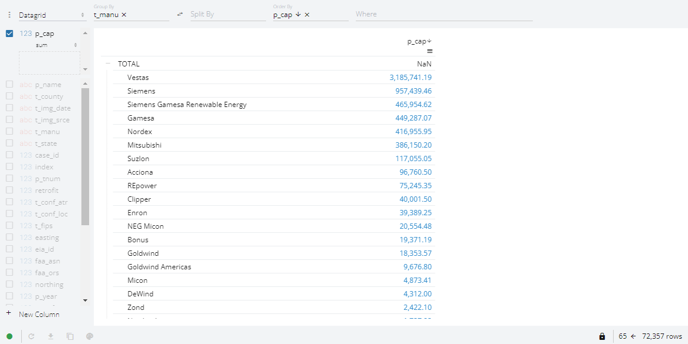
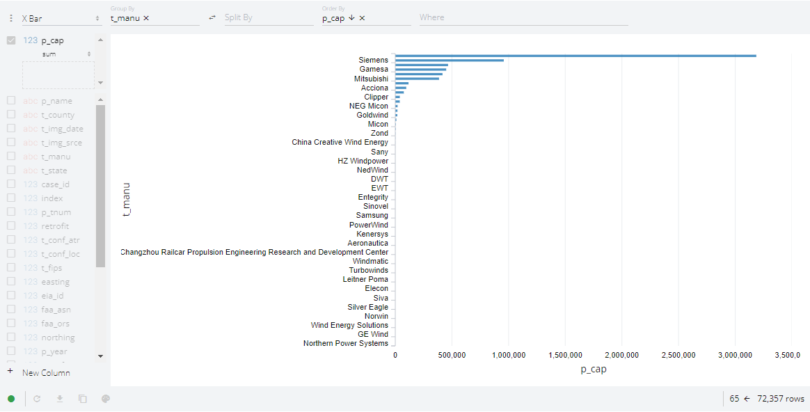

# Explore the Data

In this tutorial, we will

- understand how the global mean surface temperature has risen from 1945 to 2015 using the [Swipe](../../reference/layouts/Swipe.ipynb) *layout*.
- slice and dice the wind `turbines` dataset using the [Perspective](../../reference/panes/Perspective.ipynb) *pane*
- understand how manufacturer capacity has developed since the 80's by constructing a *bar chart race*. We will use the [Vega](../../reference/panes/Vega.ipynb) (Altair) *pane*, the [`Player`](../../reference/widgets/Player.ipynb) *widget* and `pn.bind` to do this.

This will barely scratch the surface of what Panel has to offer for an exploratory data analysis (EDA) workflow. That is why we say *Panel is **the powerful data exploration** and web app **framework***.

:::{note}
When we ask to *run the code* in the sections below, we may either execute the code directly in the Panel docs via the green *run* button, in a cell in a notebook, or in a file `app.py` that is served with `panel serve app.py --autoreload`.
:::

```{pyodide}
import panel as pn

pn.extension("perspective", "vega")
```

## Install the dependencies

Please make sure [Altair](https://altair-viz.github.io/) is installed.

::::{tab-set}

:::{tab-item} conda
:sync: conda

``` bash
conda install -y -c conda-forge altair
```

:::

:::{tab-item} pip
:sync: pip

``` bash
pip install altair
```

:::

::::

## Compare Temperatures with Swipe

Let's understand why we need renewable energy and wind turbines by comparing the global mean surface temperatures of the periods 1945-49 and 2015-2019.

Run the code below:

```{pyodide}
import panel as pn

pn.extension()

gis_1945 = 'https://earthobservatory.nasa.gov/ContentWOC/images/globaltemp/global_gis_1945-1949.png'
gis_2015 = 'https://earthobservatory.nasa.gov/ContentWOC/images/globaltemp/global_gis_2015-2019.png'

pn.Swipe(gis_1945, gis_2015).servable()
```

Try dragging the *slider* to compare the periods.

:::{note}
The `Swipe` widget uniquely supports comparing any content that Panel can display. For example two Matplotlib `Figure`s.
:::

## Slice and dice with Perspective

Throughout these tutorials, we will be using the wind `turbines` dataset. Let us take a first look.

Run the code below.

```{pyodide}
import pandas as pd
import panel as pn

pn.extension("perspective")

df = pd.read_csv("https://assets.holoviz.org/panel/tutorials/turbines.csv.gz")

pn.pane.Perspective(df, sizing_mode="stretch_width", height=600).servable()
```

:::{note}
The code refers to

- `pn.extension("perspective")`: We instruct Panel to load the javascript dependencies of [Perspective](../../reference/panes/Perspective.ipynb) into the notebook or server app.
- `pn.pane.Perspective(df, sizing_mode="stretch_width", height=600)`: Display the dataframe `df` with the [Perspective](../../reference/panes/Perspective.ipynb) *pane*. Stretch the width as much as possible and use a `height` of 600 pixels. You will learn much more about this later.
:::

:::{note}
We can use the pivoting capabilities of [Perspective](../../reference/panes/Perspective.ipynb) to explore the data. We can *drag* columns and *drop* them into the `Group By`, `Split By`, `Order By`, and `Where` input areas. We can *CTRL drag* if a column must be used in multiple places.
:::

Find the Manufacturers (`t_manu`) with the highest installed capacity (`p_cap`):

- *Group By* `t_manu`
- *Display* and *Order By* `p_cap`

:::{dropdown} Solution: Capacity by Manufacturer Table

:::

Change the visualization from a `Datagrid` to an `X Bar` chart.

:::{dropdown} Solution: Capacity by Manufacturer Chart

:::

## Create a Bar Chart Race with the Player

Run the code below

Then press the *play* button.

It will take a little bit of time to `get_data` the first time the code is run.

You should see how the top 10 manufacturer capacity has developed since the beginning of the 80's via a *bar chart race*.

```{pyodide}
import altair as alt
import pandas as pd
import panel as pn

pn.extension("vega")

BY = "t_manu"  # t_state, t_county or t_manu
VALUE = "p_cap"


@pn.cache()  # only download data once
def get_data():
    print("Downloading data ...")
    return pd.read_csv("https://assets.holoviz.org/panel/tutorials/turbines.csv.gz")


data = get_data()
min_year = int(data.p_year.min())
max_year = int(data.p_year.max())
max_group_value = data.groupby(BY)[VALUE].sum().max()


def get_group_sum(year):
    return (
        data[data.p_year <= year][[BY, VALUE]]
        .groupby(BY)
        .sum()
        .sort_values(by=VALUE, ascending=False)
        .reset_index()
        .head(10)
    )


def get_plot(year):
    data = get_group_sum(year)
    base = (
        alt.Chart(data)
        .encode(
            x=alt.X(VALUE, scale=alt.Scale(domain=[0, max_group_value])),
            y=alt.Y(f"{BY}:O", sort=[BY]),
            text=alt.Text(VALUE, format=",.0f"),
        )
        .properties(title=str(year), height=500, width="container")
    )
    return base.mark_bar() + base.mark_text(align="left", dx=2)


year = pn.widgets.Player(
    value=max_year,
    start=min_year,
    end=max_year,
    name="Year",
    loop_policy="loop",
    interval=300,
    align="center",
)
plot = pn.pane.Vega(pn.bind(get_plot, year))
pn.Column(plot, year, sizing_mode="stretch_width").servable()
```

:::{note}
It is not important to understand this example in detail right now.

What is import to note is that we use very little Panel code to create valuable data visualization that could not have been created with Altair alone.
:::

## Recap

In this tutorial we have used the

- [Swipe](../../reference/layouts/Swipe.ipynb) *layout* to understand how the global mean surface temperature has risen from 1945 to 2015
- [Perspective](../../reference/panes/Perspective.ipynb) *pane* to slice and dice the wind `turbines` dataset.
- [Vega](../../reference/panes/Vega.ipynb) (Altair) *pane*, the [`Player`](../../reference/widgets/Player.ipynb) *widget* and `pn.bind` to understand how manufacturer capacity has developed since the 80's via a *bar chart race*.

We have barely scratched the surface of how Panel can improve our exploratory data analysis (EDA) workflow. That is why we say *Panel is **the powerful data exploration** and web app **framework***.
