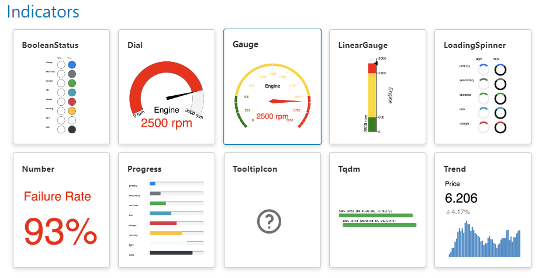

# Display Performance with Indicators

In this tutorial, we will be displaying the performance of our wind turbines using Panels *indicators*:

- Display the current performance using the [`Number`](../../reference/indicators/Number.ipynb) *indicator*.
- Display the trending performance using the [`Trend`](../../reference/indicators/Trend.ipynb) *indicator*
- Discover all *indicators* and their *reference guides* in the [Indicators Section](../../reference/index.md#indicators) of the [Component Gallery](../../reference/index.md).

:::{note}
When we ask to *run the code* in the sections below, we may either execute the code directly in the Panel docs via the green *run* button, in a cell in a notebook, or in a file `app.py` that is served with `panel serve app.py --autoreload`.
:::

## Display a Number

Run the code below

```{pyodide}
import panel as pn

pn.extension()

pn.indicators.Number(
    name="Wind Speed",
    value=8.6,
    format="{value} m/s",
    colors=[(10, "green"), (100, "red")],
).servable()
```

Try changing the `value` from `8.6` to `11.4`.

Notice that the color changes to *red*.

## Display a Trend

Run the code below

```{pyodide}
import panel as pn
import numpy as np

pn.extension()


def get_wind_speeds(n):
    # replace with your own wind speeds source
    return {"x": np.arange(n), "y": 8 + np.random.randn(n)}


pn.indicators.Trend(
    name="Wind Speed (m/s, hourly avg.)",
    data=get_wind_speeds(24),
    width=500,
    height=300,
).servable()
```

Try changing the `height` from `300` to `500`.

Spend a couple of minutes checking out the *reference guide* of the [`Trend`](../../reference/indicators/Trend.ipynb) *indicator*. It's *awesome*.

## Discover Indicators

Discover all *indicators* and their *reference guides* in the [Indicators Section](../../reference/index.md#indicators) of the [Component Gallery](../../reference/index.md).

[](../../reference/index.md#indicators)

## Recap

In this tutorial, we have been displaying the performance of our wind turbines using Panels *indicators*:

- Display the current performance using the [`Number`](../../reference/indicators/Number.ipynb) *indicator*.
- Display the trending performance using the [`Trend`](../../reference/indicators/Trend.ipynb) *indicator*
- Discover all *indicators* and their *reference guides* in the [Indicators Section](../../reference/index.md#indicators) of the [Component Gallery](../../reference/index.md).
