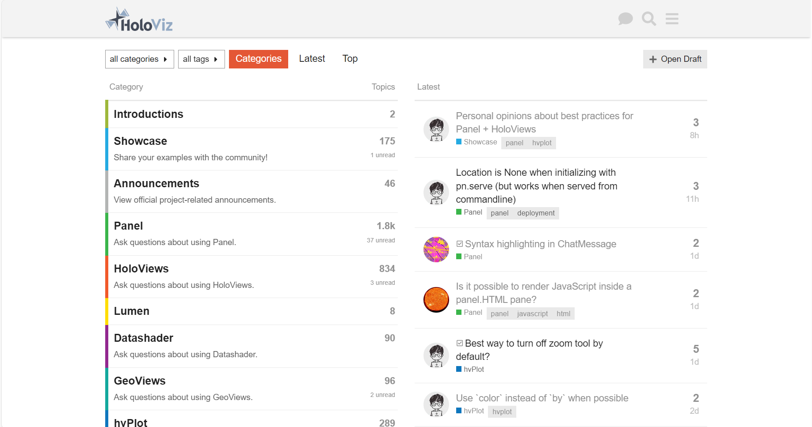

# Join the Community

Find inspiration in the community forums, ask for help, help others, share your work, report issues, add feature requests and contribute improvements.

## Prerequisites

I will assume you already have a Github account. If not please follow the official [Creating an account on Github](https://docs.github.com/en/get-started/quickstart/creating-an-account-on-github) guide.

## Detailed discussions on Discourse

:::{admonition} Note
[Discourse](https://discourse.holoviz.org/) is the place for detailed discussions around code. Here you can ask for help, find answers to other users questions and show case your work.

When asking questions please include a [Minimal, Reproducible Example](https://stackoverflow.com/help/minimal-reproducible-example) if at all possible. It will make it much, much easier to help you.
:::

Go to the [HoloViz Discourse](https://discourse.holoviz.org/) and sign up.

Click [this link](https://discourse.holoviz.org/t/welcome-please-introduce-yourself/3310/) to *introduce your self* to the community.

## Quick chats on Discord

:::{admonition} Note
[Discord](https://discord.gg/rb6gPXbdAr) is the place for quick and live discussions.
:::

Click [this link](https://discord.gg/rb6gPXbdAr) to sign up.

Then *introduce your self* in the `introduce-yourself` channel.

## Bugs, Features and Contributions on Github

:::{admonition} Note
You can report bugs, ask for new features and contribute improvements at [github.com/holoviz/panel](https://github.com/holoviz/panel).

Before reporting bugs or asking for new features please make sure they are not already in the *Issues* list.
:::

.

## Resources

- [Discord](https://discord.gg/rb6gPXbdAr)
- [Discourse](https://discourse.holoviz.org/)
- [Github](https://github.com/holoviz/panel)