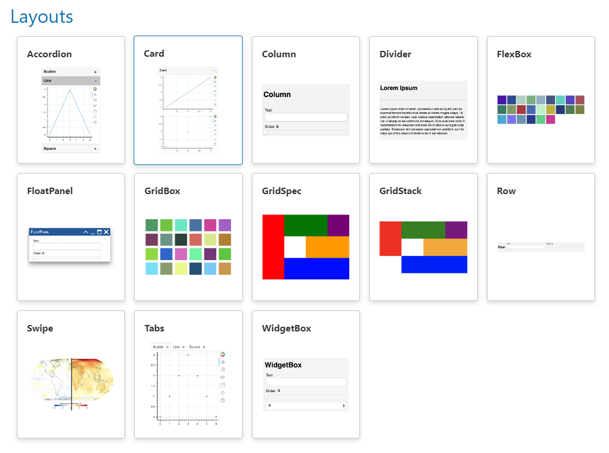

# Layout Content

In this guide, we will learn how to layout, i.e., arrange, Python objects, including Panel components:

- *Layouts* are available in the `pn` namespace.
- Arrange Python objects, including Panel components, using [`pn.Column`](../../reference/layouts/Column.ipynb) and [`pn.Row`](../../reference/layouts/Row.ipynb).
- Explore all available *layouts* and their *reference guides* in the [Layouts Section](https://panel.holoviz.org/reference/index.html#layouts) of the [Component Gallery](../../reference/index.md).

:::{note}
When we ask to *run the code* in the sections below, we may execute the code directly in the Panel documentation by using the green *run* button, in a notebook cell, or in a file named `app.py` served with `panel serve app.py --autoreload`.
:::

## Install the Dependencies

Please ensure that [hvPlot](https://hvplot.holoviz.org) and [Pandas](https://pandas.pydata.org) are installed.

::::{tab-set}

:::{tab-item} conda
:sync: conda

``` bash
conda install -y -c conda-forge hvplot pandas
```

:::

:::{tab-item} pip
:sync: pip

``` bash
pip install hvplot pandas
```

:::

::::

## Layout in a Column

Run the following code:

```{pyodide}
import pandas as pd
import panel as pn

pn.extension()

button = pn.widgets.Button(name="Refresh", icon="refresh", button_type="primary")

data = pd.DataFrame(
    [
        ("Monday", 7),
        ("Tuesday", 4),
        ("Wednesday", 9),
        ("Thursday", 4),
        ("Friday", 4),
        ("Saturday", 4),
        ("Sunday", 4),
    ],
    columns=["Day", "Wind Speed (m/s)"],
)

pn.Column("# Wind Speed", data, button).servable()
```

:::{note}
The `Column` will layout the three *arguments* `"# Wind Speed"`, `data` and `button` vertically.

We add `.servable()` to display the `Column` component in a server app. Its not needed to display it in a notebook.
:::

Click [this link](../../reference/layouts/Column.ipynb) to access the `Column` Reference Guide, and take a few minutes to familiarize yourself with its organization and content.

## Layout in a Row

Run the following code:

```{pyodide}
import pandas as pd
import panel as pn
import hvplot.pandas

pn.extension()

data = pd.DataFrame(
    [
        ("Monday", 7),
        ("Tuesday", 4),
        ("Wednesday", 9),
        ("Thursday", 4),
        ("Friday", 4),
        ("Saturday", 4),
        ("Sunday", 4),
    ],
    columns=["Day", "Wind Speed (m/s)"],
)
plot = data.hvplot(x="Day", y="Wind Speed (m/s)", kind="bar", color="goldenrod", title="Wind Speed (m/s)")

pn.Row(plot, data).servable()
```

Click [this link](https://panel.holoviz.org/reference/index.html#layouts) to access the Layouts section of the [Component Gallery](../../reference/index.md).

Open the [`Row`](../../reference/layouts/Row.ipynb) reference guide and take a few minutes to familiarize yourself with its organization and content.

## Displays using `pn.panel`

Run the code below:

```{pyodide}
import pandas as pd
import panel as pn

pn.extension()

button = pn.widgets.Button(name="Refresh", icon="refresh", button_type="primary")

data = pd.DataFrame(
    [
        ("Monday", 7),
        ("Tuesday", 4),
        ("Wednesday", 9),
        ("Thursday", 4),
        ("Friday", 4),
        ("Saturday", 4),
        ("Sunday", 4),
    ],
    columns=["Day", "Wind Speed (m/s)"],
)

component = pn.Column("# Wind Speed", data, button)
print(component)
component.servable()
```

:::{note}
The `print` statement will output something like:

```bash
Column
    [0] Markdown(str)
    [1] DataFrame(DataFrame)
    [2] Button(button_type='primary', icon='refresh', name='Refresh')
```

Under the hood, the `Column` layout has used `pn.panel` to convert the string to a [`Markdown`](../../reference/panes/Markdown.ipynb) pane and the DataFrame to a [`DataFrame`](../../reference/panes/DataFrame.ipynb) pane.

You can customize how the objects are displayed using `pn.panel` arguments, specific *Panes* or specific *Widgets*.
::::

Run the code below to customize how the objects are displayed:

```{pyodide}
import pandas as pd
import panel as pn

pn.extension()

button = pn.widgets.Button(name="Refresh", icon="refresh", button_type="primary")

data = pd.DataFrame(
    [
        ("Monday", 7),
        ("Tuesday", 4),
        ("Wednesday", 9),
        ("Thursday", 4),
        ("Friday", 4),
        ("Saturday", 4),
        ("Sunday", 4),
    ],
    columns=["Day", "Wind Speed (m/s)"],
)

pn.Column(
    pn.pane.Str("# Wind Speed"), pn.panel(data, sizing_mode="stretch_width"), button
).servable()
```

Notice how the string and DataFrame objects are displayed differently.

## Works like a list

:::{note}
`Column`, `Row`, and many other layouts are *list-like*.
:::

Run the code below:

```{pyodide}
import pandas as pd
import panel as pn

pn.extension()

button = pn.widgets.Button(name="Refresh", icon="refresh", button_type="primary")

data = pd.DataFrame(
    [
        ("Monday", 7),
        ("Tuesday", 4),
        ("Wednesday", 9),
        ("Thursday", 4),
        ("Friday", 4),
        ("Saturday", 4),
        ("Sunday", 4),
    ],
    columns=["Day", "Wind Speed (m/s)"],
)

component = pn.Column("# Wind Speed", data, button)
pn.Column(component[0], component[2], component[1]).servable()
```

:::{note}
We are utilizing the *list-like* properties of the `Column` layout to rearrange its elements. More specifically, we are using *list-indexing* as in `component[0], component[2], component[1]`.

The `Column` layout implements all the methods you would expect from a *list-like* object, including `.append` and `.remove`.
:::

## Combine Layouts

:::{note}
To create more complex arrangements of objects, we can combine and nest *layouts*.
:::

Let's run the code below:

```{pyodide}
import pandas as pd
import panel as pn
import hvplot.pandas

pn.extension()

button = pn.widgets.Button(name="Refresh", icon="refresh", button_type="primary")
data = pd.DataFrame(
    [
        ("Monday", 7),
        ("Tuesday", 4),
        ("Wednesday", 9),
        ("Thursday", 4),
        ("Friday", 4),
        ("Saturday", 4),
        ("Sunday", 4),
    ],
    columns=["Day", "Wind Speed (m/s)"],
)
plot = data.hvplot(
    x="Day",
    y="Wind Speed (m/s)",
    kind="bar",
    color="goldenrod",
    title="Wind Speed (m/s)",
)

pn.Column(
    "# Wind Speed",
    button,
    pn.Row(pn.panel(plot, sizing_mode="stretch_width"), pn.panel(data)),
).servable()
```

## Explore the Layouts

Panel provides a large collection of layouts.

Click [this link](https://panel.holoviz.org/reference/index.html#layouts) and spend a couple of minutes exploring the available layouts and their reference guides.

[](https://panel.holoviz.org/reference/index.html#layouts)

## Recap

In this guide, we have learned:

- *Layouts* are available in the `pn` namespace.
- Arrange Python objects, including Panel components, using [`pn.Column`](../../reference/layouts/Column.ipynb) and [`pn.Row`](../../reference/layouts/Row.ipynb).
- A *layout* will automatically use `pn.panel` to determine how to best display Python objects.
- Layouts like [`Column`](../../reference/layouts/Column.ipynb) and [`Row`](../../reference/layouts/Row.ipynb) behave like lists.
- Create complex arrangements by combining and nesting *layouts*.
- Explore all available *layouts* and their *reference guides* in the [Layouts Section](https://panel.holoviz.org/reference/index.html#layouts) of the [Component Gallery](../../reference/index.md).

## References

### Tutorials

- [Display objects with `pn.panel`](pn_panel.md)
- [Display objects with Panes](panes.md)

### How-to

- [Align Components](../../how_to/layout/align.md)
- [Control Size](../../how_to/layout/size.md)
- [Customize Spacing](../../how_to/layout/spacing.md)
- [Migrate from Streamlit | Layout Objects](../../how_to/streamlit_migration/layouts.md)

### Explanation

- [Components Overview](../../explanation/components/components_overview.md)

### Component Gallery

- [Layouts](https://panel.holoviz.org/reference/index.html#layouts)
