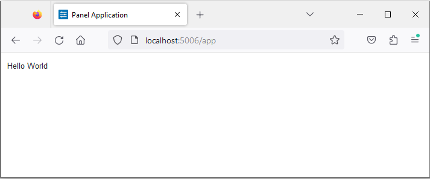

# Build Hello World App

Welcome to the "Build Hello World App" tutorial! Get ready to dive into the world of Panel and serve your very first app.

## Serve the App

Let's get started by serving our simple *Hello World* app using Panel. Choose a tab below to continue:

:::::{tab-set}

::::{tab-item} Script
:sync: script

In this section, we'll create the simplest Panel `.py` app:

```python
import panel as pn

pn.extension()

pn.panel("Hello World").servable()
```

:::{note}
Here's a breakdown of the code:

- `panel`: The Panel python package, conventionally imported as `pn`.
- `pn.extension()`: Loads javascript dependencies and configures Panel.
- `pn.panel(...)`: Creates a *displayable* Panel component.
- `.servable()`: Displays the component in a *server app*.
:::

Copy the code into a file named `app.py` and save it. Then, run the Panel server in your terminal with:

```bash
panel serve app.py --autoreload
```

::::

::::{tab-item} Notebook
:sync: notebook

In this section, we'll create the simplest Panel Notebook app:

```python
import panel as pn

pn.extension()
```

```python
pn.panel("Hello World").servable()
```

:::{note}
Here's what the code does:

- `panel`: The Panel python package, conventionally imported as `pn`.
- `pn.extension()`: **Loads the [`pyviz_comms`](https://github.com/holoviz/pyviz_comms) notebook extension**, loads javascript dependencies and configures Panel.
- `pn.panel(...)`: Creates a *displayable* Panel component, which can be directly displayed in the notebook.
- `.servable()`: Displays the component in a *server app*.
:::

Copy the above code cells into a clean notebook named `app.ipynb`. Run the cells and save the notebook as `app.ipynb`.

Then, run the Panel server in your terminal with:

```bash
panel serve app.ipynb --autoreload
```

:::::

Upon successful startup, you'll see the server's URL in the terminal.

```bash
2024-01-17 21:05:32,338 Starting Bokeh server version 3.3.3 (running on Tornado 6.4)
2024-01-17 21:05:32,339 User authentication hooks NOT provided (default user enabled)
2024-01-17 21:05:32,342 Bokeh app running at: http://localhost:5006/app
2024-01-17 21:05:32,342 Starting Bokeh server with process id: 42008
```

Open your browser at that URL to view the app. It should look like

.

Play around with the app by modifying the `"Hello World"` text, saving the file and observe how it updates in real-time. To stop the server, simply press `CTRL+C` in the terminal.

## Recap

Congratulations on serving your first Panel app! Let's recap what we've learned:

- How to serve a Python script or Notebook using `panel serve app.py` or `panel serve app.ipynb`, respectively.
- How to enable *auto reload* with the `--autoreload` flag.
- How to stop the Panel server with `CTRL+C`.

## Resources

### Tutorials

- [Serve Panel Apps (Intermediate)](../intermediate/serve.md)

### How-to

- [Launch a server dynamically with `pn.serve` or `pn.show`](../../how_to/server/programmatic.md)
- [Launch a server on the command line](../../how_to/server/commandline.md)
- [Migrate from Streamlit | Serve Apps](../../how_to/streamlit_migration/index.md)
- [Serve multiple applications with `pn.serve`](../../how_to/server/multiple.md)
- [Serve static files with `--static-dirs`](../../how_to/server/static_files.md)
- [Serve with Django](../../how_to/integrations/Django.md)
- [Serve with FastAPI](../../how_to/integrations/FastAPI.md)
- [Serve with Flask](../../how_to/integrations/flask.md)
- [Write and serve apps in Markdown](../../how_to/editor/markdown.md)

Keep exploring and building with Panel! 🚀
