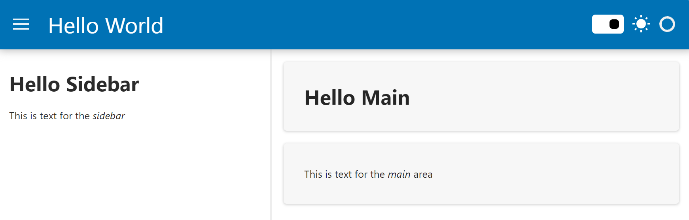
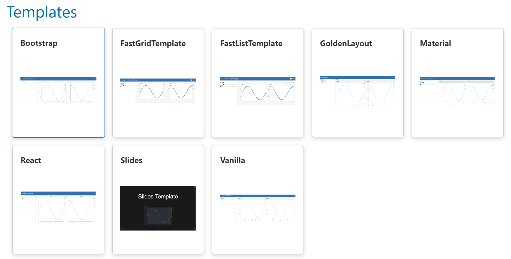
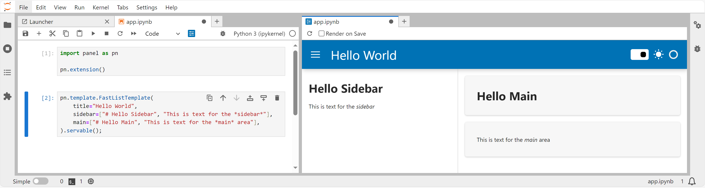
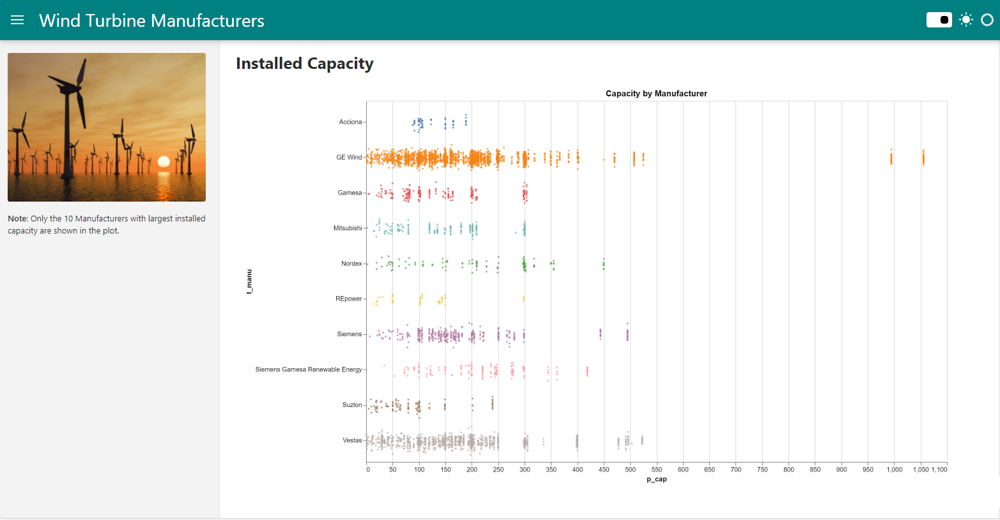
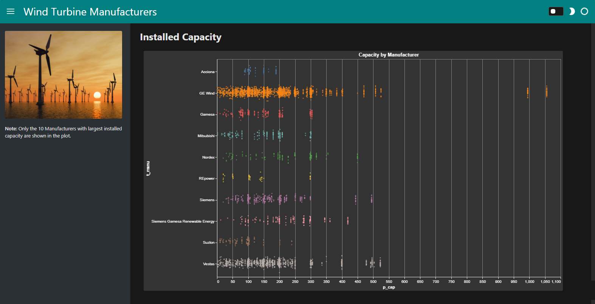

# Use Templates

In this tutorial, we will use *pre-made templates* to easily layout an app with a *header*, *sidebar*, and *main* area:

- Templates are available in the `pn.template` namespace
- Templates can be found in the [Templates Section](https://panel.holoviz.org/reference/index.html#templates) of the [Component Gallery](../../reference/index.md).
- Templates are highly customizable

## Install the Dependencies

Please make sure [Vega-Altair](https://altair-viz.github.io/) is installed.

::::{tab-set}

:::{tab-item} pip
:sync: pip

``` bash
pip install altair panel
```

:::

:::{tab-item} conda
:sync: conda

``` bash
conda install -y -c conda-forge altair panel
```

:::

::::

## Create a Hello World App

Copy the code below to a file `app.py`.

```python
import panel as pn

pn.extension()

pn.template.FastListTemplate(
    title="Hello World",
    sidebar=["# Hello Sidebar", "This is text for the *sidebar*"],
    main=["# Hello Main", "This is text for the *main* area"],
).servable()
```

Serve the app with

```bash
panel serve app.py --autoreload
```

It should look like below



:::{note}
The code refers to

- `pn.template.FastListTemplate`: The specific *template* to use.
- `title`: An optional title to be displayed in the top *header*.
- `sidebar`: An optional list of objects to display in the left *sidebar*.
- `main`: A list of objects to display in the *main* area.

See the [FastListTemplate](../../reference/templates/FastListTemplate.ipynb) *reference guide* for more configuration options.
:::

:::{tip}
Panel ships with a large collection of built-in templates. There is even a [`Slides`](../../reference/templates/Slides.ipynb) template.
:::

Spend a couple of minutes checking out the [Templates Section](https://panel.holoviz.org/reference/index.html#templates) of the [Component Gallery](../../reference/index.md). Then return here.

[](https://panel.holoviz.org/reference/index.html#templates)

## Use a Template in a Notebook

Copy the two code cells below into a notebook.

```python
import panel as pn

pn.extension()
```

```python
pn.template.FastListTemplate(
    title="Hello World",
    sidebar=["# Hello Sidebar", "This is text for the *sidebar*"],
    main=["# Hello Main", "This is text for the *main* area"],
).servable()
```

Add a `;` after `.servable()` to not display the template in the notebook.

*Preview* the app.

It should look like



:::{warning}
Currently *templates* do not display in a notebook. We hope to support this one day. Please upvote [Issue #2677](https://github.com/holoviz/panel/issues/2677) if this use case is important to you.
:::

## Customize the Template

Copy the code below to a file `app.py`.

```python
import panel as pn
import pandas as pd
import altair as alt

pn.extension("vega")

ACCENT = "teal"

image = pn.pane.JPG("https://assets.holoviz.org/panel/tutorials/wind_turbines_sunset.png")

if pn.config.theme=="dark":
    alt.themes.enable("dark")
else:
    alt.themes.enable("default")

@pn.cache # Add caching to only download data once
def get_data():
    return pd.read_csv("https://assets.holoviz.org/panel/tutorials/turbines.csv.gz")

df = get_data()

top_manufacturers = (
    df.groupby("t_manu").p_cap.sum().sort_values().iloc[-10:].index.to_list()
)
df = df[df.t_manu.isin(top_manufacturers)]
fig = (
    alt.Chart(
        df.sample(5000),
        title="Capacity by Manufacturer",
    )
    .mark_circle(size=8)
    .encode(
        y="t_manu:N",
        x="p_cap:Q",
        yOffset="jitter:Q",
        color=alt.Color("t_manu:N").legend(None),
        tooltip=["t_manu", "p_cap"],
    )
    .transform_calculate(jitter="sqrt(-2*log(random()))*cos(2*PI*random())")
    .properties(
        height="container",
        width="container",
    )
)
plot = pn.pane.Vega(fig, sizing_mode="stretch_both", max_height=800, margin=20)

pn.template.FastListTemplate(
    title="Wind Turbine Manufacturers",
    sidebar=[image, "**Note**: Only the 10 Manufacturers with the largest installed capacity are shown in the plot."],
    main=["# Installed Capacity", plot],
    accent=ACCENT,
    main_layout=None,
).servable()
```

Serve the app with

```bash
panel serve app.py --autoreload
```

It should look like below



Try clicking the *theme toggle button* in the upper right corner.

It should look like



:::{note}
The code refers to

- `pn.config.theme`: The name of the selected *theme*. Either `"default"` or `"dark"`.
- `alt.themes.enable("dark")`: We use this Altair code to give the plot a `"dark"` theme. Panel will not do that automatically for you. In the [References](#references) section below you can find a list of how-to guides for styling plots.
- `accent`: A *primary* or *accent* color to apply to the template. Can be a [*named color*](https://www.w3schools.com/tags/ref_colornames.asp) or a [*hex color value*](https://www.w3schools.com/html/html_colors_hex.asp). You can use this to quickly *brand* your entire app.
- `main_layout`. A layout to wrap each object in the `main` list in. One of `"card"` (default) or `None`.

The `accent` and `main_layout` arguments only apply to the *Fast* templates, i.e. the [FastListTemplate](../../reference/templates/FastListTemplate.ipynb) and the [FastGridTemplate](../../reference/templates/FastGridTemplate.ipynb).
:::

## Recap

In this tutorial, we have used *pre-made templates* to easily layout an app with a *header*, *sidebar*, and *main* area:

- Templates are available in the `pn.template` namespace
- Templates can be found in the [Templates Section](https://panel.holoviz.org/reference/index.html#templates) of the [Component Gallery](../../reference/index.md).
- Templates are highly customizable

## References

### How-to

- [Arrange Components in a Template](../../how_to/templates/template_arrange.md)
- [Build a Custom Template](../../how_to/templates/template_custom.md)
- [Customize Template Theme](../../how_to/templates/template_theme.md)
- [Set a Template](../../how_to/templates/template_set.md)
- [Style Altair Plots](../../how_to/styling/altair.md)
- [Style Echarts Plots](../../how_to/styling/echarts.md)
- [Style Matplotlib Plots](../../how_to/styling/matplotlib.md)
- [Style Plotly Plots](../../how_to/styling/plotly.md)
- [Style Vega/ Altair Plots](../../how_to/styling/vega.md)
- [Toggle Modal](../../how_to/templates/template_modal.md)

### Explanation

- [Templates](../../explanation/styling/templates_overview.md)

### Component Gallery

- [Templates Section](https://panel.holoviz.org/reference/index.html#templates) of the [Component Gallery](../../reference/index.md)
