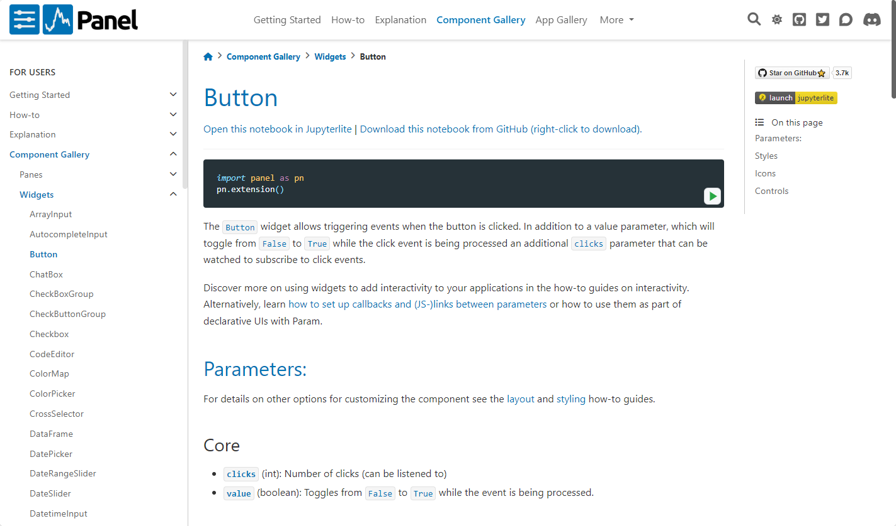
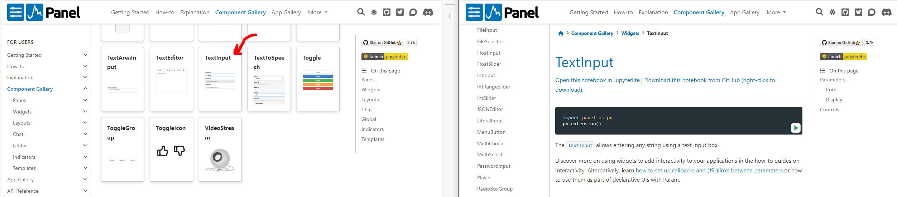

# Accept Inputs with Widgets

In this guide, we will explore how to accept user input using *widgets*:

- *Widgets* are accessible in the `pn.widgets` namespace.
- *Widgets* typically provide user input via the `value` parameter.
- *Widgets* often allow you to specify an initial `value`.
- Common parameters for *widgets* include `name`, `description`, and `disabled`.
  - The `name` is frequently used as a *label*.
  - The `description` is often employed as a tooltip.
- We'll explore accepting *click* input with the `Button` widget.
- We'll accept *text* input with the `TextInput` widget.
- We'll choose an object from a list of objects using the `Select` widget.
- Panel widgets are grouped into sets of *interchangeable* widgets.
  - We can switch out the `Select` widget with the `RadioButtonGroup` widget to modify the user experience.
- You can explore all available *widgets* and their *reference guides* in the [Widgets Section](https://panel.holoviz.org/reference/index.html#widgets) of the [Component Gallery](../../reference/index.md).

In this tutorial, we will **not learn** how to:

- Use specific *widgets* in great detail, as the details are covered in the *[reference guides](https://panel.holoviz.org/reference/index.html#widgets)*.
- React to user input, as this is addressed in the [React to User Input](bind.md) tutorial.
- Style or align *widgets*, as these topics are covered in other tutorials.

:::{note}
A *Widget* is a component that can accept user inputs via the `value` parameter. Certain more complex widgets, such as [`Tabulator`](../../reference/widgets/Tabulator.ipynb), may allow additional forms of input through other parameters.

A *Widget* is defined as a component that inherits from the `Widget` base class.
:::

:::{note}
In some cases, Panes can accept user input too. For example, the [`ECharts`](../../reference/panes/ECharts.ipynb), [`Plotly`](../../reference/panes/Plotly.ipynb), and [`Vega`](../../reference/panes/Vega.ipynb) (Altair) panes can accept user inputs. These are usually selections, instead of modifying the underlying `object`.
:::

:::{note}
When we ask you to *run the code* in the sections below, you may execute the code directly in the Panel docs via the green *run* button, in a cell in a notebook, or in a file `app.py` that is served with `panel serve app.py --autoreload`.
:::

## Accept Clicks

Let's run the code below together:

```{pyodide}
import panel as pn

pn.extension()

pn.widgets.Button(
    name="Refresh",
    icon="refresh",
    button_type="primary",
    description="Click to refresh the data",
).servable()
```

We can see that the `Button` is quite feature-rich, supporting `icon`, `button_type`, and `description`.

Feel free to hover over the button. You will notice the `description` shown as a tooltip.

:::{note}
We add `.servable()` to the component to include it in the app served by `panel serve app.py --autoreload`. Adding `.servable()` is not necessary to display the component in a notebook.
:::

:::{note}
For an in-depth understanding of how a *widget* like `Button` works, please refer to its *reference guide*.
:::

Click [this link](../../reference/widgets/Button.ipynb) to the `Button` Reference Guide, and let's spend a few minutes familiarizing ourselves with its organization and content.

It should look like

[](../../reference/widgets/Button.ipynb)

## Accept Text

Now, let's run the code below together:

```{pyodide}
import panel as pn

pn.extension()

pn.widgets.TextInput(
    description="The text given to the AI",
    disabled=True,
    max_length=15,
    name="Prompt",
    placeholder="What is Python?",
).servable()
```

Feel free to hover over the circle with the question mark inside. You will see the `description` displayed as a tooltip.

If you are in a notebook or serving as an app, try:

- Enabling the `TextInput` by changing `disabled=True` to `disabled=False`.
- Entering the text `1234567890123456`. You cannot because the `max_length` is `15`. The final `6` cannot be entered.

:::{note}
Your success with Panel hinges on your ability to navigate the [Component Gallery](../../reference/index.md) and utilize the *reference guides* effectively.
:::

Click [this link](https://panel.holoviz.org/reference/index.html#widgets) to access the Widgets Section of the [Component Gallery](../../reference/index.md). Locate the [TextInput Reference Guide](../../reference/widgets/TextInput.ipynb) and open it. You don't have to delve into the details right now.

It should look like

[](https://panel.holoviz.org/reference/index.html#widgets)

## Accept an object from a list

Let's run the code below together:

```{pyodide}
import panel as pn

pn.extension()

pn.widgets.Select(
    description="Select a Study",
    name="Study",
    options=["Wind Turbine", "Solar Panel", "Battery Storage"],
).servable()
```

:::{note}
Panels widgets come in groups of *interchangeable* widgets. For example, it's very easy to replace the `Select` widget with the `RadioButtonGroup` widget.
:::

Now, run the code below:

```{pyodide}
import panel as pn

pn.extension()

pn.widgets.RadioButtonGroup(
    description="Select a Study",
    name="Study",
    options=["Wind Turbine", "Solar Panel", "Battery Storage"],
).servable()
```

:::{note}
Usually, widgets allow us to specify the *initial* `value`.
:::

Now, let's run the code below:

```{pyodide}
import panel as pn

pn.extension()

pn.widgets.RadioButtonGroup(
    button_type="primary",
    button_style="outline",
    description="Select a Study",
    name="Study",
    options=["Wind Turbine", "Solar Panel", "Battery Storage"],
    value="Physics",
).servable()
```

You will notice how `Physics` is now displayed as the *initial* `value`, and how the `Button`'s type and style were changed.

## Recap

In this tutorial, we have learned:

- *Widgets* are available in the `pn.widgets` namespace.
- *Widgets* normally provide user input via the `value` parameter.
- *Widgets* typically allow us to provide the initial `value`.
- *Widgets* have common parameters like `name`, `description`, and `disabled`.
  - The `name` is often used as a *label*.
  - The `description` is often used as a tooltip.
- We can accept *click* input with the `Button` widget.
- We can accept *text* input with the `TextInput` widget.
- We can accept an object from a list of objects with the `Select` widget.
- Panel widgets come in groups of *interchangeable* widgets.
  - We can replace the `Select` widget with the `RadioButtonGroup` widget to change the user experience.
- You can explore all *Widgets* and their *reference guides* in the [Widgets Section](https://panel.holoviz.org/reference/index.html#widgets) of the [Component Gallery](../../reference/index.md).

## Resources

### Tutorials

- [React to User Input](bind.md)

### How-To

- [Migrate from Streamlit | Accept User Input](../../how_to/streamlit_migration/widgets.md)

### Explanation

- [Components Overview](../../explanation/components/components_overview.md)

### Component Gallery

- [Widgets](https://panel.holoviz.org/reference/index.html#widgets)
