# Develop in a Notebook

In this section you will learn the basics of developing Panel apps efficiently in a notebook:

- Preview your notebook app in Jupyter lab with the *Jupyter Panel Preview*.
- Serve your notebook app with autoreload using `panel serve app.ipynb --autoreload`.
- Inspect your component using `SHIFT+Tab` and `print`.
- Inspect your components class and instance parameters using `.param`.

:::{admonition} Note
In this guide we will assume you are working in [Jupyter lab](https://jupyter.org/). Panel works in many other notebook environments. But non-jupyterlab notebook environments might need special configuration before supporting Panel appropriately. Check out the [Resources](#resources) section below for specific guidance.
:::

## Install the Dependencies

Please make sure [Matplotlib](https://matplotlib.org/) and [Numpy](https://numpy.org/) are installed.

::::{tab-set}

:::{tab-item} conda
:sync: conda

``` bash
conda install -y -c conda-forge matplotlib numpy
```
:::

:::{tab-item} pip
:sync: pip

``` bash
pip install matplotlib numpy
```
:::

::::

## Preview your app

A simple notebook file containing a Panel app could look like.

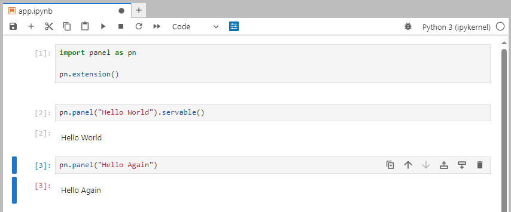

Start from an empty notebook named `app.ipynb`.

Copy paste the 3 code cells below into the notebook

```python
import panel as pn

pn.extension()
```

```python
pn.panel("Hello World").servable()
```

```python
pn.panel("Hello Again")
```

Run the cells and save it as `app.ipynb` if you have not already done it.

It should look like


:::{admonition} Note
The code in the notebook refer to

- `panel`: The Panel python package. Its a convention to import it as `pn`.
- `pn.extension()`: **Loads the [`pyviz_comms`](https://github.com/holoviz/pyviz_comms) notebook extension**, loads javascript dependencies and configures Panel.
- `pn.panel(...)`: Creates a *displayable* Panel component. **The component can be displayed directly in the notebook**.
- `.servable()`: Displays the component in a *server app*.
:::

:::{admonition} Note
The little, blue Panel icon above the notebook will launch a *preview* of your app. We call this icon the *Jupyter Panel Preview* icon.
:::

Click the *Jupyter Panel Preview* icon.

You will see the app launching in a separate window on the right.

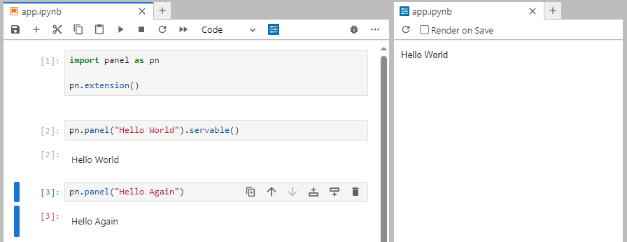

:::{admonition} Note
You will notice that "Hello Again" is not displayed in the app preview. That is because `pn.panel("Hello Again")` has not been marked `.servable()`.
:::

Replace `pn.panel("Hello Again")` with

```python
pn.panel("Hello Again").servable()
```

Save the notebook.

Click the *Reload Preview* button in the *Jupyter Panel Preview*.

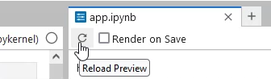

The *preview* will reload and look like

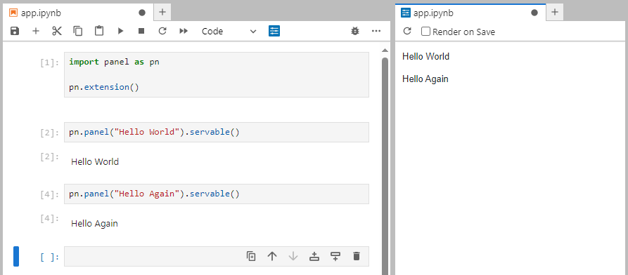

:::{admonition} Note
To enable a more efficient workflow you can check the *Render on Save* checkbox. This will *auto reload* your app when the notebook is saved.
:::

Check the *Render on Save* checkbox.

Change the last cell to

```python
pn.panel("Hello Again and Again").servable()
```

Save the notebook.

The preview will automatically reload and look like

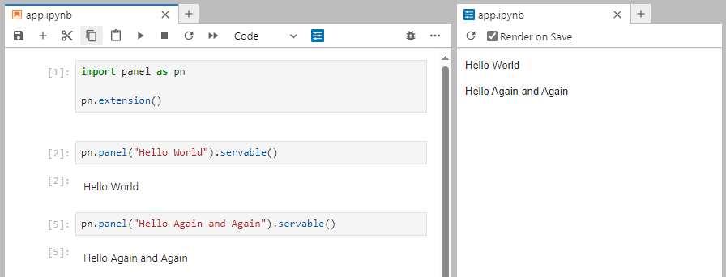

Watch the video below to learn how the techniques above can be used to develop a more advanced app.

<video controls="" poster="../../_static/images/jupyter_panel_preview_in_action.png">
    <source src="https://assets.holoviz.org/panel/tutorials/jupyter_panel_preview_in_action.mp4" type="video/mp4" style="max-height: 400px; max-width: 100%;">
    Your browser does not support the video tag.
</video>

## Serve your app with autoreload

:::{admonition} Note
A currently faster alternative to the *Jupyter Panel Preview* is serving the notebook externally with autoreload using a command like `panel serve app.ipynb --autoreload`.
:::

Start from an empty notebook named `app.ipynb`.

Copy paste the 2 cells below into the notebook.

```python
import panel as pn
import numpy as np

from matplotlib.figure import Figure

ACCENT = "goldenrod"
LOGO = "https://s3.eu-west-1.amazonaws.com/assets.holoviz.org/panel/tutorials/matplotlib-logo.png"

pn.extension(sizing_mode="stretch_width")
```

```python
data = np.random.normal(1, 1, size=100)
fig = Figure(figsize=(8,4))
ax = fig.subplots()
ax.hist(data, bins=20, color=ACCENT)

component = pn.pane.Matplotlib(fig, format='svg', sizing_mode='scale_both')

pn.template.FastListTemplate(
    title="My App", sidebar=[LOGO], main=[component], accent=ACCENT
).servable();
```

Save the notebook.

Serve the app by running the below in a terminal

```bash
panel serve app.ipynb --autoreload
```

It would look something like

```bash
$ panel serve app.ipynb --autoreload
2024-01-20 05:48:38,688 Starting Bokeh server version 3.3.3 (running on Tornado 6.4)
2024-01-20 05:48:38,688 User authentication hooks NOT provided (default user enabled)
2024-01-20 05:48:38,688 Bokeh app running at: http://localhost:5006/app
2024-01-20 05:48:38,688 Starting Bokeh server with process id: 13840
```

Open [http://localhost:5006/app](http://localhost:5006/app) in a browser.

It would look something like

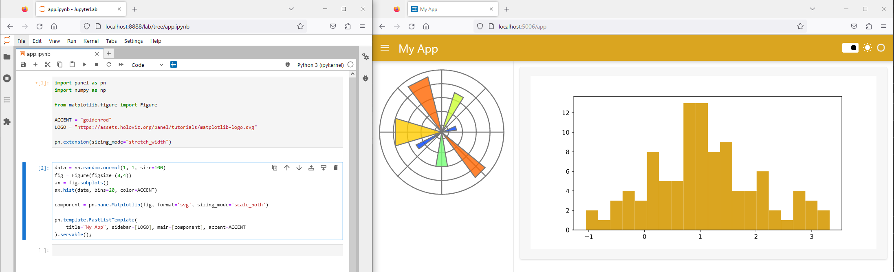

Now change the

- `ACCENT` value to `teal` and save the `app.ipynb` notebook.
- `bins` value to `15` and save
- `title` value to `"My Matplotlib App"` and save

It should look something like

<video controls="" poster="../../_static/images/develop_notebook_panel_serve_after.png">
    <source src="https://assets.holoviz.org/panel/tutorials/develop_notebook_panel_serve.mp4" type="video/mp4" style="max-height: 400px; max-width: 100%;">
    Your browser does not support the video tag.
</video>

:::{admonition} Note
You should only serve your apps with `--autoreload` while developing
:::

Stop the Panel server by sending a termination signal. In most terminal environments, you can do this by pressing `CTRL+C` one or more times.

## Inspect a Component using `SHIFT+Tab`

Start from an empty notebook named `app.ipynb`.

Copy-paste the code below into the first cell

```{python}
import panel as pn

pn.extension()
```

Run the cell

Write `pn.widgets.IntSlider` in a cell and press `SHIFT+Tab`.

It should look like

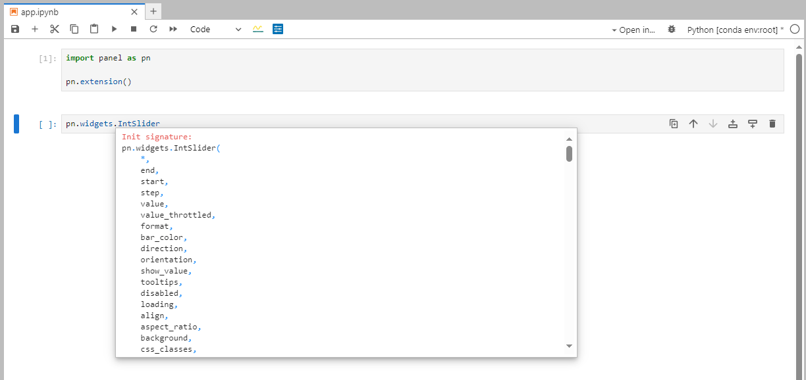

Use the mouse to scroll down until you find the *Example* code snippet and *Reference* link.

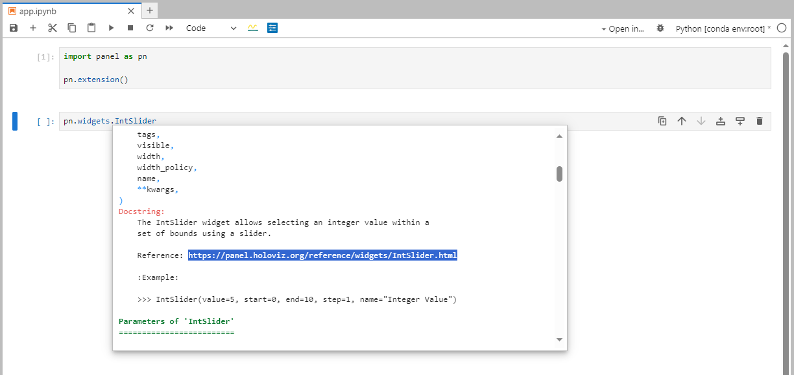

Click the *Reference* link <a href="https://panel.holoviz.org/reference/widgets/IntSlider.html" target="_blank">https://panel.holoviz.org/reference/widgets/IntSlider.html</a>

It should look like

[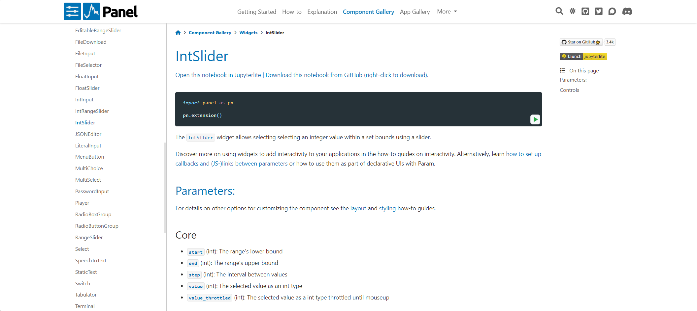](https://panel.holoviz.org/reference/widgets/IntSlider.html)

:::{admonition} Note
It is a great idea to use the *Example* code snippets and *Reference* links to speed up your workflow.
:::

## Inspect a Component using `print`

Start from an empty notebook named `app.ipynb`.

Copy-paste the code below into the notebook

```python
import panel as pn

pn.extension()
```

```python
print(pn.panel("Hello World"))
```

```python
component = pn.Column(
    "Hello World", pn.widgets.IntSlider(value=2, end=10, name="Value")
)
print(component)
```

Run the cells if you have not already done it.

It should look like

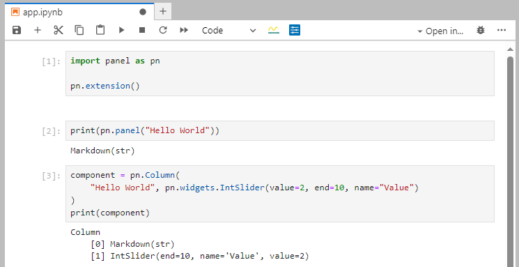

:::{admonition} Note
By printing *layout* components like `Column` you can understand how its composed. This enables you to *access* the subcomponents of the layout.
:::

Add the two code cells below

```python
component[0]
```

```python
component[1]
```

Run the new cells if you have not already done it.

It should look like

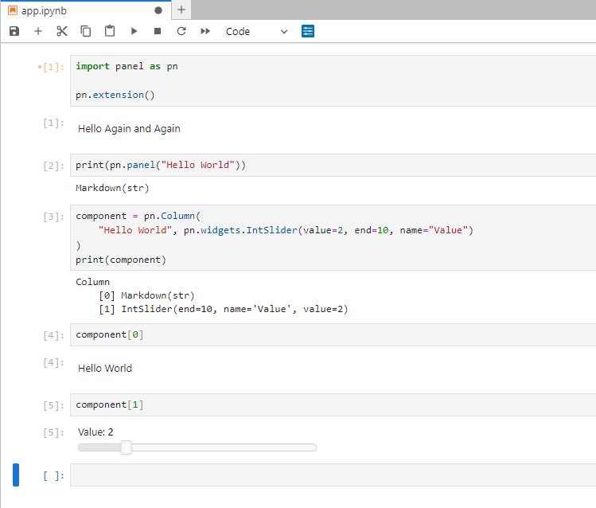

## Inspect a Components Parameters using `.param`

Start from an empty notebook named `app.ipynb`.

Copy-paste the two code cells below into the notebook

```python
import panel as pn

pn.extension()
```

```python
pn.widgets.IntSlider.param
```

Run the code cells if you have not already done it.

It should look like

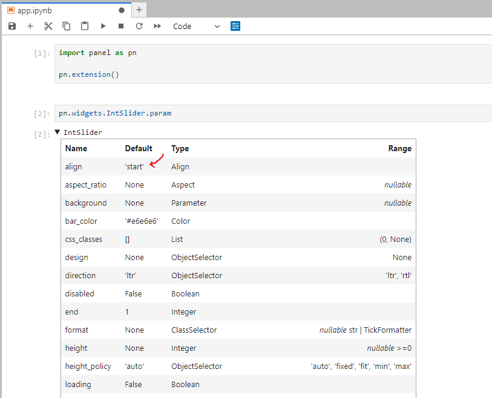

:::{admonition} Note
- The `.param` table shows you the *default* parameter values of the `IntSlider` class. For example the *default* value of `align` is `'start'`.
- The `.param` table shows you additional information like the `Type` and `Range` of the Parameter.
:::

Add the new cell

```python
pn.widgets.IntSlider(align="end").param
```

Run the code cell

It should look like

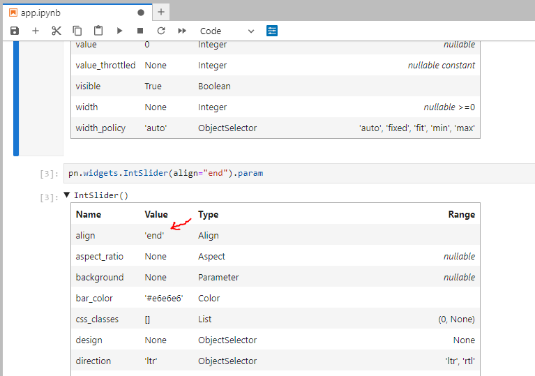

:::{admonition} Note
- In the picture above you see the *actual* parameter values of the `IntSlider` instance. For example the *actual* value of `align` is `'end'`.
:::

## Recap

You can

- Preview your notebook app in Jupyter lab with the *Jupyter Panel Preview*.
- Serve your notebook app with autoreload using `panel serve app.ipynb --autoreload`.
- Inspect your component using `SHIFT+Tab` and `print`.
- Inspect your components class and instance parameters using `.param`.

## Resources

### How-to

- [Develop in other notebook environments](../../how_to/notebook/notebook.md)
- [Display Output in Notebooks](../../how_to/notebook/notebook.md)
- [Preview Apps in Jupyterlab](../../how_to/notebook/jupyterlabpreview.md)
- [Serve an app from a notebook file](serve.md)
- [Use VS Code Notebook and Interactive Environment](../../how_to/editor/vscode_configure.md#notebook-and-interactive-environment)
