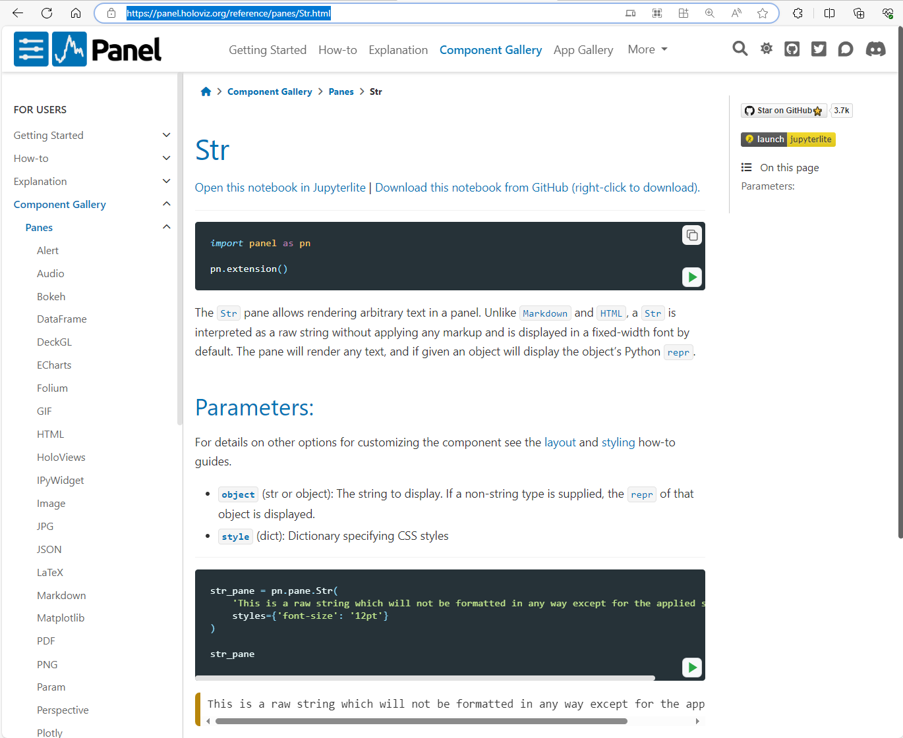

# Display objects with Panes

In this tutorial you will learn to display objects with *Panes*:

- *Panes* are available in the `pn.pane` namespace
- *Panes* take an `object` argument as well as other arguments
- Display strings with the `Str`, `Markdown` and `Alert` panes
- Display plot figures like [Matplotlib](https://matplotlib.org/), [hvPlot](https://hvplot.holoviz.org) and [Plotly](https://plotly.com/python/) with `pn.pane.Matplotlib`, `pn.pane.HoloViews` and `pn.pane.Plotly` respectively
- Display *DataFrames* with `pn.pane.DataFrame` and `pn.pane.Perspective`
- Add javascript dependencies via `pn.extension`. For example `pn.extension("plotly")`
- Use the [Panes Section](https://panel.holoviz.org/reference/index.html#panes) of the [Component Gallery](https://panel.holoviz.org/reference/index.html) to find *Panes* and their *reference guides*.

In this tutorial you will **not learn** how to

- use *Panes* in detail. Details are covered by the *[reference guides](https://panel.holoviz.org/reference/index.html#panes)*.
- layout and styles *Panes*. These topics are covered by other tutorials.

:::{admonition} Note
Loosely defined, a *Pane* is a component that can display an object. It takes an `object` as an argument. 

Technically a *Pane* is a component that inherits from the `PaneBase` class.
:::

:::{admonition} Note
When we ask you to *run the code* in the sections below, you may either execute the code directly in the Panel docs via the green *run* button, in a cell in a notebook or in a file `app.py` that is served with `panel serve app.py --autoreload`.
:::

## Install the Dependencies

Please make sure [hvPlot](https://hvplot.holoviz.org/index.html), [Matplotlib](https://matplotlib.org/) and [Plotly](https://plotly.com/python/) are installed.

::::{tab-set}

:::{tab-item} conda
:sync: conda

``` bash
conda install -y -c conda-forge hvplot matplotlib plotly
```
:::

:::{tab-item} pip
:sync: pip

``` bash
pip install hvplot matplotlib plotly
```
:::

::::

## Display Strings

### `Str` Pane

The [`Str`](https://panel.holoviz.org/reference/panes/Str.html) pane can display any text.

Run the code:

```python
import panel as pn

pn.extension()

pn.pane.Str(
    'This is a raw string which will not be formatted in any way.',
).servable()
```

:::{admonition} Note
We add `.servable()` to the component to add it to the app served by `panel serve app.py --autoreload`. Adding `.servable()` is not needed to display the component in a notebook.
:::

:::{admonition} Note
To learn in detail how a pane like `Str` works you should refer to its *reference guide*.
:::

Click [this link to the `Str` Reference Guide](https://panel.holoviz.org/reference/panes/Str.html) and spend a few minutes to familiarize your self with its organisation and content.

It should look like

[](https://panel.holoviz.org/reference/panes/Str.html)

### `Markdown` Pane

The [`Markdown`](https://panel.holoviz.org/reference/panes/Markdown.html) pane can format and display [*markdown*](https://en.wikipedia.org/wiki/Markdown) strings. 

Run the code:

```{pyodide}
import panel as pn

pn.extension()

pn.pane.Markdown("""
# Markdown Sample

This sample text is from [The Markdown Guide](https://www.markdownguide.org)!
""").servable()
```

:::{admonition}
Its key for your success with Panel, that you learn how to navigate the [Component Gallery](https://panel.holoviz.org/reference/index.html) and use the *reference guides*.
:::

Click [this link to the Panes Section](https://panel.holoviz.org/reference/index.html#panes) of the [Component Gallery](https://panel.holoviz.org/reference/index.html). Identify the [Markdown Reference Guide](https://panel.holoviz.org/reference/panes/Markdown.html) and open it. You don't have to spend time studying the details right now.

It should look like

[](https://panel.holoviz.org/reference/index.html#panes)

## Display a Matplotlib plot

Run the code below.

```{pyodide}
import panel as pn
import matplotlib.pyplot as plt
import numpy as np
import matplotlib

matplotlib.use('agg')

pn.extension()

def create_matplotlib_figure(figsize=(4,3)):
       t = np.arange(0.0, 2.0, 0.01)
       s = 1 + np.sin(2 * np.pi * t)

       fig, ax = plt.subplots(figsize=figsize)
       ax.plot(t, s)

       ax.set(xlabel='time (s)', ylabel='voltage (mV)',
              title='Voltage')
       ax.grid()

       plt.close(fig) # CLOSE THE FIGURE!
       return fig

fig = create_matplotlib_figure()
pn.pane.Matplotlib(fig, dpi=144, tight=True).servable()
```

:::{admonition} Note
In the example we provide the arguments `dpi` and `tight` to the `Matplotlib` pane. You can find explanations and more arguments in the [Matplotlib Reference Guide](https://panel.holoviz.org/reference/panes/Matplotlib.html).
:::

## Display a hvPlot plot

Run the code below.

```{pyodide}
import hvplot.pandas
import numpy as np
import pandas as pd
import panel as pn

pn.extension()
np.random.seed(1)


idx = pd.date_range('1/1/2000', periods=1000)
df = pd.DataFrame(np.random.randn(1000, 4), index=idx, columns=list('ABCD')).cumsum()
fig = df.hvplot()

pn.pane.HoloViews(fig, sizing_mode="stretch_width").servable()
```

:::{admonition} Note
[hvPlot](https://hvplot.holoviz.org/user_guide/Customization.html) is the **easy to use** plotting sister of Panel. It works similarly to the the familiar [Pandas `.plot` api](https://pandas.pydata.org/docs/reference/api/pandas.DataFrame.plot.html). hvPlot is built on top of the data visualization library [HoloViews](https://holoviews.org/). hvPlot, HoloViews and Panel are all part of the [HoloViz](https://holoviz.org/) family.
:::

## Display a Plotly plot

Run the code below.

```{pyodide}
import pandas as pd
import panel as pn
import plotly.express as px

pn.extension("plotly")

data = pd.DataFrame([
    ('Monday', 7), ('Tuesday', 4), ('Wednesday', 9), ('Thursday', 4),
    ('Friday', 4), ('Saturday', 4), ('Sunday', 4)], columns=['Day', 'Orders']
)

fig = px.line(data, x="Day", y="Orders")
fig.update_traces(mode="lines+markers", marker=dict(size=10), line=dict(width=4))
fig.layout.autosize = True

pn.pane.Plotly(fig).servable()
```

:::{admonition} Note
We must add `"plotly"` as an argument to `pn.extension` in the example to load the Plotly Javascript dependencies in the browser.

If we forget to add `"plotly"` to `pn.extension` then the Plotly figure will not display in

- a notebook
- a served app. But only if the Plotly figure is displayed dynamically after the app has loaded.
:::

## Display a DataFrame

Run the code:

```{pyodide}
import pandas as pd
import panel as pn

pn.extension()

data = pd.DataFrame([
    ('Monday', 7), ('Tuesday', 4), ('Wednesday', 9), ('Thursday', 4),
    ('Friday', 4), ('Saturday', 4), ('Sunday', 4)], columns=['Day', 'Orders']
)
pn.pane.DataFrame(data).servable()
```

```{admonition} Note
If you want to display larger dataframes, customize the way the dataframes are displayed or make them more interactive you can find specialized components in the [Component Gallery](https://panel.holoviz.org/reference/index.html) supporting these use cases. For example the [Tabulator](https://panel.holoviz.org/reference/widgets/Tabulator.html) widget and [Perspective](https://panel.holoviz.org/reference/panes/Perspective.html) pane.
```

## Display any Python object

Provides *Panes* to display (almost) any Python object.

Run the code below

```{pyodide}
import panel as pn

pn.extension()

pn.Column(
    pn.pane.JSON({"a": [1,2,3], "b": "some text"}),
    pn.pane.PNG("https://assets.holoviz.org/panel/samples/png_sample.png", height=100),
    pn.pane.Audio("https://assets.holoviz.org/panel/samples/beatboxing.mp3"),
).servable()
```

## Recap

In this guide you have learned to display Python objects with *Panes*:

- *Panes* are available in the `pn.pane` namespace
- *Panes* take an `object` argument as well as other arguments
- Display strings with the `Str`, `Markdown` and `Alert` panes
- Display plot figures like [Matplotlib](https://matplotlib.org/), [hvPlot](https://hvplot.holoviz.org) and [Plotly](https://plotly.com/python/) with `pn.pane.Matplotlib`, `pn.pane.HoloViews` and `pn.pane.Plotly` respectively
- Display *DataFrames* with `pn.pane.DataFrame` and `pn.pane.Perspective`
- Add javascript dependencies via `pn.extension`. For example `pn.extension("plotly")`
- Use the [Panes Section](https://panel.holoviz.org/reference/index.html#panes) of the [Component Gallery](https://panel.holoviz.org/reference/index.html) to find *Panes* and their *reference guides*.

## Resources

### Tutorials

- [Display objects with `pn.panel`](display_pn_panel.md)

### How-to

- [Construct Panes](../../how_to/components/construct_panes.md)
- [Style Components](../../how_to/styling/index.md)

### Explanation

- [Components Overview](https://panel.holoviz.org/explanation/components/components_overview.html)


### Component Gallery

- [Panes](../../reference/index.md#panes)
