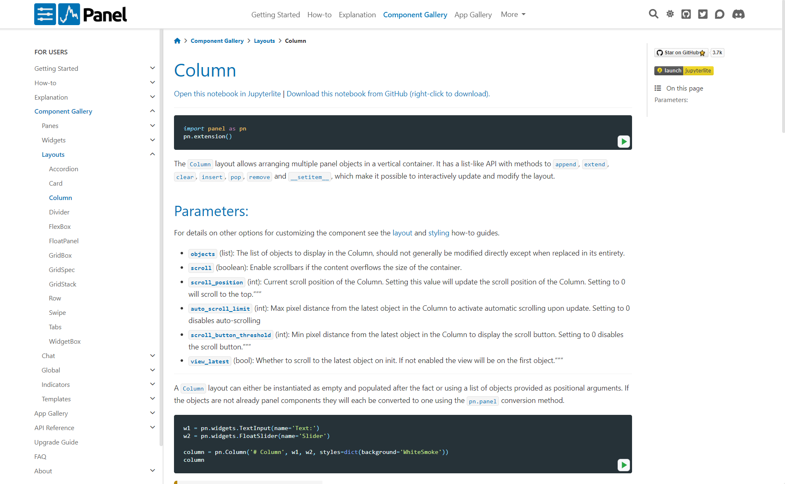
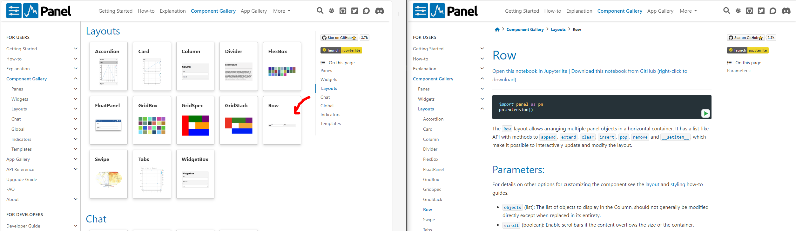

# Layout Objects

In this guide you will learn to layout, i.e. arrange, Python objects including Panel components:

- *Layouts* are available in the `pn` namespace.
- *Arrange* Python objects including Panel components with [`pn.Column`](../../reference/layouts/Column.ipynb) and [`pn.Row`](../../reference/layouts/Row.ipynb). 
- Layouts like [`Column`](../../reference/layouts/Column.ipynb) and [`Row`](../../reference/layouts/Row.ipynb) are *list-like*.
- A *layout* will automatically use `pn.panel` to determine how to best display non-Panel objects.
- Create complex arrangements by combining and nesting *layouts*.
- Discover all *layouts* and their *reference guides* in the [Layouts Section](../../reference/index.md#layouts) of the [Component Gallery](../../reference/index.md).

In this tutorial you will **not learn** how to

- Use specific *layouts* in detail. Details are covered by the *[reference guides](../../reference/index.md#layouts)*.
- Style *layouts*. This topic is covered by another tutorial.

:::{admonition} Note
When we ask you to *run the code* in the sections below, you may either execute the code directly in the Panel docs via the green *run* button, in a cell in a notebook or in a file `app.py` that is served with `panel serve app.py --autoreload`.
:::

## Install the Dependencies

Please make sure [hvPlot](https://hvplot.holoviz.org) and [Pandas](https://pandas.pydata.org) are installed.

::::{tab-set}

:::{tab-item} conda
:sync: conda

``` bash
conda install -y -c conda-forge hvplot pandas
```
:::

:::{tab-item} pip
:sync: pip

``` bash
pip install hvplot pandas
```
:::

::::

## Layout in a Column

Run the code below:

```{pyodide}
import pandas as pd
import panel as pn

pn.extension(design="bootstrap")

button = pn.widgets.Button(name="Refresh", icon="refresh", button_type="primary")

data = pd.DataFrame(
    [
        ("Monday", 7),
        ("Tuesday", 4),
        ("Wednesday", 9),
        ("Thursday", 4),
        ("Friday", 4),
        ("Saturday", 4),
        ("Sunday", 4),
    ],
    columns=["Day", "Orders"],
)

pn.Column("# Orders", data, button).servable()
```

:::{admonition} Note
To learn in detail how a layout like `Column` works you should refer to its *reference guide*.
:::

Click [this link to the `Column` Reference Guide](../../reference/layouts/Column.ipynb) and spend a few minutes to familiarize your self with its organisation and content.

It should look like

[](../../reference/layouts/Column.ipynb)

## Layout in a Row

Run the code below:

```{pyodide}
import pandas as pd
import panel as pn
import hvplot.pandas

pn.extension(design="bootstrap")

data = pd.DataFrame(
    [
        ("Monday", 7),
        ("Tuesday", 4),
        ("Wednesday", 9),
        ("Thursday", 4),
        ("Friday", 4),
        ("Saturday", 4),
        ("Sunday", 4),
    ],
    columns=["Day", "Orders"],
)
plot = data.hvplot(x="Day", y="Orders", kind="bar", color="goldenrod", title="Orders")

pn.Row(plot, data).servable()
```

Click [this link to the Layouts section](../../reference/index.md#layouts) of the [Component Gallery](../../reference/index.md).

Open the [`Row`](../../reference/layouts/Row.ipynb) reference guide and spend a few minutes to familiarize your self with its organisation and content.

It should look like

[](../../reference/layouts/Row.ipynb)

## Works like a list

:::{admonition} Note
`Column`, `Row` and many other layouts are *list-like*.
:::

Run the code below

```{pyodide}
import pandas as pd
import panel as pn

pn.extension(design="bootstrap")

button = pn.widgets.Button(name="Refresh", icon="refresh", button_type="primary")

data = pd.DataFrame(
    [
        ("Monday", 7),
        ("Tuesday", 4),
        ("Wednesday", 9),
        ("Thursday", 4),
        ("Friday", 4),
        ("Saturday", 4),
        ("Sunday", 4),
    ],
    columns=["Day", "Orders"],
)

component = pn.Column("# Orders", data, button)
pn.Column(component[0], component[2], component[1]).servable()
```

:::{admonition} Note
We used the *list-like* properties of the `Column` to re-arrange it. More specifically we used *list-indexing* as in `component[2]`.
:::

## Displays using `pn.panel`

Run the code below:

```{pyodide}
import pandas as pd
import panel as pn

pn.extension(design="bootstrap")

button = pn.widgets.Button(name="Refresh", icon="refresh", button_type="primary")

data = pd.DataFrame(
    [
        ("Monday", 7),
        ("Tuesday", 4),
        ("Wednesday", 9),
        ("Thursday", 4),
        ("Friday", 4),
        ("Saturday", 4),
        ("Sunday", 4),
    ],
    columns=["Day", "Orders"],
)

component = pn.Column("# Orders", data, button)
print(component)
component.servable()
```

:::{admonition} Note
The `print` statement will output something like

```bash
Column(design=<class 'panel.theme.bootst...)
    [0] Markdown(str, design=<class 'panel.theme.bootst...)
    [1] DataFrame(DataFrame, design=<class 'panel.theme.bootst...)
    [2] Button(button_type='primary', design=<class 'panel.theme.bootst..., icon='refresh', name='Refresh')
```

Under the hood the `Column` has used `pn.panel` to convert the string to a [`Markdown`](../../reference/panes/Markdown.ipynb) pane and the DataFrame to a [`DataFrame`](../../reference/panes/DataFrame.ipynb) pane.

You can customize how the objects are displayed using `pn.panel` or specific *Panes*.
::::

Run the code below.

```{pyodide}
import pandas as pd
import panel as pn

pn.extension(design="bootstrap")

button = pn.widgets.Button(name="Refresh", icon="refresh", button_type="primary")

data = pd.DataFrame(
    [
        ("Monday", 7),
        ("Tuesday", 4),
        ("Wednesday", 9),
        ("Thursday", 4),
        ("Friday", 4),
        ("Saturday", 4),
        ("Sunday", 4),
    ],
    columns=["Day", "Orders"],
)

pn.Column(
    pn.pane.Str("# Orders"), pn.panel(data, sizing_mode="stretch_width"), button
).servable()
```

## Combine Layouts

:::{admonition} Note
To create more complex arrangements of objects, you can combine and nest *layouts*
:::

Run the code below:

```{pyodide}
import pandas as pd
import panel as pn
import hvplot.pandas

pn.extension(design="bootstrap")

button = pn.widgets.Button(name="Refresh", icon="refresh", button_type="primary")
data = pd.DataFrame(
    [
        ("Monday", 7),
        ("Tuesday", 4),
        ("Wednesday", 9),
        ("Thursday", 4),
        ("Friday", 4),
        ("Saturday", 4),
        ("Sunday", 4),
    ],
    columns=["Day", "Orders"],
)
plot = data.hvplot(x="Day", y="Orders", kind="bar", color="goldenrod", title="Orders")

pn.Column("# Orders", button, pn.Row(plot, pn.panel(data, width=400))).servable()
```

## Recap

In this guide you have learned:

- *Layouts* are available in the `pn` namespace.
- *Arrange* Python objects including Panel components with [`pn.Column`](../../reference/layouts/Column.ipynb) and [`pn.Row`](../../reference/layouts/Row.ipynb). 
- [`pn.Column`](../../reference/layouts/Column.ipynb) and [`pn.Row`](../../reference/layouts/Row.ipynb) work like Python `list`s.
- A *layout* will automatically use `pn.panel` to determine how to best display non-Panel objects.
- Create complex arrangements by combining and nesting *layouts*.
- Discover all *layouts* and their *reference guides* in the [Layouts Section](../../reference/index.md#layouts) of the [Component Gallery](../../reference/index.md).

## References

### Tutorials

- [Display objects with `pn.panel`](.md)
- [Display objects with Panes](.md)

### How-to

- [Align Components](../../how_to/layout/align.md)
- [Control Size](../../how_to/layout/size.md)
- [Customize Spacing](../../how_to/layout/spacing.md)
- [Migrate from Streamlit | Layout Objects](../../how_to/streamlit_migration/layouts.html)

### Explanation

- [Components Overview](../../explanation/components/components_overview.md)

### Component Gallery

- [Layouts](../../reference/index.md#layouts)

