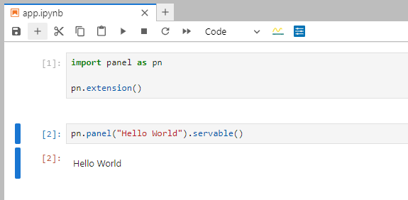
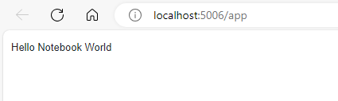

# Serve Apps

In this section you will learn the basics of serving Panel apps:

- serve your Python script, Notebook or Markdown file with the commands `panel serve app.py`, `panel serve app.ipynb` or `panel serve app.md` respectively.
- serve with *auto reload* by adding the flag `--autoreload`.
- stop your server with `CTRL+C`.

## Serve a Python script

The simplest Panel `.py` file could look like this:

```python
import panel as pn

pn.extension()

pn.panel("Hello World").servable()
```

:::{admonition} Note
The code refers to

- `panel`: The Panel python package. Its a convention to import it as `pn`.
- `pn.extension()`: Loads javascript dependencies and configures Panel.
- `pn.panel(...)`: Creates a *displayable* Panel component.
- `.servable()`: Displays the component in a *server app*.
:::

Copy code into a file named `app.py`.

Save the file.

Run the Panel server with

```python
panel serve app.py --autoreload
```

It will look like

```bash
$ panel serve app.py --autoreload
2024-01-17 15:49:11,443 Starting Bokeh server version 3.3.2 (running on Tornado 6.3.3)
2024-01-17 15:49:11,444 User authentication hooks NOT provided (default user enabled)
2024-01-17 15:49:11,450 Bokeh app running at: http://localhost:5006/app
2024-01-17 15:49:11,450 Starting Bokeh server with process id: 47256
```

:::{admonition} Note
The command `panel serve app.py --autoreload` refers to:

- `panel`: the panel executable.
- `serve`: the command you want panel to run
- `app.py`: the file `app.py` you want to serve
- `--autoreload`: make the server restart after code changes. Use this for **development only**.
:::

In the output, you will find the line

```bash
Bokeh app running at: http://localhost:5006/app
```

That line shows the URL where your app is being served, in your local machine.


:::{admonition} Note
The `Bokeh server` is mentioned because Panel is built on top of [Bokeh](https://docs.bokeh.org).
:::

Open your browser at [http://localhost:5006/app](http://localhost:5006/app).

The application will look like.

.

Now stop the server by pressing `CTRL+C` one or more times in the terminal.

## Serve a notebook

Copy the 2 code cells below into a clean notebook named `app.ipynb`.

```python
import panel as pn

pn.extension()
```

```python
pn.panel("Hello Notebook World").servable()
```

Run the cells in the notebook and save it as `app.ipynb` if you have not already done it.

It should look like

.

:::{admonition} Note
The code refers to

- `panel`: The Panel python package. Its a convention to import it as `pn`.
- `pn.extension()`: **Loads the [`pyviz_comms`](https://github.com/holoviz/pyviz_comms) notebook extension**, loads javascript dependencies and configures Panel.
- `pn.panel(...)`: Creates a *displayable* Panel component. **The component can be displayed directly in the notebook**.
- `.servable()`: Displays the component in a *server app*.
:::

Run the Panel server with

```bash
panel serve app.ipynb --autoreload
```

It will look like

```bash
$ panel serve app.ipynb --autoreload
2024-01-17 21:05:32,338 Starting Bokeh server version 3.3.3 (running on Tornado 6.4)
2024-01-17 21:05:32,339 User authentication hooks NOT provided (default user enabled)
2024-01-17 21:05:32,342 Bokeh app running at: http://localhost:5006/app
2024-01-17 21:05:32,342 Starting Bokeh server with process id: 42008
```

:::{admonition} Note
The command `panel serve app.ipynb --autoreload` refers to:

- `panel`: the panel executable.
- `serve`: the command you want panel to run
- `app.ipynb`: the file `app.ipynb` you want to serve
- `--autoreload`: make the server restart after code changes. Use this for **development only**.
:::

In the output, you will find the line

```bash
Bokeh app running at: http://localhost:5006/app
```

That line shows the URL where your app is being served, in your local machine.

Open your browser at [http://localhost:5006/app](http://localhost:5006/app).

The application will look like.

.

Now stop the server by pressing `CTRL+C` one or more times in the terminal.

## Serve a Markdown document

:::{admonition} Note
The command `panel serve app.md` will serve a Markdown file as a live Panel app. You can use this feature if your use case is developing live, interactive documentation in Markdown files.

Check out the [Write and serve apps in Markdown](../../how_to/editor/markdown.md) how-to guide for more information.
:::

## Recap

You can

- serve your Python script, Notebook or Markdown file with the commands `panel serve app.py`, `panel serve app.ipynb` or `panel serve app.md` respectively.
- serve with *auto reload* by adding the flag `--autoreload`.
- stop your server with `CTRL+C`.

## Resources

### Tutorials

- [Serve Panel Apps (Intermediate)](../intermediate/panel_serve.md)

### How-to

- [Launch a server dynamically with `pn.serve` or `pn.show`](../../how_to/server/programmatic.md)
- [Launch a server on the commandline](../../how_to/server/commandline.md)
- [Serve multiple applications with `pn.serve`](../../how_to/server/multiple.md)
- [Serve static files with `--static-dirs`](../../how_to/server/static_files.md)
- [Serve with Django](../../how_to/integrations/django.md)
- [Serve with FastAPI](../../how_to/integrations/FastAPI.md)
- [Serve with Flask](../../how_to/integrations/flask.md)
- [Write and serve apps in Markdown](../../how_to/editor/markdown.md)
