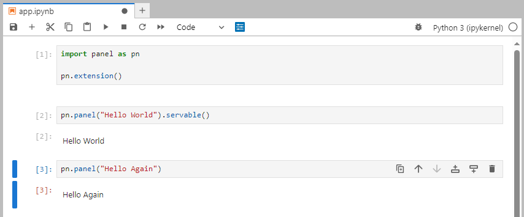
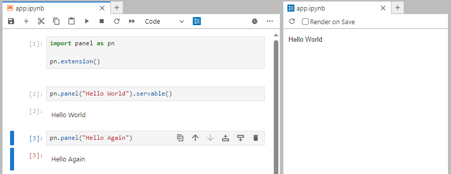

# Develop in a Notebook

In this guide you will learn how to develop efficiently in a notebook:

- Preview your app in Jupyter lab with the *Jupyter Panel Preview*.
- Inspect your component using `SHIFT+Tab` and `print`.
- Inspect your components class and instance parameters using `.param`.

:::note
In this guide we will assume you are working in [Jupyter lab](https://jupyter.org/). Panel works in many other notebook environments. But non-jupyterlab notebook environments might need special configuration before supporting Panel appropriately. Check out the [Resources](#resources) section below for more specific guidance.
:::

## Preview your app

A simple notebook file containing a Panel app could look like.



Create a new notebook

Copy paste the code below into the notebook

```{python}
import panel as pn

pn.extension()
```

```python
slider = pn.widgets.IntSlider(value=4, name="Value").servable()
```

```python
pn.panel("Hello Again and Again")
```

Run the cells

It should look like


:::note
The code in the notebook refer to

- `panel`: The Panel python package. Its a convention to import it as `pn`.
- `pn.extension()`: **Loads the [`pyviz_comms`](https://github.com/holoviz/pyviz_comms) notebook extension**, loads javascript dependencies and configures Panel.
- `pn.panel(...)`: Creates a *displayable* Panel component. **The component can be displayed directly in the notebook**.
- `.servable()`: Displays the component in a *server app*.
:::

The little, blue Panel icon above the notebook will launch a *preview* of your app. We call this icon the *Jupyter Panel Preview* icon.

Click the *Jupyter Panel Preview* icon.

You will see the app launching in a separate window on the right.



You will notice that "Hello Again" is not displayed in the app preview. That is because `pn.panel("Hello Again")` has not been added to the app. You can do that by marking it `.servable()`.

Change the cell to `pn.panel("Hello Again).servable()`.

Click the *refresh* button in the *Jupyter Panel Preview*. Its located left of the *Render on Save* check box.

Your *preview* will update and look like


To enable a more efficient workflow you can check the *Render on Save* checkbox. This will *auto reload* your app when the notebook is saved.

Check the *Render on Save* checkbox.

Change the cell to `pn.panel("Hello Again and Again.).servable()`.

The app will automatically reload and look like


Watch the video below to see how the techniques above can be used to develop a more advanced app.

<video controls="" poster="../_static/images/jupyter_panel_preview_in_action.png">
    <source src="https://assets.holoviz.org/panel/tutorials/jupyter_panel_preview_in_action.mp4" type="video/mp4" style="max-height: 400px; max-width: 100%;">
    Your browser does not support the video tag.
</video>

## Inspect a Component using `SHIFT+Tab`

Create a new notebook

Copy-paste the code below into the first cell

```{python}
import panel as pn

pn.extension()
```

Run the cell

Write `pn.widgets.IntSlider` in a cell and press `SHIFT+Tab`.

It should look like


Scroll down until you find the *Example* and *Reference* link


Click the *Reference* link [https://panel.holoviz.org/reference/widgets/IntSlider.html](https://panel.holoviz.org/reference/widgets/IntSlider.html).

It should look like

[](https://panel.holoviz.org/reference/widgets/IntSlider.html)

:::info
You can speed up your workflow by using the *Example* code and *Reference* links in the Panel docstrings.
:::

## Inspect a Component using `print`

Create a new notebook

Copy-paste the code below into the notebook

```python
import panel as pn

pn.extension()
```

```python
print(pn.panel("Hello World"))
```

```python
component = pn.Column(
    "Hello World", pn.widgets.IntSlider(value=2, end=10, name="Value")
)
print(component)
```

Run the cells

It should look like


:::note
By printing *layout* components like `Column` you can understand how its composed. This enables you to *access* the subcomponents of the layout.
:::

Add the two code cells below

```python
component[0]
```

```python
component[1]
```

Run the new cells

It should look like


## Inspect a Components Parameters using `.param`

Create a new notebook

Copy-paste the two code cells below into the notebook

```python
import panel as pn

pn.extension()
```

```python
pn.widgets.IntSlider.param
```

Run the code cells

It should look like


:::note
- The `.param` table shows you the *default* parameter values of the `IntSlider` class. I.e. the *default* value of `align` is `'start'`.
- The `.param` table shows you additional information like the `Type` and `Range` of the Parameter.
:::

Add the new cell

```python
pn.widgets.IntSlider(align="end").param
```

Run the code cell

It should look like


:::note
- In the picture above you see the *actual* parameter values of the `IntSlider` instance. I.e. the *actual* value of `align` is `'end'`.
:::

## Recap

You can

- Preview your app in Jupyter lab with the *Jupyter Panel Preview*.
- Inspect your component using `SHIFT+Tab` and `print`.
- Inspect your components class and instance parameters using `.param`.

## Resources

### How-to

- [Develop in other notebook environments](../how_to/notebook/notebook.html)
- [Display Output in Notebooks](../how_to/notebook/notebook.html)
- [Preview Apps in Jupyterlab](../how_to/notebook/jupyterlabpreview.md)
- [Serve an app from a notebook file](serve.md)
- [Use VS Code Notebook and Interactive Environment](../how_to/editor/vscode_configure.html#notebook-and-interactive-environment)
