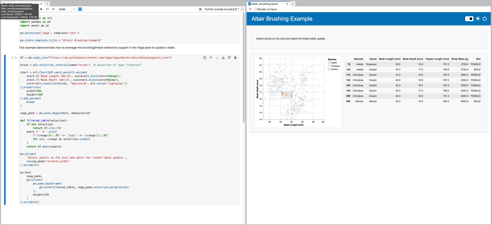
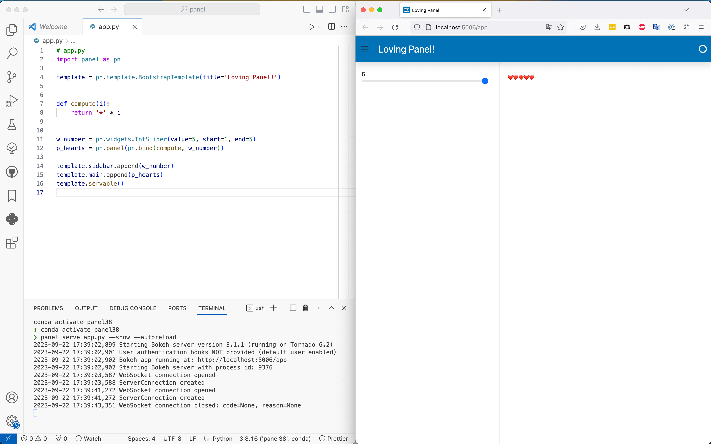

# Effective Development

:::{note} Tutorial 4. **Efficient Development**
:icon: false

 It's also important for you to be able to use a coding environment you are comfortable with. To this end, Panel offers very good support for Jupyter Notebooks (Classic and JupyterLab) and editors like Visual Studio Code, which are the two environments we will cover in this guide.

:::

## Notebook

### Notebook friendly

Jupyter notebooks have been supported in Panel since day 1 and more generally since the inception of the HoloViz project. Notebooks are environments that allow to iterate quickly, running some code and observing instantaneously its output. Notebooks also happen to be a valid deployment option:

- you can actually develop apps that are meant to live only in a notebook, that you will share as a file with your colleagues and friends. Panel allows you to make your notebooks more user friendly, like IPywidgets does.
- you can serve a notebook with `panel serve file.ipynb`, Panel will parse your notebook to collect all of its code and run it as if it were a Python script.

Jupyter notebooks aren't the only flavor of notebooks available, Panel also supports Visual Studio Code and Google Colab notebooks, and probably works fine on other platforms. For Visual Studio Code notebooks, you will need to install the `jupyter_bokeh` package in your environment.

### `pn.extension`

The first step when working in a notebook environment should **always** be to load the `pn.extension`:

```{pyodide}
import panel as pn

pn.extension()
```

The extension ensures that all required Javascript and CSS resources are added to your notebook environment. If you are going to be using any custom extensions, such as [Vega](https://panel.holoviz.org/reference/panes/Vega.html) or [Tabulator](https://panel.holoviz.org/reference/widgets/Tabulator.html) you must ensure that you initialize these as well.

```{pyodide}
pn.extension('vega', 'tabulator')
```

### Rich display

One of the major benefits of notebook environments is that they support rich output. This means that if you place an object with rich output at the end of a cell the notebook will figure out how to render the rich representation. Panel uses this mechanism to ensure that all components return a rich representation.

```{pyodide}
pane = pn.panel('<marquee>Here is some custom HTML</marquee>')
pane
```

To instead see a textual representation of the component, you can use the `print` function on any Panel object.

```{pyodide}
print(pane)
```

### Callback logs

When you set up interactivity in your app using one of the various ways Panel offers to register a callback (e.g. `param.bind`, `@param.watch`, `on_<event>` methods), it can be useful for you as a developer to print some debug information. Panel catches all the content sent to *stdout* and *stderr* when callbacks are executed and renders it above the displayed object. The default mode of this functionality is to accumulate content, you can modify this by setting `pn.config.console_output` to `'replace'` for instance to only see the last message caught. Move the slider in the little app below to see the stream of printed messages being displayed in the notebook.

```{pyodide}
pn.config.console_output = False
```

```{pyodide}
def compute(i):
    print(f'debug {i}')
    return '❤️' * i

w = pn.widgets.IntSlider(value=1, start=1, end=10)

pn.Row(w, pn.bind(compute, w))
```

### Render templates

You have been told in the previous guide to avoid rendering Panel templates in a notebook. That's however not a dead end! There are two approaches you can leverage to display an app that is wrapped in a template while working from a notebook, in addition to just being able to serve the notebook with `panel serve notebook.ipynb`.

Templates, as any other Panel visual components, are equipped with the `.show()` method that when called starts a Bokeh server, serves your app and opens it in a new tab. While this approach doesn't allow you to iterate super quickly, it's a simple way to check what your app looks like when served.

```{pyodide}
template = pn.template.BootstrapTemplate(
    title='Loving Panel!',
    sidebar=['**Text 1**', '**Text 2**'],
    main=['Main area'],
)
# Uncomment the next line to try out `.show()`
template;#.show();
```

The second approach deserves a section of its own.

### *Preview* functionality

With the *Preview* functionality, available in JupyterLab, you can display the app you are building in a JupyterLab tab right next to your code. This is a traditional setup for web developers, who like to quickly visualize the effects of their code changes.

To have your app appear in the *Preview*, you need to mark the objects you want to display with `.servable()`. This is identical to how you would mark objects that you want to serve with `panel serve ...`.

You can enable the *Preview* by clicking on Panel’s logo in the menu bar of your notebook. Once clicked, you should see a new tab being opened next to your notebook tab, and after some moment your app will be rendered in this tab. Just try it out!

```{pyodide}
template = pn.template.BootstrapTemplate(title='HM Training!')

def compute(i):
    return '❤️' * i

w_number = pn.widgets.IntSlider(value=5, start=1, end=5)
p_hearts = pn.panel(pn.bind(compute, w_number))

template.sidebar.append(w_number)
template.main.append(p_hearts)
template.servable();
```

:::{tip}

Note the `;` at the end of `template.servable();`. This is a special IPython command that prevents the output of a cell from being displayed. This comes in handy when dealing with templates in a notebook!
:::

This is what you should be able to see after a little while. Now tick `Render on Save` in the *Preview*, change the heart for a ⭐ in the notebook and save it, shortly after the preview will display an updated app.



## Visual Studio Code

Visual Studio Code (VS Code) has quickly become one of the most popular Python coding environment. In this section you will see how you can to set yourself a nice developer experience with VS Code when developing a Panel app.

### Setup and autoreload

Save the content of the next cell in a file named `app.py`.

```python
# app.py
import panel as pn

template = pn.template.BootstrapTemplate(title='Loving Panel!')


def compute(i):
    return '❤️' * i


w_number = pn.widgets.IntSlider(value=5, start=1, end=5)
p_hearts = pn.panel(pn.bind(compute, w_number))

template.sidebar.append(w_number)
template.main.append(p_hearts)
template.servable()
```

From the VS Code terminal run the following command.

```bash
panel serve app.py --show --autoreload
```

The `--show` flag will open a browser tab with the live app and the `--autoreload` flag ensures that the app reloads whenever you make a change to the Python source. `--autoreload` is key to your developer experience, you will see the app being updated live when you save your app file! In the image below the windows have been re-arranged the way web developers like, on one side the code and on the other side a live view of the app, just like the *Preview* functionality in Jupyterlab.



### Debugging

While you can debug your app using the often blamed but never outperformed `print`, or by manually adding breakpoints with `breakpoint()`, the VS Code integrated debugger offers a more user friendly experience.

To configure the integrated debugger for Panel, you will need to add a debugging configuration like the following.

```json
// .vscode/launch.json
{
    "version": "0.2.0",
    "configurations": [
        {
            "name": "panel serve",
            "type": "python",
            "request": "launch",
            "program": "-m",
            "args": [
                "panel",
                "serve",
                "${relativeFile}",
                "--show"
            ],
            "console": "integratedTerminal",
            "justMyCode": true
        }
    ]
}
```

With this configuration in place, launching the debugger will serve the file you are working on with Panel, open a new browser tab pointing at the served app. Interact then with your app to hit one of the breakpoints you set up in VS Code.


