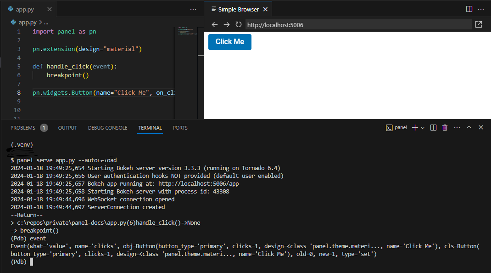

# Develop in an Editor

In this section you will learn more advances techniques to develop efficiently in an editor:

- Resetting the cache with `pn.state.clear_caches()` or `some_cached_func.clear()`.
- Debug with [Pdb](https://docs.python.org/3/library/pdb.html) by inserting a `breakpoint()`

:::{note}
This guide builds upon the [Develop in an Editor (beginner)](../basic/develop_editor.md) tutorial.
:::

:::{note}
Some of the features demonstrated in this guide might require special configuration of your editor. For configuration we refer you to the [Resources](#resources) section below and general resources on the web.
:::

## Resetting the Cache

When developing with the `--autoreload` option and utilizing caching, you may need to reset the cache. You have the option to clear either the entire cache or just the cache for a specific function.

Execute the code below:

```python
import panel as pn
from datetime import datetime

pn.extension()

# To clear the entire cache, uncomment the following line:
# pn.state.clear_caches()

@pn.cache
def get_data():
    return datetime.now()

# To clear the cache for this specific function, uncomment:
# get_data.clear()

pn.panel(get_data).servable()
```

To reset the cache, uncomment and use either `pn.state.clear_caches()` for the entire cache or `get_data.clear()` for the specific function's cache. Below is a video demonstrating this process:

<video muted controls loop poster="../../_static/images/clear-cache-with-autoreload.png" style="max-height: 400px; max-width: 100%;">
    <source src="https://assets.holoviz.org/panel/tutorials/clear-cache-with-autoreload.mp4" type="video/mp4">
    Your browser does not support the video tag.
</video>

## Debug your App with Pdb

A simple way to debug your apps that works in any editor is to insert a `breakpoint()`.

Copy the code below into a file named `app.py`.

```python
import panel as pn

pn.extension(design="material")

def handle_click(event):
    breakpoint()

pn.widgets.Button(name="Click Me", on_click=handle_click, button_type="primary").servable()
```

Serve the app with `panel serve app.py --autoreload`.

Open [http://localhost:5006/app](http://localhost:5006/app) in a browser.

The app will look something like


Click the `Click Me` Button.

Your terminal will look something like

```bash
$ panel serve app.py --autoreload
2024-01-20 08:12:09,512 Starting Bokeh server version 3.3.3 (running on Tornado 6.4)
2024-01-20 08:12:09,514 User authentication hooks NOT provided (default user enabled)
2024-01-20 08:12:09,516 Bokeh app running at: http://localhost:5006/app
2024-01-20 08:12:09,516 Starting Bokeh server with process id: 9768
2024-01-20 08:12:10,608 WebSocket connection opened
2024-01-20 08:12:10,608 ServerConnection created
--Return--
> /home/jovyan/app.py(6)handle_click()->None
-> breakpoint()
(Pdb)
```

Write `event` in the terminal. Press `ENTER`.

It should look like



Write `help` and press `ENTER` for more info. It will look like

```bash
(Pdb) help

Documented commands (type help <topic>):
========================================
EOF    c          d        h         list      q        rv       undisplay
a      cl         debug    help      ll        quit     s        unt
alias  clear      disable  ignore    longlist  r        source   until
args   commands   display  interact  n         restart  step     up
b      condition  down     j         next      return   tbreak   w
break  cont       enable   jump      p         retval   u        whatis
bt     continue   exit     l         pp        run      unalias  where

Miscellaneous help topics:
==========================
exec  pdb
```

Write `c` and press `ENTER` to continue running the code and server.

:::{note}
For more about debugging with [Pdb](https://docs.python.org/3/library/pdb.html) and `breakpoint` please check out the [PDB Documentation](https://docs.python.org/3/library/pdb.html).
:::

:::{note}
For *integrated debugging* in your editor, please refer to the [Resources](#resources) section below and general resources on the web.
:::

## Recap

You have learned to

- Reset the cache with `pn.state.clear_caches()` or `some_cached_func.clear()`.
- Debug with [Pdb](https://docs.python.org/3/library/pdb.html) by inserting a `breakpoint()`

## Resources

### Tutorials

- [Develop in an Editor (Beginner)](../basic/develop_editor.md)

## Explanation

- [Develop Seamlessly](../../explanation/develop_seamlessly.md)

### How-to

- [Configure PyCharm](../../how_to/editor/pycharm_configure.md)
- [Configure VS Code](../../how_to/editor/vscode_configure.md)
