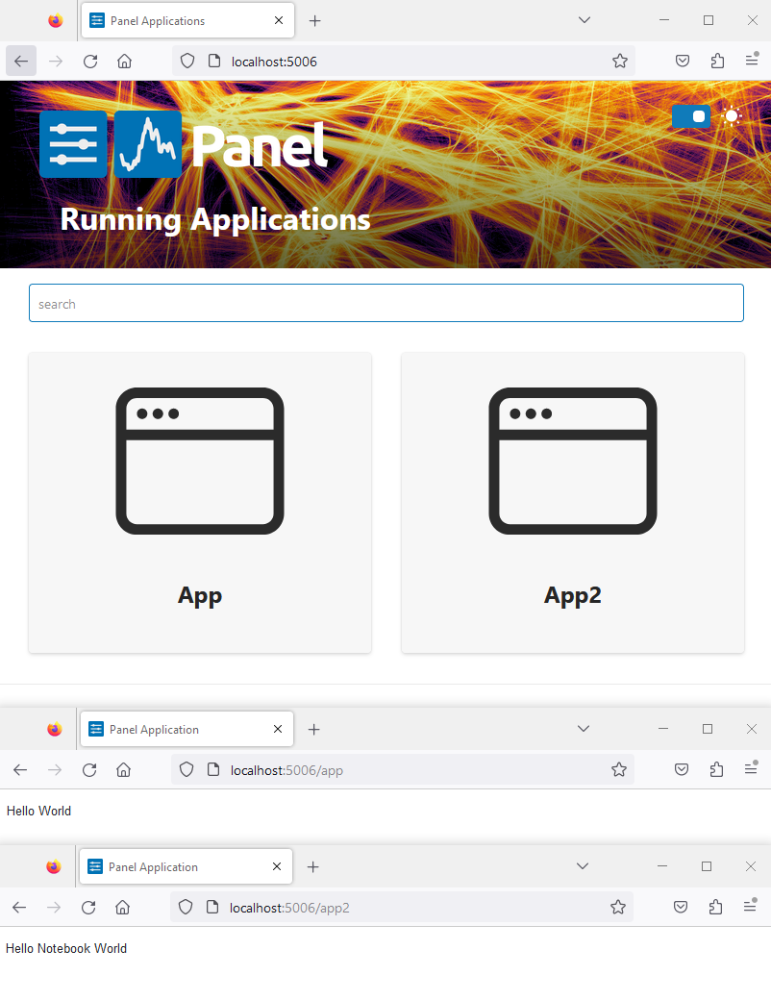

# Serve Apps

In this tutorial you will learn more advanced techniques to serve Panel apps:

- serve a multi page app by providing a list of files or [*globs*](https://en.wikipedia.org/wiki/Glob_(programming)).
- list the configuration options of `panel serve` by adding the flag `--help`.

:::{admonition} Note
This guide builds upon the [Serve Panel Apps (beginner)](../beginner/) tutorial.
:::

## Serve a multi-page app

You can serve an app with multiple pages just by providing the file paths to `panel serve`.

Copy the code below into a file named `app.py` and save the file

```python
import panel as pn

pn.extension()

pn.panel("Hello World").servable()
```

Copy the 2 code cells below into a clean notebook named `app2.ipynb`.

```python
import panel as pn

pn.extension()
```

```python
pn.panel("Hello Notebook World").servable()
```

Run the cells and save the notebook if you have not already done it.

Run `panel serve app.py app2.ipynb --autoreload`.

It should look like

```bash
$ panel serve app.py app2.ipynb --autoreload
2024-01-17 21:14:43,502 Starting Bokeh server version 3.3.3 (running on Tornado 6.4)
2024-01-17 21:14:43,503 User authentication hooks NOT provided (default user enabled)
2024-01-17 21:14:43,506 Bokeh app running at: http://localhost:5006/app
2024-01-17 21:14:43,506 Bokeh app running at: http://localhost:5006/app2
2024-01-17 21:14:43,506 Starting Bokeh server with process id: 39832
```

Open [http://localhost:5006](http://localhost:5006), [http://localhost:5006/app](http://localhost:5006/app) and [http://localhost:5006/app2](http://localhost:5006/app2).

It will look something like



:::{admonition} Note
You can also use one or more [*globs*](https://en.wikipedia.org/wiki/Glob_(programming)) to serve a long or dynamic list of apps. For example `apps/*`, `pages/*.py`, `examples/*.ipynb` or `docs/*.md`.
:::

## Configure `panel serve`

The command **`panel serve` is highly configurable**.

Run `panel serve --help` in a terminal.

It should look like the below.

```bash
$ panel serve --help
usage: panel serve [-h] [--port PORT] [--address ADDRESS] [--unix-socket UNIX-SOCKET] [--log-level LOG-LEVEL] [--log-format LOG-FORMAT]
                   [--log-file LOG-FILE] [--use-config CONFIG] [--args ...] [--dev [FILES-TO-WATCH ...]] [--show]
                   [--allow-websocket-origin HOST[:PORT]] [--prefix PREFIX] [--ico-path ICO_PATH] [--keep-alive MILLISECONDS]
                   [--check-unused-sessions MILLISECONDS] [--unused-session-lifetime MILLISECONDS] [--stats-log-frequency MILLISECONDS]
                   [--mem-log-frequency MILLISECONDS] [--use-xheaders] [--ssl-certfile CERTFILE] [--ssl-keyfile KEYFILE] [--session-ids MODE]
                   [--auth-module AUTH_MODULE] [--enable-xsrf-cookies] [--exclude-headers EXCLUDE_HEADERS [EXCLUDE_HEADERS ...]]
                   [--exclude-cookies EXCLUDE_COOKIES [EXCLUDE_COOKIES ...]] [--include-headers INCLUDE_HEADERS [INCLUDE_HEADERS ...]]
                   [--include-cookies INCLUDE_COOKIES [INCLUDE_COOKIES ...]] [--cookie-secret COOKIE_SECRET] [--index INDEX]
                   [--disable-index] [--disable-index-redirect] [--num-procs N] [--session-token-expiration N]
                   [--websocket-max-message-size BYTES] [--websocket-compression-level LEVEL] [--websocket-compression-mem-level LEVEL]
                   [--glob] [--static-dirs KEY=VALUE [KEY=VALUE ...]] [--basic-auth BASIC_AUTH] [--oauth-provider OAUTH_PROVIDER]
                   [--oauth-key OAUTH_KEY] [--oauth-secret OAUTH_SECRET] [--oauth-redirect-uri OAUTH_REDIRECT_URI]
                   [--oauth-extra-params OAUTH_EXTRA_PARAMS] [--oauth-jwt-user OAUTH_JWT_USER] [--oauth-encryption-key OAUTH_ENCRYPTION_KEY]
                   [--oauth-error-template OAUTH_ERROR_TEMPLATE] [--oauth-expiry-days OAUTH_EXPIRY_DAYS] [--oauth-refresh-tokens]
                   [--oauth-guest-endpoints [OAUTH_GUEST_ENDPOINTS ...]] [--oauth-optional] [--login-endpoint LOGIN_ENDPOINT]
                   [--logout-endpoint LOGOUT_ENDPOINT] [--auth-template AUTH_TEMPLATE] [--logout-template LOGOUT_TEMPLATE]
                   [--basic-login-template BASIC_LOGIN_TEMPLATE] [--rest-provider REST_PROVIDER] [--rest-endpoint REST_ENDPOINT]
                   [--rest-session-info] [--session-history SESSION_HISTORY] [--warm] [--admin] [--admin-endpoint ADMIN_ENDPOINT]
                   [--admin-log-level {debug,info,warning,error,critical}] [--profiler PROFILER] [--autoreload] [--num-threads NUM_THREADS]
                   [--setup SETUP] [--liveness] [--liveness-endpoint LIVENESS_ENDPOINT] [--reuse-sessions] [--global-loading-spinner]
                   [DIRECTORY-OR-SCRIPT ...]

positional arguments:
  DIRECTORY-OR-SCRIPT   The app directories or scripts to serve (serve empty document if not specified)

options:
  -h, --help            show this help message and exit
  --port PORT           Port to listen on
  --address ADDRESS     Address to listen on
  --unix-socket UNIX-SOCKET
                        Unix socket to bind. Network options such as port, address, ssl options are incompatible with unix socket
  --log-level LOG-LEVEL
                        One of: trace, debug, info, warning, error or critical
  --log-format LOG-FORMAT
                        A standard Python logging format string (default: '%(asctime)s %(message)s')
  --log-file LOG-FILE   A filename to write logs to, or None to write to the standard stream (default: None)
  --use-config CONFIG   Use a YAML config file for settings
  --args ...            Command line arguments remaining to passed on to the application handler. NOTE: if this argument precedes DIRECTORY-
                        OR-SCRIPT then some other argument, e.g. --show, must be placed before the directory or script.
  --dev [FILES-TO-WATCH ...]
                        Enable live reloading during app development. By default it watches all *.py *.html *.css *.yaml files in the app
                        directory tree. Additional files can be passed as arguments. NOTE: if this argument precedes DIRECTORY-OR-SCRIPT then
                        some other argument, e.g --show, must be placed before the directory or script. NOTE: This setting only works with a
                        single app. It also restricts the number of processes to 1. NOTE FOR WINDOWS USERS : this option must be invoked
                        using 'python -m bokeh'. If not Tornado will fail to restart the server
  --show                Open server app(s) in a browser
  --allow-websocket-origin HOST[:PORT]
                        Public hostnames which may connect to the Bokeh websocket With unix socket, the websocket origin restrictions should
                        be enforced by the proxy.
  --prefix PREFIX       URL prefix for Bokeh server URLs
  --ico-path ICO_PATH   Path to a .ico file to use as the favicon.ico, or 'none' to disable favicon.ico support. If unset, a default Bokeh
                        .ico file will be used
  --keep-alive MILLISECONDS
                        How often to send a keep-alive ping to clients, 0 to disable.
  --check-unused-sessions MILLISECONDS
                        How often to check for unused sessions
  --unused-session-lifetime MILLISECONDS
                        How long unused sessions last
  --stats-log-frequency MILLISECONDS
                        How often to log stats
  --mem-log-frequency MILLISECONDS
                        How often to log memory usage information
  --use-xheaders        Prefer X-headers for IP/protocol information
  --ssl-certfile CERTFILE
                        Absolute path to a certificate file for SSL termination
  --ssl-keyfile KEYFILE
                        Absolute path to a private key file for SSL termination
  --session-ids MODE    One of: unsigned, signed or external-signed
  --auth-module AUTH_MODULE
                        Absolute path to a Python module that implements auth hooks
  --enable-xsrf-cookies
                        Whether to enable Tornado support for XSRF cookies. All PUT, POST, or DELETE handlers must be properly instrumented
                        when this setting is enabled.
  --exclude-headers EXCLUDE_HEADERS [EXCLUDE_HEADERS ...]
                        A list of request headers to exclude from the session context (by default all headers are included).
  --exclude-cookies EXCLUDE_COOKIES [EXCLUDE_COOKIES ...]
                        A list of request cookies to exclude from the session context (by default all cookies are included).
  --include-headers INCLUDE_HEADERS [INCLUDE_HEADERS ...]
                        A list of request headers to make available in the session context (by default all headers are included).
  --include-cookies INCLUDE_COOKIES [INCLUDE_COOKIES ...]
                        A list of request cookies to make available in the session context (by default all cookies are included).
  --cookie-secret COOKIE_SECRET
                        Configure to enable getting/setting secure cookies
  --index INDEX         Path to a template to use for the site index
  --disable-index       Do not use the default index on the root path
  --disable-index-redirect
                        Do not redirect to running app from root path
  --num-procs N         Number of worker processes for an app. Using 0 will autodetect number of cores (defaults to 1)
  --session-token-expiration N
                        Duration in seconds that a new session token is valid for session creation. After the expiry time has elapsed, the
                        token will not be able create a new session (defaults to seconds).
  --websocket-max-message-size BYTES
                        Set the Tornado websocket_max_message_size value (default: 20MB)
  --websocket-compression-level LEVEL
                        Set the Tornado WebSocket compression_level
  --websocket-compression-mem-level LEVEL
                        Set the Tornado WebSocket compression mem_level
  --glob                Process all filename arguments as globs
  --static-dirs KEY=VALUE [KEY=VALUE ...]
                        Static directories to serve specified as key=value pairs mapping from URL route to static file directory.
  --basic-auth BASIC_AUTH
                        Password or filepath to use with Basic Authentication.
  --oauth-provider OAUTH_PROVIDER
                        The OAuth2 provider to use.
  --oauth-key OAUTH_KEY
                        The OAuth2 key to use
  --oauth-secret OAUTH_SECRET
                        The OAuth2 secret to use
  --oauth-redirect-uri OAUTH_REDIRECT_URI
                        The OAuth2 redirect URI
  --oauth-extra-params OAUTH_EXTRA_PARAMS
                        Additional parameters to use.
  --oauth-jwt-user OAUTH_JWT_USER
                        The key in the ID JWT token to consider the user.
  --oauth-encryption-key OAUTH_ENCRYPTION_KEY
                        A random string used to encode the user information.
  --oauth-error-template OAUTH_ERROR_TEMPLATE
                        A random string used to encode the user information.
  --oauth-expiry-days OAUTH_EXPIRY_DAYS
                        Expiry off the OAuth cookie in number of days.
  --oauth-refresh-tokens
                        Whether to automatically OAuth access tokens when they expire.
  --oauth-guest-endpoints [OAUTH_GUEST_ENDPOINTS ...]
                        List of endpoints that can be accessed as a guest without authenticating.
  --oauth-optional      Whether the user will be forced to go through login flow or if they can access all applications as a guest.
  --login-endpoint LOGIN_ENDPOINT
                        Endpoint to serve the authentication login page on.
  --logout-endpoint LOGOUT_ENDPOINT
                        Endpoint to serve the authentication logout page on.
  --auth-template AUTH_TEMPLATE
                        Template to serve when user is unauthenticated.
  --logout-template LOGOUT_TEMPLATE
                        Template to serve logout page.
  --basic-login-template BASIC_LOGIN_TEMPLATE
                        Template to serve for Basic Authentication login page.
  --rest-provider REST_PROVIDER
                        The interface to use to serve REST API
  --rest-endpoint REST_ENDPOINT
                        Endpoint to store REST API on.
  --rest-session-info   Whether to serve session info on the REST API
  --session-history SESSION_HISTORY
                        The length of the session history to record.
  --warm                Whether to execute scripts on startup to warm up the server.
  --admin               Whether to add an admin panel.
  --admin-endpoint ADMIN_ENDPOINT
                        Name to use for the admin endpoint.
  --admin-log-level {debug,info,warning,error,critical}
                        One of: debug (default), info, warning, error or critical
  --profiler PROFILER   The profiler to use by default, e.g. pyinstrument, snakeviz or memray.
  --autoreload          Whether to autoreload source when script changes.
  --num-threads NUM_THREADS
                        Whether to start a thread pool which events are dispatched to.
  --setup SETUP         Path to a setup script to run before server starts.
  --liveness            Whether to add a liveness endpoint.
  --liveness-endpoint LIVENESS_ENDPOINT
                        The endpoint for the liveness API.
  --reuse-sessions      Whether to reuse sessions when serving the initial request.
  --global-loading-spinner
                        Whether to add a global loading spinner to the application(s).
```

## Recap

You can

- serve a multi page app by providing a list of files or [*globs*](https://en.wikipedia.org/wiki/Glob_(programming)).
- list the configuration options of `panel serve` by adding the flag `--help`.

## Additional Resources

### Tutorials

- [Serve Apps (beginner)](../beginner/panel_serve)

### How-to

- [Launch a server dynamically with `pn.serve` or `pn.show`](../../how_to/server/programmatic.md)
- [Launch a server on the commandline](../../how_to/server/commandline.md)
- [Serve multiple applications with `pn.serve`](../../how_to/server/multiple.md)
- [Serve static files with `--static-dirs`](../../how_to/server/static_files.md)
- [Serve with Django](../../how_to/integrations/django.md)
- [Serve with FastAPI](../../how_to/integrations/FastAPI.md)
- [Serve with Flask](../../how_to/integrations/flask.md)
- [Write and serve apps in Markdown](../../how_to/editor/markdown.md)
