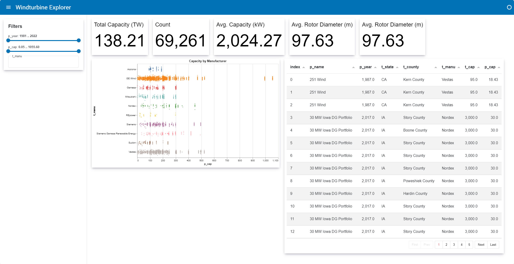

# Structure with a DataStore

In this tutorial you will learn how to use the `DataStore` *design pattern*:

- The `DataStore` design pattern has proven quite successful across a wide range of use cases.
- The `DataStore` component receives `data` and `filters`. Based on the `data` and `filters` it *transforms* the data.
- One or more `View` components consumes the *transformed* data.
- The components can be (re-)used for data exploration in notebooks and for building apps.

:::{note}
When building a larger application we generally recommend using a *class based construction* and following best practices for object-oriented programming, specifically composition.
:::

```{pyodide}
import panel as pn
pn.extension('tabulator', 'vega', throttled=True)
```

<div class="header-box" style="box-shadow: rgba(50, 50, 93, 0.25) 0px 6px 12px -2px, rgba(0, 0, 0, 0.3) 0px 3px 7px -3px; padding: 5px 10px; border-left: 4px solid green;">

## Install the dependencies

Please make sure [Altair](https://altair-viz.github.io/), [Pandas](https://pandas.pydata.org) and [PyArrow](https://arrow.apache.org/docs/python/index.html) are installed.

::::{tab-set}

:::{tab-item} pip
:sync: pip

``` bash
pip install altair pandas panel pyarrow
```

:::

:::{tab-item} conda
:sync: conda

``` bash
conda install -y -c conda-forge altair pandas panel pyarrow
```

:::

::::

## Build the app

### The Data Store

Copy the code below into a new file and save the file as `data_store.py`.

```{pyodide}
import param
import panel as pn
import pandas as pd
from panel.viewable import Viewer

CARD_STYLE = """
:host {{
  box-shadow: rgba(50, 50, 93, 0.25) 0px 6px 12px -2px, rgba(0, 0, 0, 0.3) 0px 3px 7px -3px;
  padding: {padding};
}} """

TURBINES_URL = "https://datasets.holoviz.org/windturbines/v1/windturbines.parq"

@pn.cache(ttl=15 * 60)
def get_turbines():
    return pd.read_parquet(TURBINES_URL)


class DataStore(Viewer):
    data = param.DataFrame()

    filters = param.List(constant=True)

    def __init__(self, **params):
        super().__init__(**params)
        dfx = self.param.data.rx()
        widgets = []
        for filt in self.filters:
            dtype = self.data.dtypes[filt]
            if dtype.kind == "f":
                widget = pn.widgets.RangeSlider(
                    name=filt, start=dfx[filt].min(), end=dfx[filt].max()
                )
                condition = dfx[filt].between(*widget.rx())
            else:
                options = dfx[filt].unique().tolist()
                widget = pn.widgets.MultiChoice(name=filt, options=options)
                condition = dfx[filt].isin(widget.rx().rx.where(widget, options))
            dfx = dfx[condition]
            widgets.append(widget)
        self.filtered = dfx
        self.count = dfx.rx.len()
        self.total_capacity = dfx.t_cap.sum()
        self.avg_capacity = dfx.t_cap.mean()
        self.avg_rotor_diameter = dfx.t_rd.mean()
        self.top_manufacturers = (
            dfx.groupby("t_manu").p_cap.sum().sort_values().iloc[-10:].index.to_list()
        )
        self._widgets = widgets

    def filter(
        self,
    ):
        return

    def __panel__(self):
        return pn.Column(
            "## Filters",
            *self._widgets,
            stylesheets=[CARD_STYLE.format(padding="5px 10px")],
            margin=10
        )
```

:::{note}
The `DataStore` class is be responsible for transforming `data` in various ways.

1. The `DataStore` must receive `data` as an argument when instantiated.
2. When the `filters` value is updated, it triggers an update of the `count`, `total_capacity`, ... etc. values.
:::

### The Views

Copy the code below into a new file, remove the `#` from the import and save the file as `views.py`.

```{pyodide}
import altair as alt
import param
# from data_store import DataStore, CARD_STYLE
from panel.viewable import Viewer
import panel as pn

class View(Viewer):
    data_store = param.ClassSelector(class_=DataStore)


class Table(View):
    columns = param.List(
        default=["p_name", "p_year", "t_state", "t_county", "t_manu", "t_cap", "p_cap"]
    )

    def __panel__(self):
        data = self.data_store.filtered[self.param.columns]
        return pn.widgets.Tabulator(
            data,
            pagination="remote",
            page_size=13,
            stylesheets=[CARD_STYLE.format(padding="10px")],
            margin=10,
        )


class Histogram(View):
    def __panel__(self):
        df = self.data_store.filtered
        df = df[df.t_manu.isin(self.data_store.top_manufacturers)]
        fig = (
            pn.rx(alt.Chart)(
                (df.rx.len() > 5000).rx.where(df.sample(5000), df),
                title="Capacity by Manufacturer",
            )
            .mark_circle(size=8)
            .encode(
                y="t_manu:N",
                x="p_cap:Q",
                yOffset="jitter:Q",
                color=alt.Color("t_manu:N").legend(None),
            )
            .transform_calculate(jitter="sqrt(-2*log(random()))*cos(2*PI*random())")
            .properties(
                height=400,
                width=600,
            )
        )
        return pn.pane.Vega(
            fig, stylesheets=[CARD_STYLE.format(padding="0")], margin=10
        )


class Indicators(View):
    def __panel__(self):
        style = {"stylesheets": [CARD_STYLE.format(padding="10px")]}
        return pn.FlexBox(
            pn.indicators.Number(
                value=self.data_store.total_capacity / 1e6,
                name="Total Capacity (TW)",
                format="{value:,.2f}",
                **style
            ),
            pn.indicators.Number(
                value=self.data_store.count,
                name="Count",
                format="{value:,.0f}",
                **style
            ),
            pn.indicators.Number(
                value=self.data_store.avg_capacity,
                name="Avg. Capacity (kW)",
                format="{value:,.2f}",
                **style
            ),
            pn.indicators.Number(
                value=self.data_store.avg_rotor_diameter,
                name="Avg. Rotor Diameter (m)",
                format="{value:,.2f}",
                **style
            ),
            pn.indicators.Number(
                value=self.data_store.avg_rotor_diameter,
                name="Avg. Rotor Diameter (m)",
                format="{value:,.2f}",
                **style
            ),
        )
```

:::{note}
Here we declared a *base* `View` class that holds a reference to the `DataStore` as a parameter. Now we can have any number of concrete `View` classes that consume data from the `DataStore` and render it in any number of ways:
:::

### The App

Copy the code below into a new file and save the file as `app.py`.

```python
import param
from panel.viewable import Viewer
from data_store import DataStore, get_turbines
from views import Indicators, Histogram, Table

import panel as pn

pn.extension("tabulator", "vega", throttled=True)

class App(Viewer):
    data_store = param.ClassSelector(class_=DataStore)

    title = param.String()

    views = param.List()

    def __init__(self, **params):
        super().__init__(**params)
        updating = self.data_store.filtered.rx.updating()
        updating.rx.watch(
            lambda updating: pn.state.curdoc.hold()
            if updating
            else pn.state.curdoc.unhold()
        )
        self._views = pn.FlexBox(
            *(view(data_store=self.data_store) for view in self.views), loading=updating
        )
        self._template = pn.template.MaterialTemplate(title=self.title)
        self._template.sidebar.append(self.data_store)
        self._template.main.append(self._views)

    def servable(self):
        if pn.state.served:
            return self._template.servable()
        return self

    def __panel__(self):
        return pn.Row(self.data_store, self._views)


data = get_turbines()
ds = DataStore(data=data, filters=["p_year", "p_cap", "t_manu"])

App(
    data_store=ds, views=[Indicators, Histogram, Table], title="Windturbine Explorer"
).servable()
```

Run `panel serve app.py --autoreload`

The app will look something like



## Reuse in a Notebook

:::{note}
The beauty of the *compositional approach* to constructing application components is that they are now usable in multiple contexts.
:::

Copy the two cells below into a notebook, remove the `#` from the imports and run the cells.

```{pyodide}
# from data_store import DataStore, get_turbines
# from views import Indicators, Histogram, Table

import panel as pn

pn.extension("tabulator", "vega", throttled=True)
```

```{pyodide}
turbines = get_turbines()

ds = DataStore(data=turbines, filters=['p_year', 'p_cap', 't_manu'])

pn.Row(
    ds,
    pn.Tabs(
        ('Indicators', Indicators(data_store=ds)),
        ('Histogram', Histogram(data_store=ds)),
        ('Table', Table(data_store=ds)),
        sizing_mode='stretch_width',
    )
).servable()
```

## Recap

In this tutorial you have learned:

- The `DataStore` design pattern has proven quite successful across a wide range of use cases.
- The `DataStore` component receives `data` and `filters`. Based on the `data` and `filters` it *transforms* the data.
- One or more `View` components consumes the *transformed* data.
- The components can be (re-)used for data exploration in notebooks and for building apps.

## Resources
