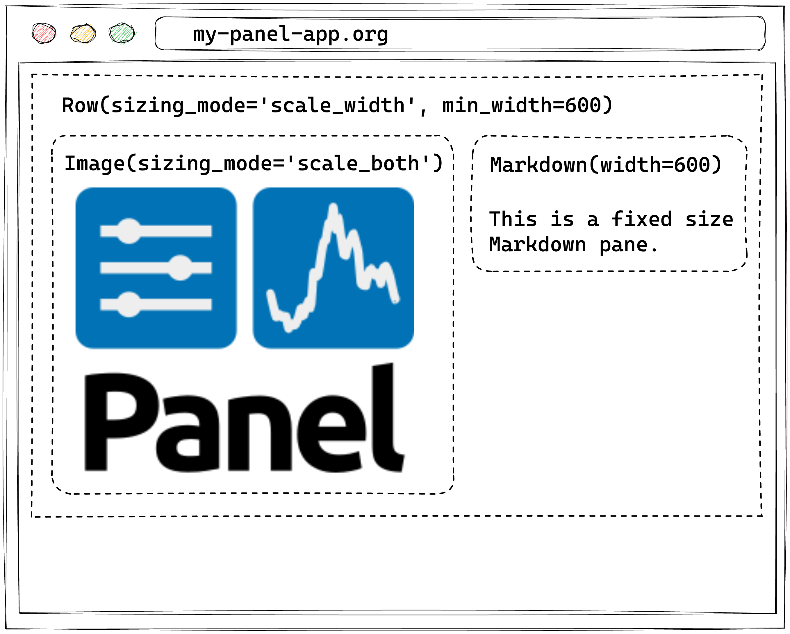

# Upgrade Guide

Welcome to the Upgrade Guide for Panel! When we make backward-incompatible changes, we will provide a detailed guide on how you can update your application to be compatible with the latest changes.

## Version 1.0

The 1.0 release brings a wealth of improvements compared to the 0.x series, including significant changes to the layout engine and an improved approach to handling CSS for individual components. These improvements are thanks to the new Bokeh 3.x releases, which received a bottom-up rewrite of layouts and CSS handling. These updates not only boost the performance but also elevate the customizability of your Panel apps.

As with any major update, it's important to understand the implications of these changes for your existing applications. This guide is designed to walk you through the key updates introduced in Panel 1.0, the rationale behind them, and the critical considerations to consider while adapting your applications to this new version. We'll take you on a comprehensive journey, outlining how the new layout engine transforms how you create and manage your Panel apps and the impact of the enhanced CSS handling on your components.

By the end of this guide, you will have a clear understanding of how to leverage the full potential of Panel 1.0's features and enhancements, ensuring a smooth transition for your applications. So, without further ado, let's dive into the exciting world of Panel 1.0 and explore the new possibilities it has to offer!

### The layout engine

Panel 1.0, built upon Bokeh 3.0, introduces a CSS-based layout engine that replaces the previous engine, primarily optimized for plotting. This upgrade results in improved performance, especially when handling a multitude of components on the page at the same time and makes it possible to create more complex applications without sacrificing speed and responsiveness.

Additionally, Panel 1.0 offers better sizing of components that are slow to render, such as images. By removing the need for explicit CSS size overrides, Panel 1.0 streamlines the customization process for your layouts. This added flexibility makes it easier to tailor your apps to fit your design goals and user needs.

However, it's important to note that the complete replacement of the layout implementation might not ensure identical behavior to previous versions. In the upcoming sections, we'll review key points to consider when adapting to this new layout engine.

#### `sizing_mode`

The `sizing_mode` has been the primary way to configure the responsiveness of components in Panel, and that has not changed. However, previously the layout engine was quite forgiving in the way it interpreted combinations of the `sizing_mode` and explicit `width`/`height` settings that really did not make sense. Before we dive into some of these differences, let's briefly go through the different `sizing_mode` options and what they actually mean:


- `stretch_width`: Stretches content/container in width, while the size of contents determines the height.
- `stretch_height`: Stretches content/container in height, while the size of contents determines the width.
- `stretch_both`: Stretches content/container in both width and height.

Now let us explore what changed in this release. In the past, the behavior of a responsive component inside a non-responsive container was poorly defined. Generally it would force the container to be responsive as well, but often it would only be width responsive. In this release there are a number of well defined behaviors which determine how a container behaves when it wraps one or more responsively sized component:

- If a child is responsive in width then the layout should also be responsive in width (unless a fixed `width` has been).
- If a container is vertical (e.g. a `Column`) or supports responsive reflowing (e.g. a `FlexBox`) and a child is responsive in height then the container should also be height-responsive (unless a fixed `height` is set).
- If a container is horizontal (e.g. a `Row`) and all children are responsive in height then the container should also be height-responsive. This behavior is asymmetrical with width because there isn't always vertical space to expand into and it is better for the component to match the height of the other children.
- If any children declare a fixed `width` or `height` then the container will inherit these as `min_width` and `min_height` settings to ensure that sufficient space is allocated.

These very explicit rules ensure consistent behavior in most cases, however it is always best to be explicit and declare the sizes.

Let us walk through an example. Below we declare a responsive `Image` and a fixed-size `Markdown` pane inside a `Row`. According to the rules above the `Row` layout will inherit responsive sizing in `width` but not `height`. Additionally it will inherit a `min_width` from the `Markdown` pane.

<div style="text-align:center">

</div>

:::{note}
To maintain backward compatibility Panel will still try to infer the appropriate sizing mode by inspecting the children of a container. It is, however, always best to be explicit.
:::

#### Ambiguous configurations

In the past, Panel would happily accept ambiguous layout configurations, e.g., providing a fixed width while also setting a responsive `sizing_mode` along the same dimension. As an example, take the following:

```python
pn.pane.Image(..., sizing_mode='stretch_both', width=500)
```

This specification is ambiguous. Did you want it to stretch the width, or did you want to set a fixed width? In the past, this would be resolved in favor of making the component responsive, i.e. ignoring the `width` value. In Panel 1.0, we will warn that this is not a supported configuration and turn the `width` into a `min_width`. In the future, this conflicting specification will error. To toggle these errors on instead of a warning, set `layout_compatibility` to `'error'`:

```python
pn.extension(layout_compatibility='error')
# OR
pn.config.layout_compatibility = 'error'
```

### CSS styling

The other major change in Panel 1.0 is in the CSS handling on components. Starting in Bokeh 3.0 each component is now rendered into the [Shadow DOM](https://developer.mozilla.org/en-US/docs/Web/API/Web_components/Using_shadow_DOM). While you don't have to understand the intricacies of how the shadow DOM works, know that each component is now encapsulated and therefore isolated from the rest of the page. This has big benefits because each component can be styled fully independently without the CSS leaking to other components but it also has significant backward compatibility implications.

#### Global vs. local stylesheets

In the past, it was possible to declare global stylesheets that could override the styles of all components on the page. As a backward compatibility measure, any stylesheets defined using the `raw_css` and `css_files` config parameters, e.g., by setting:

```python
pn.extension(raw_css=['div.widget-box { color: red; }'], css_files=['https://panel.holoviz.org/custom.css'])
```

is now strongly discouraged. Because global stylesheets no longer affect the encapsulated components, we will inject these stylesheets directly into each component, which is highly inefficient.

:::{attention}
Usage of `pn.config.raw_css` and `pn.config.css_files` is now **strongly** discouraged.
:::

Depending on whether your custom CSS controlled the styling of individual components or the template, you should now either use the stylesheets property on each component OR use the `raw_css` and `css_files` parameters on the template.

#### Component Stylesheets

Now that each component is isolated from the rest of the page, it is possible to style each component separately by injecting `stylesheets`. This is what makes it possible for each component to be styled using the `design` frameworks ([see the how-to guide on applying designs](how_to/styling/design.md)). Instead of injecting global stylesheets, you should now apply the stylesheets on the component.

Let us walk through a simple example. Let's say you had a global stylesheet that would change the style of a Slider handle. Previously you would have injected this globally like this:

```python
import panel as pn

slider_css = """
.noUi-handle {
  border-radius: 100%;
  box-shadow: unset;
  background-color: #0081f3;
}
"""

pn.extension(raw_css=[slider_css])
```

Now you can inject it directly on the specific component you want to override like this:

```{pyodide}
import panel as pn

slider_css = """
.noUi-handle {
  border-radius: 100%;
  box-shadow: unset;
  background-color: #0081f3;
}
"""

pn.widgets.FloatSlider(name='Number', stylesheets=[slider_css])
```

Alternatively you can also modify the class default like this:

```python
pn.widgets.FloatSlider.stylesheets = [slider_css]
```

For more details on applying CSS to components [see the corresponding how-to guide](how_to/styling/apply_css.md).

#### Template Stylesheets

Sometimes there is still a need to change the appearance of the overall template. Instead of injecting those options via the global `raw_css` and `css_files` config parameters you can inject them directly on a template, e.g.:

```python
pn.template.MaterialTemplate(
    raw_css=[...], css_files=[...]
)
```

or if you are using a global template:

```python
pn.state.template.param.update(
    raw_css=[...], css_files=[...]
)
```

### Loading extensions

In the past Panel extensions could be loaded using the `pn.extension` call, or, if no extension call was present, could simply be imported. When serving an application Panel would then include the resources for all loaded extensions. This meant that when serving multiple applications that required very different components you may end up loading resources for components were not even used.

Going forward we strongly recommend that you always declare which components a particular application is using with a `pn.extension` call, e.g. if you are using the `Tabulator` widget and the `Vega` pane you should declare:

```python
import panel as pn

pn.extension('tabulator', 'vega', ...)
```

at the top of your application. The flipside of this is that if you call `pn.extension` but fail to declare the actual requirements then those resources will not be loaded and your application will not render correctly.

:::{tip}
We recommend always declaring all required extensions at the top of your application.
:::

### Smaller changes

- `Tabulator.frozen_rows` now respects the order of rows in the data instead of the order in which the `frozen_rows` were defined.
- `Viewable.embed` now returns a `Mimebundle` object that can be rendered in a notebook but also in other contexts.
- The `policy` argument toon `pn.cache` used to accept `'LIFO'` but instead implemented a `'FIFO'` policy. This has been fixed and the function now only accepts `'LRU'`, `'LIFO'`, and `'LFU'` policies.

### Deprecations

The following changes have been deprecated; we will warn you and guide you on how to update them.

#### `styles` and `background`

To align with the definition set by Bokeh 3.x, `style` has been renamed to `styles`, and the background is now needed to be set inside the styles dictionary:

``` python
# Before:
pn.pane.Markdown("# Hello", background="red")
# Now:
pn.pane.Markdown("# Hello", styles={'background': 'red'})
```

#### `Ace` renamed to `CodeEditor`

`pn.widgets.Ace()` has been renamed to `pn.widgets.CodeEditor()` to reflect better what the component does and not the implementation used.
