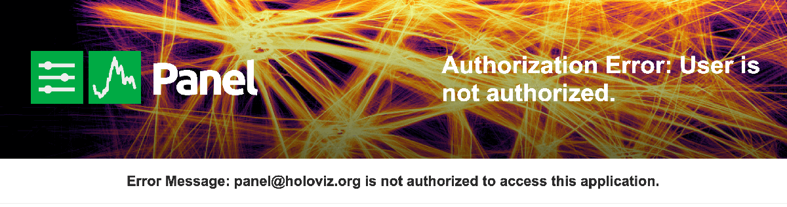

# Authentication

Authentication is a difficult topic fraught with potential pitfalls and complicated configuration options. Panel aims to be a "batteries-included" package for building applications and dashboards and therefore ships with a number of inbuilt providers for authentication in an application.

The primary mechanism by which Panel performs autentication is [OAuth 2.0](https://oauth.net/2/). The official specification for OAuth 2.0 describes the protocol as follows:

    The OAuth 2.0 authorization framework enables a third-party
    application to obtain limited access to an HTTP service, either on
    behalf of a resource owner by orchestrating an approval interaction
    between the resource owner and the HTTP service, or by allowing the
    third-party application to obtain access on its own behalf.

In other words OAuth outsources authentication to a third party provider, e.g. GitHub, Google or Azure AD, to authenticate the user credentials and give limited access to the APIs of that service.

Note that since Panel is built on Bokeh server and Tornado it is also possible to implement your own authentication independent of the OAuth components shipped with Panel, [see the Bokeh documentation](https://docs.bokeh.org/en/latest/docs/user_guide/server.html#authentication) for further information.

## Configuring OAuth

The OAuth component will stop any user from accessing the application before first logging into the selected provider. The configuration to set up OAuth is all handled via the global `pn.config` object, which has a number of OAuth related parameters. When launching the application via the `panel serve` CLI command these config options can be set as CLI arguments or environment variables, when using the `pn.serve` function on the other hand these variables can be passed in as arguments.

### `oauth_provider`

The first step in configuring a OAuth is to specify a specific OAuth provider. Panel ships with a number of providers by default:

* `azure`: Azure Active Directory
* `bitbucket`: Bitbucket
* `github`: GitHub
* `gitlab`: GitLab
* `google`: Google
* `okta`: Okta

We will go through the process of configuring each of these individually later but for now all we need to know that the `oauth_provider` can be set on the commandline using the `--oauth-provider` CLI argument to `panel serve` or the `PANEL_OAUTH_PROVIDER` environment variable.

Examples:

```
panel serve oauth_example.py --oauth-provider=...

PANEL_OAUTH_PROVIDER=... panel serve oauth_example.py
```

### `oauth_key` and `oauth_secret`

To authenticate with a OAuth provider we generally require two pieces of information (although some providers will require more customization):

1. The Client ID is a public identifier for apps.
2. The Client Secret is a secret known only to the application and the authorization server.

These can be configured in a number of ways the client ID and client secret can be supplied to the `panel serve` command as `--oauth-key` and `--oauth-secret` CLI arguments or `PANEL_OAUTH_KEY` and `PANEL_OAUTH_SECRET` environment variables respectively.

Examples:

```
panel serve oauth_example.py --oauth-key=... --oauth-secret=...

PANEL_OAUTH_KEY=... PANEL_OAUTH_KEY=... panel serve oauth_example.py ...
```

### `oauth_extra_params`

Some OAuth providers will require some additional configuration options which will become part of the OAuth URLs. The `oauth_extra_params` configuration variable allows providing this additional information and can be set using the `--oauth-extra-params` CLI argument or `PANEL_OAUTH_EXTRA_PARAMS`.

Examples:

```
panel serve oauth_example.py --oauth-extra-params={'tenant_id': ...}

PANEL_OAUTH_EXTRA_PARAMS={'tenant_id': ...} panel serve oauth_example.py ...
```

### `cookie_secret`

Once authenticated the user information and authorization token will be set as secure cookies. Cookies are not secure and can easily be modified by clients. A secure cookie ensures that the user information cannot be interfered with or forged by the client by signing it with a secret key. Note that secure cookies guarantee integrity but not confidentiality. That is, the cookie cannot be modified but its contents can be seen by the user. To generate a `cookie_secret` use the `panel secret` CLI argument or generate some other random non-guessable string, ideally with at least 256-bits of entropy.

To set the `cookie_secret` supply `--cookie-secret` as a CLI argument or set the `PANEL_COOKIE_SECRET` environment variable.

Examples:

```
panel serve oauth_example.py --cookie-secret=...

PANEL_COOKIE_SECRET=... panel serve oauth_example.py ...
```

### `oauth_expiry`

The OAuth expiry configuration value determines for how long an OAuth token will be valid once it has been issued. By default it is valid for 1 day, but may be overwritten by providing the duration in the number of days (decimal values are allowed).

To set the `oauth_expiry` supply `--oauth-expiry-days` as a CLI argument or set the `PANEL_OAUTH_EXPIRY` environment variable.

Examples:

```
panel serve oauth_example.py --oauth-expiry-days=...

PANEL_OAUTH_EXPIRY=... panel serve oauth_example.py ...
```

### Encryption

The architecture of the Bokeh/Panel server means that credentials stored as cookies can be leak in a number of ways. On the initial HTTP(S) request the server will respond with the HTML document that renders the application and this will include an unencrypted token containing the OAuth information. To ensure that the user information and access token are properly encrypted we rely on the Fernet encryption in the `cryptography` library. You can install it with `pip install cryptography` or `conda install cryptography`.

Once installed you will be able to generate a encryption key with `panel oauth-secret`. This will generate a secret you can pass to the `panel serve` CLI command using the ``--oauth-encryption-key`` argument or `PANEL_OAUTH_ENCRYPTION` environment variable.

Examples:

```
panel serve oauth_example.py --oauth-encryption-key=...

PANEL_OAUTH_ENCRYPTION=... panel serve oauth_example.py ...
```

### Redirect URI

Once the OAuth provider has authenticated a user it has to redirect them back to the application, this is what is known as the redirect URI. For security reasons this has to match the URL registered with the OAuth provider exactly. By default Panel will redirect the user straight back to the original URL of your app, e.g. when you're hosting your app at `https://myapp.myprovider.com` Panel will use that as the redirect URI. However in certain scenarios you may override this to provide a specific redirect URI. This can be achieved with the `--oauth-redirect-uri` CLI argument or the `PANEL_OAUTH_REDIRECT_URI` environment variable.

Examples:

```
panel serve oauth_example.py --oauth-redirect-uri=...

PANEL_OAUTH_REDIRECT_URI=... panel serve oauth_example.py
```

### Summary

A fully configured OAuth configuration may look like this:

```
panel serve oauth_example.py --oauth-provider=github --oauth-key=... --oauth-secret=... --cookie-secret=... --oauth-encryption-key=...

PANEL_OAUTH_PROVIDER=... PANEL_OAUTH_KEY=... PANEL_OAUTH_SECRET=... PANEL_COOKIE_SECRET=... PANEL_OAUTH_ENCRYPTION=... panel serve oauth_example.py ...`
```

## Accessing OAuth information

Once a user is authorized with the chosen OAuth provider certain user information and an `access_token` will be available to be used in the application to customize the user experience. Like all other global state this may be accessed on the `pn.state` object, specifically it makes three attributes available:

* **`pn.state.user`**: A unique name, email or ID that identifies the user.
* **`pn.state.access_token`**: The access token issued by the OAuth provider to authorize requests to its APIs.
* **`pn.state.refresh_token`**: The refresh token issued by the OAuth provider to authorize requests to its APIs (if available these are usually longer lived than the `access_token`).
* **`pn.state.user_info`**: Additional user information provided by the OAuth provider. This may include names, email, APIs to request further user information, IDs and more.

## Authorization

The OAuth providers integrated with Panel provide an easy way to enable authentication on your applications. This verifies the identity of a user and also provides some level of access control (i.e. authorization). However often times the OAuth configuration is controlled by a corporate IT department or is otherwise difficult to manage so its often easier to grant permissions to use the OAuth provider freely but then restrict access controls in the application itself. To manage access you can provide an `authorization_callback` as part of your applications.

The `authorization_callback` can be configured on `pn.config` or via the `pn.extension`:

```python
import panel as pn

def authorize(user_info):
    with open('users.txt') as f:
        valid_users = f.readlines()
    return user_info['username'] in valid_users

pn.config.authorize_callback = authorize # or pn.extension(..., authorize_callback=authorize)
```

The `authorize_callback` is given a dictionary containing the data in the OAuth provider's `id_token`. The example above checks whether the current user is in the list of users specified in a `user.txt` file. However you can implement whatever logic you want to either grant a user access or reject it.

If a user is not authorized they will be presented with a authorization error template which can be configured using the `--auth-template` commandline option or by setting `config.auth_template`.

</img>

The auth template must be a valid Jinja2 template and accepts a number of arguments:

- `{{ title }}`: The page title.
- `{{ error_type }}`: The type of error.
- `{{ error }}`: A short description of the error.
- `{{ error_msg }}`: A full description of the error.

## OAuth Providers

Panel provides a  number of inbuilt OAuth providers, below is the list

### **Azure Active Directory**

To set up OAuth2.0 authentication for Azure Active directory follow [these instructions](https://docs.microsoft.com/en-us/azure/api-management/api-management-howto-protect-backend-with-aad). In addition to the `oauth_key` and `oauth_secret` ensure that you also supply the tenant ID using `oauth_extra_params`, e.g.:

```
panel serve oauth_test.py --oauth-extra-params="{'tenant': '...'}"

PANEL_OAUTH_EXTRA_PARAMS="{'tenant': '...'}" panel serve oauth_example.py ...
```

### **Bitbucket**

Bitbucket provides instructions about setting [setting up an OAuth consumer](https://support.atlassian.com/bitbucket-cloud/docs/use-oauth-on-bitbucket-cloud/). Follow these and then supply the `oauth_key` and `oauth_secret` to Panel as described above.

### **GitHub**

GitHub provides detailed instructions on [creating an OAuth app](https://developer.github.com/apps/building-oauth-apps/creating-an-oauth-app/). Follow these and then supply the `oauth_key` and `oauth_secret` to Panel as described above.

### **GitLab**

GitLab provides a detailed guide on [configuring an OAuth](https://docs.gitlab.com/ee/api/oauth2.html) application. In addition to the `oauth_key` and `oauth_secret` you will also have to supply a custom url using the `oauth_extra_params` if you have a custom GitLab instance (the default `oauth_extra_params={'url': 'gitlab.com'}`).

### **Google**

Google provides a guide about [configuring a OAuth application](https://developers.google.com/identity/protocols/oauth2/native-app). By default nothing except the `oauth_key` and `oauth_secret` are required but to access Google services you may also want to override the default `scope` via the `oauth_extra_params`.

### **Okta**

Okta provides a guide about [configuring OAuth2](https://developer.okta.com/docs/concepts/oauth-openid/). You must provide an `oauth_key` and `oauth_secret` but in most other ordinary setups you will also have to provide a `url` via the `oauth_extra_params` and if you have set up a custom authentication server (i.e. not 'default') with Okta you must also provide 'server', the `oauth_extra_params` should then look something like this: `{'server': 'custom', 'url': 'dev-***.okta.com'}`

### Plugins

The Panel OAuth providers are pluggable, in other words downstream libraries may define their own Tornado `RequestHandler` to be used with Panel. To register such a component the `setup.py` of the downstream package should register an entry_point that Panel can discover. To read more about entry points see the [Python documentation](https://packaging.python.org/specifications/entry-points/). A custom OAuth request handler in your library may be registered as follows:

```python
entry_points={
    'panel.auth': [
        "custom = my_library.auth:MyCustomOAuthRequestHandler"
    ]
}
```
