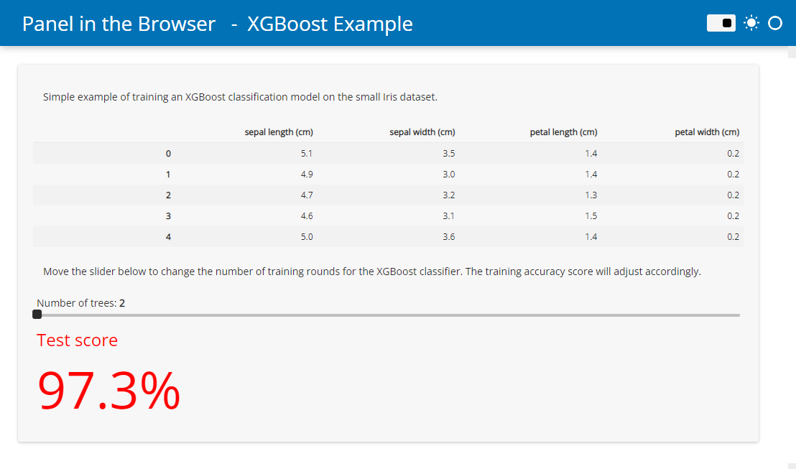
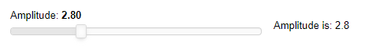

# Running Panel in the Browser with WASM

Panel lets you write dashboards and other applications in Python that are accessed using a web browser. Typically, the Python interpreter runs as a separate Jupyter or Bokeh server process, communicating with JavaScript code running in the client browser. However, **it is now possible to run Python directly in the browser**, with **no separate server needed!**

The underlying technology involved is called [WebAssembly](https://webassembly.org/) (or WASM). More specifically, [Pyodide](https://pyodide.org/) pioneered the ability to install Python libraries, manipulate the web page's [DOM](https://developer.mozilla.org/en-US/docs/Web/API/Document_Object_Model/Introduction) from Python, and execute regular Python code entirely in the browser. A number of libraries have sprung up around Python in WASM, including [PyScript](https://pyscript.net/).

Panel can be run directly in Pyodide and has special support for rendering in PyScript.

This guide will take you through the process of either

- Automatically converting Panel applications into a Pyodide/PyScript based application
- Manually installing Panel in the browser and using it to render components.
- Embedding Panel in your Sphinx documentation.
- Setting up a Jupyterlite instance with support for Panel

## Converting Panel applications

Writing an HTML file from scratch with all the Javascript and Python dependencies and other boilerplate can be quite cumbersome, and requires learning a good bit of HTML. To avoid writing all the boilerplate, Panel provides support for converting an entire application (including Panel templates) to an HTML file, using the `panel convert` command-line interface (CLI). As a starting point create one or more Python scripts or notebook files containing your application. The only requirement is that they import only global modules and packages (relative imports of other scripts or modules is not supported) and that the libraries have been [compiled for Pyodide](https://github.com/pyodide/pyodide/tree/main/packages) or are available as pure-Python wheels from PyPI.

The ``panel convert`` command has the following options:

    positional arguments:
      SCRIPTs               The scripts or notebooks to convert

    optional arguments:
      -h, --help            Show this help message and exit
      --to                  The format to convert to, one of 'pyodide', 'pyodide-worker' or 'pyscript'
      --out                 Directory to export files to
      --title               Custom title for the application(s)
      --skip-embed          Whether to skip the prerendering while pyodide loads.
      --index               Whether to create an index if multiple files are served.
      --pwa                 Whether to add files to allow serving the application as a Progressive Web App.
      --requirements        List of Python requirements to add to the converted file. By default it will automatically try to infer dependencies based on your imports and Panel will automatically be included.
      --watch               Watches files for changes and rebuilds them when they are updated.
      --disable-http-patch  Disables patching of http requests using pyodide-http library.

### Example

This example will demonstrate how to *convert* and *serve* a basic data app locally.

- Create a `script.py` file with the following content

```python
import panel as pn

from sklearn.datasets import load_iris
from sklearn.metrics import accuracy_score
from xgboost import XGBClassifier

pn.extension(sizing_mode="stretch_width", template="fast")
pn.state.template.param.update(site="Panel in the Browser", title="XGBoost Example")

iris_df = load_iris(as_frame=True)

trees = pn.widgets.IntSlider(start=2, end=30, name="Number of trees")

def pipeline(trees):
    model = XGBClassifier(max_depth=2, n_estimators=trees)
    model.fit(iris_df.data, iris_df.target)
    accuracy = round(accuracy_score(iris_df.target, model.predict(iris_df.data)) * 100, 1)
    return pn.indicators.Number(
        name="Test score",
        value=accuracy,
        format="{value}%",
        colors=[(97.5, "red"), (99.0, "orange"), (100, "green")],
    )

pn.Column(
    "Simple example of training an XGBoost classification model on the small Iris dataset.",
    iris_df.data.head(),
    "Move the slider below to change the number of training rounds for the XGBoost classifier. The training accuracy score will adjust accordingly.",
    trees,
    pn.bind(pipeline, trees),
).servable()
```

- Run `panel convert script.py --to pyodide-worker --out pyodide`
- Run `python3 -m http.server` to start a web server locally
- Open `http://localhost:8000/pyodide/script.html` to try out the app.

The app should look like this



You can now add the `script.html` (and `script.js` file if you used the `pyodide-worker` target) to your Github pages or similar. **no separate server needed!**

#### Tips & Tricks for development

- While developing you should run the script locally with *auto reload*: `panel serve script.py --autoreload`.
- You can also watch your script for changes and rebuild it if you make an edit with `panel convert ... --watch`
- If the converted app does not work as expected, you can most often find the errors in the browser
console. [This guide](https://balsamiq.com/support/faqs/browserconsole/) describes how to open the
console.
- You can find answers to the most frequently asked questions about *Python in the browser* in the [Pyodide - FAQ](https://pyodide.org/en/stable/usage/faq.html) or the [PyScript FAQ](https://docs.pyscript.net/latest/reference/faq.html). For example the answer to "How can I load external data?".

### Formats

Using the `--to` argument on the CLI you can control the format of the file that is generated by `panel convert`. You have three options, each with distinct advantages and disadvantages:

- **`pyodide`** (default): Run application using Pyodide running in the main thread. This option is less performant than pyodide-worker but produces completely standalone HTML files that do not have to be hosted on a static file server (e.g. Github Pages).
- **`pyodide-worker`**: Generates an HTML file and a JS file containing a Web Worker that runs in a separate thread. This is the most performant option, but files have to be hosted on a static file server.
- **`pyscript`**: Generates an HTML leveraging PyScript. This produces standalone HTML files containing `<py-env>` and `<py-script>` tags containing the dependencies and the application code. This output is the most readable, and should have equivalent performance to the `pyodide` option.

### Requirements

The `panel convert` command will try its best to figure out the requirements of your script based on the imports, which means that in most cases you won't have to provide the explicit `--requirements` argument. However, if some library uses an optional import that cannot be inferred from the list of imports in your app you will have to provide an explicit list of dependencies. Note that `panel` and its dependencies including NumPy and Bokeh will be added loaded automatically, e.g. the explicit requirements for the app above would look like this:

```bash
panel convert script.py --to pyodide-worker --out pyodide --requirements xgboost scikit-learn pandas
```

Alternatively you may also provide a `requirements.txt` file:

```bash
panel convert script.py --to pyodide-worker --out pyodide --requirements requirements.txt
```

### Index

If you convert multiple applications at once you may want to add an index to be able to navigate between the applications easily. To enable the index simply pass `--index` to the convert command.

### Prerendering

In order to improve the loading experience Panel will pre-render and embed the initial render of the page and replace it with live components once the page is loaded. This is important because Pyodide has to fetch the entire Python runtime and all required packages from a CDN. This can be **very** slow depending on your internet connection. If you want to disable this behavior and render an initially blank page use the `--skip-embed` option. Otherwise Panel will render application using the current Python process (presumably outside the browser) into the HTML file as a "cached" copy of the application for the user to see while the Python runtime is initialized and the actual browser-generated application is ready for interaction.

### Progressive Web Apps

Progressive web applications (PWAs) provide a way for your web apps to behave almost like a native application, both on mobile devices and on the desktop. The `panel convert` CLI has a `--pwa` option that will generate the necessary files to turn your Panel + Pyodide application into a PWA. The web manifest, service worker script and assets such as thumbnails are exported alongside the other HTML and JS files and can then be hosted on your static file host. Note that Progressive web apps must be served via HTTPS to ensure user privacy, security, and content authenticity, including the application itself and all resources it references. Depending on your hosting service, you will have to enable HTTPS yourself. GitHub pages generally make this very simple and provide a great starting point.

Once generated, you can inspect the `site.webmanifest` file and modify it to your liking, including updating the favicons in the assets directory.

```{note}
If you decide to enable the `--pwa` ensure that you also provide a unique `--title`. Otherwise the browser caches storing your apps dependencies will end up overwriting each other.
```

### Handling HTTP requests

By default Panel 0.14.1 will install the [pyodide-http](https://github.com/koenvo/pyodide-http) library which patches `urllib3` and `requests` making it possible to use them within the pyodide process. To disable this behavior use the `--disable-http-patch` CLI option.

Note that making HTTP requests when converting to the `pyodide` or `pyscript` target will block the main browser thread and result in a poor user experience. Therefore we strongly recommend converting to `pyodide-worker` if your app is making synchronous HTTP requests.

## Installing Panel in the browser

To install Panel in the browser you merely have to use the installation mechanism provided by each supported runtime:

### Pyodide

Currently the best supported mechanism for installing packages in Pyodide is `micropip`.

To get started with Pyodide simply follow their [Getting started guide](https://pyodide.org/en/stable/usage/quickstart.html). Note that if you want to render Panel output you will also have to load [Bokeh.js](https://docs.bokeh.org/en/2.4.1/docs/first_steps/installation.html#install-bokehjs:~:text=Installing%20standalone%20BokehJS%C2%B6) and Panel.js from CDN. The most basic pyodide application therefore looks like this:

```html
<!DOCTYPE html>
<html>
  <head>
    <script src="https://cdn.jsdelivr.net/pyodide/v0.21.2/full/pyodide.js"></script>

    <script type="text/javascript" src="https://cdn.bokeh.org/bokeh/release/bokeh-2.4.3.js"></script>
    <script type="text/javascript" src="https://cdn.bokeh.org/bokeh/release/bokeh-widgets-2.4.3.min.js"></script>
    <script type="text/javascript" src="https://cdn.bokeh.org/bokeh/release/bokeh-tables-2.4.3.min.js"></script>
    <script type="text/javascript" src="https://cdn.jsdelivr.net/npm/@holoviz/panel@0.14.0/dist/panel.min.js"></script>

  </head>
  <body>
    <div id="simple_app"></div>
    <script type="text/javascript">
      async function main(){
        let pyodide = await loadPyodide();
        await pyodide.loadPackage("micropip");
        const micropip = pyodide.pyimport("micropip");
        await micropip.install('panel')
        pyodide.runPython(`
          import panel as pn

          pn.extension(sizing_mode="stretch_width")

          slider = pn.widgets.FloatSlider(start=0, end=10, name='Amplitude')

          def callback(new):
              return f'Amplitude is: {new}'

          pn.Row(slider, pn.bind(callback, slider)).servable(target='simple_app');
	    `);
      }
      main();
    </script>
  </body>
</html>
```

The app should look like this



:::{admonition}
The default bokeh and panel packages are very large, therefore we recommend you pip install specialized wheels:

```javascript
const bk_whl = "https://cdn.holoviz.org/panel/0.14.0/wheels/bokeh-2.4.3-py3-none-any.whl"
const pn_whl = "https://cdn.holoviz.org/panel/0.14.0/wheels/panel-0.14.0-py3-none-any.whl"
await micropip.install(bk_whl, pn_whl)
```
:::

### PyScript

PyScript makes it even easier to manage your dependencies, with a `<py-config>` HTML tag. Simply include `panel` in the list of dependencies and PyScript will install it automatically:

```html
<py-config>
packages = [
  "panel",
  ...
]
</py-config>
```

Once installed you will be able to `import panel` in your `<py-script>` tag. Again, make sure you also load Bokeh.js and Panel.js:

```html
<!DOCTYPE html>
<html>
  <head>
    <script type="text/javascript" src="https://cdn.bokeh.org/bokeh/release/bokeh-2.4.3.js"></script>
    <script type="text/javascript" src="https://cdn.bokeh.org/bokeh/release/bokeh-widgets-2.4.3.min.js"></script>
    <script type="text/javascript" src="https://cdn.bokeh.org/bokeh/release/bokeh-tables-2.4.3.min.js"></script>
    <script type="text/javascript" src="https://cdn.jsdelivr.net/npm/@holoviz/panel@0.14.0/dist/panel.min.js"></script>

    <link rel="stylesheet" href="https://pyscript.net/releases/2022.09.1/pyscript.css" />
    <script defer src="https://pyscript.net/releases/2022.09.1/pyscript.js"></script>
  </head>
  <body>
    <py-config>
       packages = [
         "panel",
         ...
       ]
    </py-config>
    <div id="simple_app"></div>
    <py-script>
      import panel as pn

      pn.extension(sizing_mode="stretch_width")

      slider = pn.widgets.FloatSlider(start=0, end=10, name='Amplitude')

      def callback(new):
         return f'Amplitude is: {new}'

      pn.Row(slider, pn.bind(callback, slider)).servable(target='simple_app');
    </py-script>
  </body>
</html>
```

The app should look identical to the one above but show a loading spinner while Pyodide is initializing.

### Rendering Panel components in Pyodide or Pyscript

Rendering Panel components into the DOM is quite straightforward. You can simply use the `.servable()` method on any component and provide a target that should match the `id` of a DOM node:

```python
import panel as pn

slider = pn.widgets.FloatSlider(start=0, end=10, name='Amplitude')

def callback(new):
    return f'Amplitude is: {new}'

pn.Row(slider, pn.bind(callback, slider)).servable(target='simple_app');
```

This code will render this simple application into the `simple_app` DOM node:

```html
<div id="simple_app"></div>
```

Alternatively you can also use the `panel.io.pyodide.write` function to write into a particular DOM node:

```python
await pn.io.pyodide.write('simple_app', component)
```

## Embedding in Sphinx documentation

One more option is to include live Panel examples in your Sphinx documentation using the `nbsite.pyodide` directive.

### Setup

In the near future we hope to make this a separate Sphinx extension, until then simply install latest nbsite with `pip` or `conda`:

::::{tab-set}
:::{tab-item} Conda
:sync: conda

``` bash
conda install -c pyviz nbsite
```

:::
:::{tab-item} Pip
:sync: pip

``` bash
pip install nbsite
```
:::
::::

add the extension to the Sphinx `conf.py`:

```python
extensions += [
    ...,
    'nbsite.pyodide'
]
```

### Configuration

In the `conf.py` of your project you can configure the extension in a number of ways by defining an `nbsite_pyodide_conf` dictionary with the following options:

- `PYODIDE_URL`: The URl to fetch Pyodide from
- `autodetect_deps` (default=`True`): Whether to automatically detect dependencies in the executed code and install them.
- `enable_pwa` (default=`True`): Whether to add a web manifest and service worker to configure the documentation as a progressive web app.
- `requirements` (default=`['panel']`): Default requirements to include (by default this includes just panel.
- `scripts`: Scripts to add to the website when a Pyodide cell is first executed.
- `setup_code` (default=`''`): Python code to run when initializing the Pyodide runtime.

and then you can use the `pyodide` as an RST directive:

```rst
.. pyodide::

   import panel as pn

   slider = pn.widgets.FloatSlider(start=0, end=10, name='Amplitude')

   def callback(new):
       return f'Amplitude is: {new}'

   pn.Row(slider, pn.bind(callback, slider))
```

### Examples

The resulting output looks like this:

```{pyodide}
import panel as pn
```


```{pyodide}
slider = pn.widgets.FloatSlider(start=0, end=10, name='Amplitude')

def callback(new):
    return f'Amplitude is: {new}'

pn.Row(slider, pn.bind(callback, slider))
```

In addition to rendering Panel components it also renders regular Pytho
types:

```{pyodide}
1+1
```


```{pyodide}
"A string"
```

and also handles stdout and stderr streams:

```{pyodide}
import numpy as np
for i in range(10):
    print(f'Repeat {i}')
    for i in range(10000):
        np.random.rand(1000)
```

```{pyodide}
raise ValueError('Encountered an error')
```

and supports `_repr_<mime>_` methods that are commonly used by the IPython and Jupyter ecosystem:

```{pyodide}
class HTML:

    def __init__(self, html):
	    self.html = html

    def _repr_html_(self):
	    return self.html

HTML('<b>HTML!</b>')
```

### Usage

The code cell will display a button to execute the cell, which will warn about downloading the Python runtime on first-click and ask you to confirm whether you want to proceed. It will then download Pyodide, all required packages and finally display the output.

## Setting up JupyterLite

[JupyterLite](https://jupyterlite.readthedocs.io/en/latest/) is a JupyterLab distribution built from all the usual components and extensions that come with JupyterLab, but now running entirely in the browser with no external server needed. In order to use Panel in JupyterLite you will have to build your own distribution. As a starting point we recommend [this guide](https://jupyterlite.readthedocs.io/en/latest/howto/configure/simple_extensions.html) in the JupyterLite documentation, which will tell you how to set up an environment to begin building JupyterLite.

### Create a `<lite-dir>`

Once your environment is set up, create a new directory, which will become the source for your JupyterLite distribution. Once created place the file contents you want to make available in JupyterLite into `<lite-dir>/files`.

### Adding extensions

In order for Panel to set up communication channels inside JupyterLite we have to add the `pyviz_comms` extension to the environment. Ensure this package is installed in the environment you are building Panel from, e.g. by running `pip install pyviz_comms` OR by including it in the `requirements.txt` you used when setting up your build environment.

### Optimized wheels (optional)

To get Panel installed inside a Jupyterlite session we have to install it with `piplite`. The default Bokeh and Panel packages are quite large since they contain contents which are needed in a server environment. Since we will be running inside Jupyter these contents are not needed. To bundle the optimized packages download them from the CDN and place them in the `<lite-dir>/pypi` directory. You can download them from the CDN (replacing the latest version numbers):

```
https://cdn.holoviz.org/panel/0.14.2/dist/wheels/bokeh-2.4.3-py3-none-any.whl
https://cdn.holoviz.org/panel/0.14.2/dist/wheels/panel-0.14.2-py3-none-any.whl
```

### Building Panel lite

Finally `cd` into your `<lite-dir>` and run `jupyter lite build --output-dir ./dist`. This will bundle up the file contents, extensions and wheels into your JupyterLite distribution. You can now easily deploy this to [GitHub pages](https://jupyterlite.readthedocs.io/en/latest/quickstart/deploy.html) or elsewhere.
