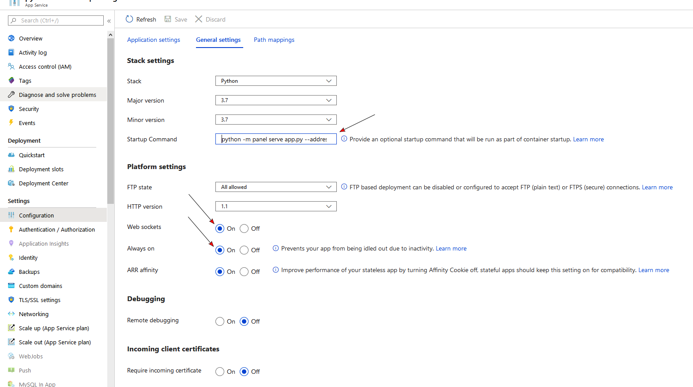

# Server Deployment

Panel is built on top of Bokeh, which provides a powerful [Tornado](https://www.tornadoweb.org/en/stable/) based web-server to communicate between Python and the browser. The bokeh server makes it possible to share the app or dashboard you have built locally, your own web server or using any of the numerous cloud providers. In this guide we will go through the details of deploying an app on a local system or cloud provider step by step.

## The server

The Bokeh server is built on Tornado, which handles all of the communication between the browser and the backend. Whenever a user accesses the app or dashboard in a browser a new session is created which executes the app code and creates a new ``Document`` containing the models served to the browser where they are rendered by BokehJS.

<div style="margin-left: auto; margin-right: auto; display: block">
</img>
</div>

### Accessing request arguments

When a user accesses the Panel application via the browser they can optionally provide additional arguments in the URL. For example the query string ``?N=10`` will result in the following argument will be available on ``pn.state.session_args``: ``{'N': [b'10']}``. Such arguments may be used to customize the application.

## Deployment

As was covered in [Server Configuration](Server_Configuration.md) guide a Panel app, either in a notebook or a Python script, can be annotated with `.servable()` and then launched from the commandline using ``panel serve``. This launches a Tornado server on a specific port (defaulting to 5006) which you can access locally at ``https://localhost:{PORT}``. This is a good option for simple deployments on a local network.

However many deployment scenarios have additional requirements around authentication, scaling, and uptime.

### SSH

In some scenarios a standalone bokeh server may be running on remote host. In such cases, SSH can be used to “tunnel” to the server. In the simplest scenario, the Bokeh server will run on one host and will be accessed from another location, e.g., a laptop, with no intermediary machines.

Run the server as usual on the remote host:

Next, issue the following command on the local machine to establish an SSH tunnel to the remote host:

```
ssh -NfL localhost:5006:localhost:5006 user@remote.host
```

Replace user with your username on the remote host and remote.host with the hostname/IP address of the system hosting the Bokeh server. You may be prompted for login credentials for the remote system. After the connection is set up you will be able to navigate to localhost:5006 as though the Bokeh server were running on the local machine.

The second, slightly more complicated case occurs when there is a gateway between the server and the local machine. In that situation a reverse tunnel must be established from the server to the gateway. Additionally the tunnel from the local machine will also point to the gateway.

Issue the following commands on the remote host where the Bokeh server will run:

```
nohup bokeh server &
ssh -NfR 5006:localhost:5006 user@gateway.host
```

Replace user with your username on the gateway and gateway.host with the hostname/IP address of the gateway. You may be prompted for login credentials for the gateway.

Now set up the other half of the tunnel, from the local machine to the gateway. On the local machine:

```
ssh -NfL localhost:5006:localhost:5006 user@gateway.host
```

Again, replace user with your username on the gateway and gateway.host with the hostname/IP address of the gateway. You should now be able to access the Bokeh server from the local machine by navigating to localhost:5006 on the local machine, as if the Bokeh server were running on the local machine. You can even set up client connections from a Jupyter notebook running on the local machine.

### Reverse proxy

If the goal is to serve an web application to the general Internet, it is often desirable to host the application on an internal network, and proxy connections to it through some dedicated HTTP server. For some basic configurations to set up a Bokeh server behind some common reverse proxies, including Nginx and Apache, refer to the [Bokeh documentation](https://bokeh.pydata.org/en/latest/docs/user_guide/server.html#basic-reverse-proxy-setup).

### Cloud Deployments

If you do not want to maintain your own web server and/or set up complex reverse proxies various cloud providers make it relatively simple to quickly deploy arbitrary apps on their system. In this section we will go through step-by-step to set up deployments on some of these providers.

#### MyBinder

Binder allows you to create custom computing environments that can be shared and used by many remote users. MyBinder is a public, free hosting option, with limited compute and memory resources, which will allow you to deploy your simple app quickly and easily.

Here we will take you through the configuration to quickly set up a GitHub repository with notebooks containing Panel apps for deployment on MyBinder.org. As an example refer to the [Clifford demo repository](https://github.com/pyviz-demos/clifford).

1. Create a GitHub repository and add the notebook or script you want to serve (in the example repository this is the clifford.ipynb file)

2. Add an ``environment.yml`` which declares a conda environment with the dependencies required to run the app (refer to the [conda documentation](https://docs.conda.io/projects/conda/en/latest/user-guide/tasks/manage-environments.html#creating-an-environment-file-manually) to see how to declare your dependencies). Add `jupyter_panel_proxy` as a dependency by adding either `conda-forge` or `pyviz` to the channel list:


```
channels:
- pyviz

packages:
- jupyter-panel-proxy
```

3. Go to mybinder.org, enter the URL of your GitHub repository and hit ``Launch``

4. mybinder.org will give you a link to the deployment, e.g. for the example app it is https://mybinder.org/v2/gh/panel-demos/clifford-interact/master. To visit the app simply append ``?urlpath=/panel/clifford`` where you should replace clifford with the name of the notebook or script you are serving.


#### Heroku

Heroku makes deployment of arbitrary apps including Panel apps and dashboards very easy and provides a free tier to get you started. This makes it a great starting point for users not too familiar with web development and deployment.

To get started working with Heroku [signup](https://signup.heroku.com) for a free account and [download and install the CLI](https://devcenter.heroku.com/articles/getting-started-with-python#set-up). Once you are set up follow the instructions to log into the CLI.

1. Create a new Git repo (or to follow along clone the [minimal-heroku-demo](https://github.com/pyviz-demos/minimal-heroku-demo) GitHub repo)

2. Add a Jupyter notebook or Python script which declares a Panel app or dashboard to the repository.

3. Define a requirements.txt containing all the requirements for your app (including Panel itself). For the sample app the requirements are as minimal as:

```
panel
hvplot
scikit-learn
```

3. Define a `Procfile` which declares the command Heroku should run to serve the app. In the sample app the following command serves the `iris_kmeans.ipynb` example. The websocket origin should match the name of the app on Heroku ``app-name.herokuapp.com`` which you will declare in the next step:

```
web: panel serve --address="0.0.0.0" --port=$PORT iris_kmeans.ipynb --allow-websocket-origin=app-name.herokuapp.com
```

4. Create a Heroku app using the CLI ensuring that the name matches the URL we declared in the previous step:

```
heroku create app-name
```

5. Push the app to heroku and wait until it is deployed.

6. Visit the app at app-name.herokuapp.com

Once you have deployed the app you might find that if your app is visited by more than one user at a time it will become unresponsive. In this case you can use the Heroku CLI [to scale your deployment](https://devcenter.heroku.com/articles/getting-started-with-python#scale-the-app).

#### Anaconda Enterprise 5 (AE5)

All live examples in the Panel documentation are served on AE5, to see further examples deployed there see [examples.pyviz.org](https://examples.pyviz.org) and for detailed instructions follow the [developer guide](https://examples.pyviz.org/make_project.html).

#### Microsoft Azure

Azure is popular choice for enterprises often in combination with an automated CI/CD pipeline via Azure DevOps. To get started you can use the [Azure Portal](portal.azure.com) to deploy your app as a Linux Web App via the web based user interface.

There are a few things you need to be aware of in order to be able to start your app.

Python Web Apps assumes your web app

- is using `gunicorn` (like Flask or Django) or alternative is started by a `python` command. Thus
    - You **cannot use** `panel serve app.py ...` as a *Startup Command*.
    - You **can use** `python -m panel serve app.py ...` or `python app.py ...` as a *Startup command*.
- is served on address 0.0.0.0 and port 8000

Thus you can use

```bash
python -m panel serve app.py --address 0.0.0.0 --port 8000 --allow-websocket-origin=app-name.azurewebsites.net
```

as a *Startup command*.

You might be able to use `python app.py` as a *Startup command* with `.show()` or `panel.serve` inside your `app.py` file, if you can configure the `address`, `port` and `allow-websocket-origin` in the app.py file or via environment variables.

You also need to configure your app service **general settings** to

- allow `Web sockets` and
- be `Always on`

</img>

If you would like to setup **automated CI/ CD** via Azure DevOps, Azure Pipelines and Docker to a Web App for Containers, you can find a good starting point in the [devops Folder](https://github.com/MarcSkovMadsen/awesome-panel/tree/master/devops) of [awesome-panel.org](https://awesome-panel.org).


#### Google Cloud Platform (GCP)

First, you need to set up your Google cloud account following the [Cloud Run documentation](https://cloud.google.com/run/docs/quickstarts/build-and-deploy/python) or the [App Engine documentation](https://cloud.google.com/appengine/docs/standard/python3/quickstart) depending on whether you would like to deploy your Panel app to Cloud Run or App Engine.

Next, you will need three files:
1. app.py: This is the Python file that creates the Panel App.

2. requirements.txt: This file lists all the package dependencies of our Panel app. Here is an example for requirements.txt:

```
panel
bokeh
hvplot
```
3. app.yml (for App Engine) or Dockerfile (for Cloud Run)

Here is an example for app.yml (if you would like to deploy to App Engine):
```
runtime: python
env: flex
entrypoint: panel serve app.py --address 0.0.0.0 --port 8080 --allow-websocket-origin="*"

runtime_config:
  python_version: 3
```

Here is an example for Dockerfile (if you would like to deploy to Cloud Run):
```
# Use the official lightweight Python image.
# https://hub.docker.com/_/python
FROM python:3.10-slim

# Allow statements and log messages to immediately appear in the Knative logs
ENV PYTHONUNBUFFERED True

# Copy local code to the container image.
ENV APP_HOME /app
WORKDIR $APP_HOME
COPY . ./

# Install production dependencies.
RUN pip install --no-cache-dir -r requirements.txt

# Run the web service on container startup.
CMD panel serve app.py --address 0.0.0.0 --port 8080 --allow-websocket-origin="*"
```

Finally, to deploy a Panel app to App Engine run `gcloud app create` and `gcloud app deploy`. To deploy a Panel app to Cloud Run, run `gcloud run deploy`.

For detailed information and steps, check out this [example](https://towardsdatascience.com/deploy-a-python-visualization-panel-app-to-google-cloud-cafe558fe787?sk=98a75bd79e98cba241cc6711e6fc5be5) on how to deploy a Panel app to App Engine and this [example](https://towardsdatascience.com/deploy-a-python-visualization-panel-app-to-google-cloud-ii-416e487b44eb?sk=aac35055957ba95641a6947bbb436410) on how to deploy a Panel app to Cloud Run.

#### Hugging Face

The guides below assumes you have already signed up and logged into your account at [huggingface.co](https://huggingface.co/).

##### Duplicate an existing space

The easiest way to get started is to  [search](https://huggingface.co/spaces), find and duplicate an existing space. A simple space to duplicate is
[MarcSkovMadsen/awesome-panel](https://huggingface.co/spaces/MarcSkovMadsen/awesome-panel).

- Open the space [MarcSkovMadsen/awesome-panel](https://huggingface.co/spaces/MarcSkovMadsen/awesome-panel).
- Click the 3 dots and select *Duplicate this Space*.

</img>

- Follow the instructions to finish the duplication.

Once you have finalized the duplication you will need to take a look at the `app.py` file in the new space to figure out what to replace.

</img>

##### Creating a new space from scratch

You can deploy Panel to Hugging Face Spaces as a [*Custom Python Space*](https://huggingface.co/docs/hub/spaces-sdks-python). For a general introduction to Hugging Face Spaces see the [Spaces Overview](https://huggingface.co/docs/hub/spaces-overview).

Go to [Spaces](https://huggingface.co/spaces) and click the "Create New Space" button.

</img>

Fill out the form. Make sure to select the *Gradio Space SDK*.

</img>

A Gradio space will serve your app via the commmand `python app.py`. I.e. you cannot run `panel serve app.py ...`.

To work around this your `app.py` will need to either

- Use `subprocess` to run `panel serve ...` or
- Use `pn.serve` to serve one or more functions.

The app also needs to run on a port given by the `PORT` environment variable.

Check out the example repository [MarcSkovMadsen/awesome-panel](https://huggingface.co/spaces/MarcSkovMadsen/awesome-panel/tree/main) for inspiration.

##### Git clone

Optionally you can git clone your repository using

```bash
git clone https://huggingface.co/spaces/NAME-OF-USER/NAME-OF-SPACE
```

</img>

#### Other Cloud Providers

Panel can be used with just about any cloud provider that can launch a Python process, including Amazon Web Services (AWS) and DigitalOcean. The Panel developers will add documentation for these services as they encounter them in their own work, but we would greatly appreciate step-by-step instructions from users working on each of these systems.
