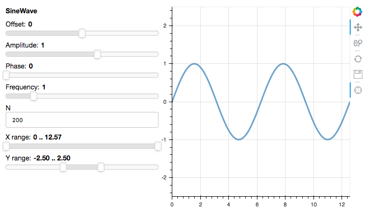

# Sample django + parambokeh apps

Demos showing how panel can be integrated with django, to varying
degrees.

To install: `conda install "django=2"` (or install django your
preferred way).

## sliders

Based on a standard django2 app template, the sliders app shows how to
integrate panel with a django view; there's no interaction
between param and django models.

Additions/modifications to django2 app template:

  * `sliders/sinewave.py`: a (pre-existing) parameterized object (to
    replace with your own)

  * `sliders/bk_sliders.py`: the panel/bokeh app (based on
    https://github.com/bokeh/bokeh/blob/master/examples/app/sliders.py;
    to replace with your own)

  * sliders/apps.py: how a django app can import and use bokeh server

  * sliders/views.py and templates/base.html: getting the bokeh app
    into a django view

To run: `python manage.py runserver`, then visit
http://localhost:8000/sliders in your browser.

## polls

Based on https://docs.djangoproject.com/en/2.0/intro/tutorial01/, the
polls app shows one possible way to update a django model from a
parameterized object (displayed using panel in a django view).

To run: `python manage.py migrate` (first time only, to create polls
models); subsequently run `python manage.py runserver` then visit
http://localhost:8000/polls

In the future, we could provide a way for people to integrate param
and django models.
