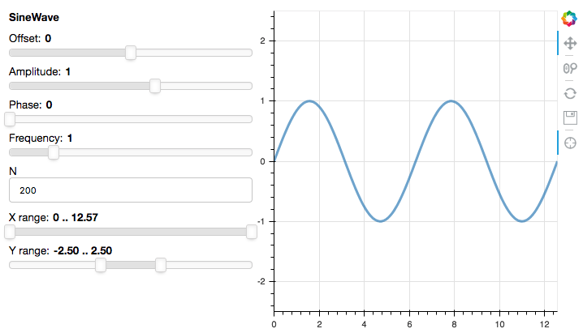

# Panel in a Django project

Based on a standard Django project template, the sliders app shows how to embed
a Panel application in a Django view.



## Installation

```bash
pip install -r requirements.txt
```

or with `conda`:

```bash
conda install -c conda-forge django panel uvicorn
```

## Running

Panel serves its applications on the ASGI application declared in
`project/asgi.py`, so the project has to be run with an ASGI server. Note that
`python manage.py runserver` is WSGI only and will therefore serve the Django
views but not the Panel application:

```bash
uvicorn project.asgi:application
```

Then visit http://localhost:8000/sliders in your browser.

## How it works

* `sliders/sinewave.py`: a Parameterized object, replace it with your own.
* `sliders/pn_app.py`: the Panel application, a function that modifies the
  Bokeh `Document` it is given.
* `project/asgi.py`: declares the application with `autoload`, i.e. it is
  served for embedding in a Django view, and composes it with the ASGI
  application of the Django project.
* `sliders/views.py` and `sliders/templates/base.html`: embed the application
  in a Django view with `bokeh.embed.server_document`.

:::{note}
There is no interaction between Param and Django models. To update a Django
model from a Panel application, call the ORM from the application itself.
:::
